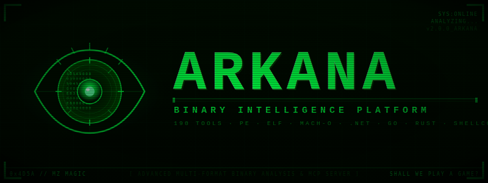

# Arkana - Your Entire Malware Analysis Lab, Behind One AI Prompt



[](LICENSE)
[](https://github.com/JameZUK/Arkana/actions/workflows/ci.yml)
[](https://www.python.org/)
[](docs/tools-reference.md)
[](https://github.com/JameZUK/Arkana)

> *"Analyse asyncrat.exe and tell me what it does"*

From a single prompt, Arkana opens the binary, triages it (CRITICAL -- 43/72 VT detections),
extracts the C2 server (`cveutb.sa.com`), identifies AES-256 encrypted communications via
MessagePack, maps 12 MITRE ATT&CK techniques, detects anti-VM checks for VMware/VirtualBox/
Sandboxie, finds the persistence mechanism (Registry Run key), and recovers the operator's
PDB path revealing a Vietnamese-speaking threat actor.
[See the full report.](docs/examples/example-report-asyncrat.md)

> *"Step through the unpacking stub and show me what it decrypts"*

Arkana starts an interactive debug session, sets breakpoints on `VirtualAlloc` and `VirtualProtect`, steps through the decryption loop, snapshots state before and after, diffs the memory regions, and dumps the unpacked payload -- all driven by natural language.


Arkana is a [Model Context Protocol](https://modelcontextprotocol.io/) (MCP) server that gives **Claude Code** (or any MCP client) **259 analysis tools** -- decompilation, symbolic execution, interactive step-through debugging, data-flow analysis, YARA/capa/FLOSS signatures, Binary Refinery data transforms, Qiling/Speakeasy emulation, .NET deobfuscation, function similarity matching, and a real-time web dashboard -- so you can investigate PE, ELF, Mach-O, .NET, Go, Rust, and shellcode samples by describing what you want to know. No Ghidra scripts, no CLI flags, no context-switching between a dozen tools. Just results.

---

## Why Arkana

**The problem:** Malware analysis means juggling Ghidra, IDA, CyberChef, YARA, and a dozen other tools -- each with its own interface, scripting language, and learning curve. Investigating a single sample might mean switching between 5-10 tools, manually correlating findings across disconnected workflows.

Arkana eliminates this by putting **259 specialised analysis tools behind a single AI-driven interface** -- the equivalent of an entire malware lab in one MCP server. Describe what you want to know in natural language and the AI orchestrates the right tools automatically.

**What makes it different:**

- **Breadth** -- 259 tools spanning PE/ELF/Mach-O parsing, angr-powered decompilation and symbolic execution, Binary Refinery's 200+ composable data transforms, YARA/capa/FLOSS/PEiD signature engines, Qiling/Speakeasy emulation, .NET/Go/Rust specialised analysis, .NET deobfuscation and C# decompilation, Frida script generation, vulnerability pattern detection, cross-binary function similarity search, and VirusTotal integration.
- **AI reasoning over results** -- Unlike tools that just produce output, Arkana feeds results back to an AI that can reason about them. When it decompiles a function and sees `VirtualAlloc` followed by `memcpy` and an indirect call, it recognises the shellcode injection pattern, renames the function to `inject_shellcode`, and suggests investigating the source buffer.
- **Zero-config auto-enrichment** -- Open a file and Arkana immediately begins background classification, risk scoring, MITRE ATT&CK mapping, IOC extraction, library identification, and a decompilation sweep. By the time you ask your first question, the answers are already cached.
- **Interactive debugging** -- Step through binaries instruction-by-instruction with breakpoints, watchpoints, memory inspection, execution snapshots, API call tracing, I/O capture, and custom API stubs. Explore alternative execution paths by snapshotting state, modifying registers or memory, and comparing outcomes.
- **Session continuity** -- Notes, function renames, custom type definitions, and tool history survive context window limits and server restarts, enabling investigations that span hours or days without losing context.
- **Real-time web dashboard** -- A visual companion that updates live as the AI works: function triage with XREF analysis, interactive call graph, strings explorer, MITRE ATT&CK matrix, hex viewer, and analysis timeline. Analyst flags set on the dashboard feed directly back into the AI's tool suggestions.

**Who benefits:**

- **SOC analysts** -- automated triage with risk scoring, MITRE mapping, and IOC extraction in seconds; web dashboard for visual review
- **Malware reversers** -- natural language drives decompilation, symbolic execution, interactive debugging, and data transforms across multi-stage payloads
- **Incident responders** -- rapid C2 config extraction, network indicators, and structured reports under time pressure
- **Learners** -- built-in interactive RE tutor with Socratic guidance, progress tracking, and hands-on exercises using real tools
- **Threat intel teams** -- automated similarity hashing, family identification, YARA rule generation, and cross-binary function matching

---

## Key Features

- **Multi-format support** -- PE, ELF, Mach-O, .NET, Go, Rust, and raw shellcode with auto-detection and pre-parse integrity checks (truncation, corruption, null-padding detection). Unknown formats (ZIP, PDF, PCAP) fall back to raw mode with clear guidance instead of crashing. LIEF serves as a fallback parser when pefile cannot handle malformed PEs.
- **Angr-powered analysis** -- 46 tools for decompilation, batch decompilation, CFG, symbolic execution, data-flow, slicing, and emulation
- **Comprehensive static analysis** -- 27 PE structure tools, YARA/capa/PEiD/FLOSS signatures, crypto detection, hex pattern search, IOC export
- **Binary Refinery integration** -- 23 context-efficient tools wrapping 200+ composable data transforms (encoding, crypto, compression, forensics)
- **Cross-platform emulation** -- Speakeasy (Windows APIs) and Qiling (Windows/Linux/macOS, x86/x64/ARM/MIPS)
- **Interactive debugger** -- 29 tools for step-through emulation with breakpoints, watchpoints, memory inspection, snapshots, API call tracing, I/O capture, custom API stubs, and memory search -- up to 3 concurrent debug sessions
- **Function similarity (BSim-style)** -- Architecture-independent function matching across binaries using CFG, API, VEX IR, string, and constant features with persistent SQLite signature database
- **Interactive annotation** -- Rename functions and variables, define custom structs/enums, add address labels -- all persisted across sessions and applied automatically in decompilation output
- **Session persistence** -- Notes, renames, custom types, tool history, and analysis cache survive restarts and context window limits
- **Auto-enrichment** -- Opening a file automatically triggers background classification, triage, MITRE mapping, IOC collection, library identification, and a decompilation sweep -- results are ready before you ask
- **AI-optimised workflow** -- Compact triage, smart function ranking, batch decompilation, digest summaries, and guided next steps
- **Robust architecture** -- Docker-first, thread-safe state, background tasks, pagination, smart truncation, graceful degradation
- **Web dashboard** -- Real-time CRT-themed web interface on port 8082 with binary summary, function triage with XREF analysis panel, dagre-layout call graph with tabbed sidebar, analysis timeline, strings explorer, and notes browser -- analyst flags feed back into AI tool suggestions

### How It Compares

| | Arkana | Ghidra | IDA Pro | CyberChef |
|---|---|---|---|---|
| **AI reasoning** | Native | No | No | No |
| **Decompilation** | Angr (multi-arch, batch) | Ghidra Decompiler | Hex-Rays ($$$) | No |
| **Function similarity** | BSim-style cross-binary | BSim (Java) | BinDiff/Lumina | No |
| **Data transforms** | 200+ via Refinery | Manual scripting | Manual scripting | 300+ (manual) |
| **Emulation** | Speakeasy + Qiling | Limited | No | No |
| **Interactive debugging** | 29-tool step debugger | Manual | Manual | No |
| **Auto-enrichment** | Background triage on open | No | No | No |
| **Web dashboard** | Real-time, 14 pages | No | No | No |
| **Learning curve** | Natural language | Months | Months | Moderate |
| **Cost** | Free & open source | Free | $1,800+/yr | Free |

Arkana complements rather than replaces Ghidra/IDA -- see [Scenarios & Comparisons](docs/examples/scenarios.md) for detailed analysis.

### Web Dashboard

Arkana includes a real-time web dashboard that launches automatically on port 8082. It provides a visual companion to the AI-driven analysis, letting you observe and interact with the investigation as it happens.

- **Overview** -- Binary summary with risk score, packing status, security mitigations, key findings with function pivot links, and recent notes
- **Functions** -- Sortable function explorer with triage buttons (FLAG / SUS / CLN), XREF analysis panel, inline notes, full-text code search, and symbol tree view -- click XREF to see cross-references with suspicious API badges, clickable callers/callees that navigate to the target function, and associated strings, all without requiring decompilation first
- **Call Graph** -- Interactive Cytoscape.js call graph with dagre hierarchical layout, tabbed sidebar (INFO / XREFS / STRINGS / CODE) on node selection, enrichment score-based border thickness, neighbourhood highlighting with marching-ant edges, search, bookmarks, and PNG/SVG export
- **Sections** -- PE/ELF section permissions with anomaly highlighting (W+X detection) and entropy heatmap
- **Imports** -- DLL import tables with export/function grouping and clickable export addresses
- **Hex View** -- Infinite-scroll hex dump with jump-to-offset navigation
- **Strings** -- Unified string explorer with FLOSS detail panel (type breakdown, decoded/stack string preview), type/category filtering, sifter scores, and function column with links
- **CAPA** -- Capability matches grouped by namespace with function links
- **MITRE** -- ATT&CK technique matrix with IOC panel
- **Types** -- Custom struct/enum type editor for binary data parsing
- **Diff** -- Binary diff via angr BinDiff with file browser and manual path input
- **Timeline** -- Chronological log of every tool call and note, with expandable detail panels showing request parameters and result summaries
- **Notes** -- Category-filtered view of all analysis notes (general, function, tool_result, IOC, hypothesis, conclusion, manual) with clickable address links
- **Global status bar** -- Active tool and background task progress visible from every page
- **Real-time updates** -- SSE-driven live refresh as the AI runs tools


The dashboard uses token-based authentication (persisted to `~/.arkana/dashboard_token`). Access URL with token is printed at server startup. See the [Dashboard Gallery](docs/dashboard.md) for screenshots of all views.

---

## Example Reports

Every report below was generated from a single prompt: *"Analyse this binary and tell me what it does."*

| Report | Sample | Highlights |
|--------|--------|-----------|
| [Trojan.Delshad BYOVD Loader](docs/examples/example-report.md) | Multi-stage dropper | Payload carving, attack chain diagram, 12 ATT&CK techniques |
| [LockBit 3.0 Ransomware](docs/examples/example-report-lockbit.md) | Packed ransomware | Entropy analysis, packing detection, stub extraction |
| [AsyncRAT .NET RAT](docs/examples/example-report-asyncrat.md) | .NET RAT | C2 config extraction despite obfuscated metadata |
| [StealC Info Stealer](docs/examples/example-report-stealc.md) | Credential stealer | 32 capa rules, browser/Steam targeting, crypto toolkit |
| [ValleyRAT Multi-Stage Loader](docs/examples/example-report-valleyrat.md) | Chinese APT RAT | 5-stage unpacking, custom ARX cipher reversal, C2 config extraction |
| [Brute Ratel C4 Badger](docs/examples/example-report-bruteratel.md) | Commercial C2 implant | PIC shellcode tracing, RC4 unpacking, C2 config extraction, 17 ATT&CK techniques |
| [CrackMeZ3S CTF Challenge](docs/examples/example-report-crackme-z3s.md) | PELock 6-key crackme | Interactive debugger with IAT patching, code-cave shellcode injection, encrypted blob decryption, manual XOR cipher reversal, MD5 hash cracking |

---

## How Analysis Works

When you say *"Analyse this binary and tell me what it does"*, the AI doesn't just call one tool. It follows a structured, multi-phase methodology -- the same workflow a human malware analyst would use, but orchestrated automatically across Arkana's 259 tools.

```
                            ┌─────────────────────┐
                            │   "Analyse this      │
                            │    binary for me"    │
                            └──────────┬──────────┘
                                       │
                          ┌────────────▼────────────┐
                          │  PHASE 0: ENVIRONMENT    │
                          │  get_config()            │
                          │  list_samples()          │
                          └────────────┬────────────┘
                                       │
                          ┌────────────▼────────────┐
                          │  PHASE 1: IDENTIFY       │
                          │  open_file() ─── auto-   │
                          │  enrichment starts in    │
                          │  background (classify,   │
                          │  triage, MITRE, IOCs,    │
                          │  FLIRT, decompile sweep) │
                          │                          │
                          │  get_triage_report()     │
                          │  classify_binary_purpose()│
                          └────────────┬────────────┘
                                       │
                              ┌────────▼────────┐
                              │  Packed binary?  │
                              └───┬─────────┬───┘
                              YES │         │ NO
                     ┌────────────▼───┐     │
                     │  PHASE 2:      │     │
                     │  UNPACK        │     │
                     │  auto_unpack   │     │
                     │  → try_all     │     │
                     │  → qiling_dump │     │
                     │  → manual OEP  │     │
                     │                │     │
                     │  Re-open the   │     │
                     │  unpacked file │     │
                     └────────┬───────┘     │
                              │             │
                              └──────┬──────┘
                                     │
                          ┌──────────▼──────────┐
                          │  PHASE 3: MAP        │
                          │  get_focused_imports()│
                          │  get_strings_summary()│
                          │  get_function_map()   │
                          │  get_capa_analysis()  │
                          │  identify_malware_    │
                          │    family()           │
                          │  get_analysis_digest()│
                          └──────────┬──────────┘
                                     │
                          ┌──────────▼──────────┐
                          │  PHASE 4: DEEP DIVE  │
                          │                      │
                          │  Tier 1: Static      │
                          │  decompile + rename  │
                          │  + batch_decompile   │
                          │         │            │
                          │  Tier 2: Data Flow   │
                          │  reaching_defs +     │
                          │  propagate_constants │
                          │         │            │
                          │  Tier 3: Emulation   │
                          │  speakeasy / qiling  │
                          │  / interactive debug │
                          └──────────┬──────────┘
                                     │
                          ┌──────────▼──────────┐
                          │  PHASE 5: EXTRACT    │
                          │  C2 configs, IOCs,   │
                          │  decrypted payloads, │
                          │  YARA rules          │
                          └──────────┬──────────┘
                                     │
                          ┌──────────▼──────────┐
                          │  PHASE 6: RESEARCH   │
                          │  VirusTotal, family  │
                          │  attribution, MITRE  │
                          │  ATT&CK mapping      │
                          └──────────┬──────────┘
                                     │
                          ┌──────────▼──────────┐
                          │  PHASE 7: REPORT     │
                          │  generate_report()   │
                          │  Structured findings │
                          │  with full evidence  │
                          │  chain               │
                          └──────────────────────┘
```

### Walkthrough: Triaging a Suspicious PE

Here's what actually happens behind the scenes when the AI analyses a binary. Each step shows the real MCP tool calls the AI makes:

**1. Environment & identification** -- The AI discovers available libraries and opens the file. `open_file()` returns format detection, hashes, and a file integrity assessment. Auto-enrichment kicks off in the background, immediately starting classification, risk scoring, MITRE mapping, IOC extraction, and a decompilation sweep -- by the time the AI asks its next question, many answers are already cached.

**2. Triage** -- `get_triage_report(compact=True)` returns a ~2KB assessment: packing status, suspicious imports ranked by risk, capa capability matches mapped to ATT&CK, network IOCs, digital signature status, and a risk score. The AI reads this and decides what to investigate next.

**3. Mapping the binary** -- Based on triage results, the AI calls `get_focused_imports()` to see security-relevant imports categorised by threat behaviour, `get_strings_summary()` for string intelligence, and `get_function_map()` to get functions ranked by interestingness -- this becomes the decompilation priority list.

**4. Deep dive** -- The AI decompiles the highest-ranked functions with `decompile_function_with_angr()`, renames cryptic function names (`sub_401830` becomes `decrypt_c2_config`), and traces data flow with `get_reaching_definitions()` when static reading isn't enough. If the code decrypts something at runtime, the AI can emulate it with Speakeasy or step through it instruction-by-instruction with the interactive debugger.

**5. Evidence gathering** -- Throughout the analysis, the AI records every finding with `add_note()` and `auto_note_function()`. Notes survive context window limits and server restarts, so investigations can span hours. `get_analysis_digest()` synthesises all findings at any point.

**6. Reporting** -- `generate_report()` produces a structured markdown report with executive summary, risk assessment, detailed findings with function-level evidence, IOCs, MITRE ATT&CK mappings, and the complete analysis timeline.

The AI adapts its depth based on the goal. A quick triage might stop after Phase 3. Deep reverse engineering goes through every tier. A CTF challenge might spend most of its time in the interactive debugger. The methodology is the same -- the depth varies.

### Built-in Guardrails

The analysis skill enforces strict methodology constraints that prevent the AI from cutting corners or producing unreliable results:

- **Evidence-first, no speculation** -- Every claim must cite specific tool output. The AI cannot say *"this binary probably injects into processes"* -- it must decompile the function, show the `VirtualAllocEx` → `WriteProcessMemory` → `CreateRemoteThread` chain, and cite the addresses. If something is unknown, it says so.
- **Indicators are leads, not conclusions** -- VirusTotal detections, capa matches, YARA hits, and risk scores are treated as pointers for investigation, not proof. A capa match for "process injection" means a byte pattern was found -- the AI still decompiles the relevant function to confirm the behaviour.
- **No speculative decryption** -- The AI cannot attempt to decrypt, decompress, or decode embedded data without concrete evidence from decompiled code showing the algorithm, key source, and data location. Entropy analysis and "this looks encrypted" are not sufficient -- it must find the actual decryption function first.
- **Unpack before analysing** -- When triage detects packing (high entropy, minimal imports, PEiD match), the AI must unpack before attempting decompilation or config extraction. Packed code defeats static analysis by design -- the AI follows the unpacking cascade (`auto_unpack_pe` → `try_all_unpackers` → `qiling_dump`) rather than guessing at encrypted content.
- **Fair interpretation** -- Flagged APIs and behaviours are assessed in context. `IsDebuggerPresent` in a Rust binary's panic handler is a compiler artifact, not anti-analysis. `VirtualProtect` in any loader is a functional requirement, not evasion. The AI distinguishes between capability (what an API *can* do) and intent (what the developer *meant* it to do).
- **Deep dive checkpoint** -- Before entering the time-intensive Phase 4 deep dive, the AI pauses to present its findings so far and asks the user whether to proceed. This prevents burning time decompiling functions the analyst doesn't care about.
- **Mandatory note-taking** -- After every decompilation, the AI records a summary note. When it discovers any finding, it adds a note. Notes survive context window limits and server restarts, ensuring nothing is lost during long investigations.

For seven detailed real-world walkthroughs (email attachment triage, packed .NET RAT, multi-stage dropper, Go ELF binary, IOC extraction, custom cipher reversal, and C2 implant unpacking), see [Scenarios & Comparisons](docs/examples/scenarios.md).

---

## Get Started in 4 Commands

Arkana works with **Claude Code** and any MCP-compatible client. The fastest way to get running with Claude Code and Docker:

```bash
# 1. Clone and build (first build takes a few minutes)
git clone https://github.com/JameZUK/Arkana.git
cd Arkana
./run.sh --build

# 2. Add Arkana to Claude Code
claude mcp add --scope project arkana -- ./run.sh --samples ~/your-samples --stdio

# 3. Start Claude Code and analyse a binary
claude
```

Then in Claude Code, use the `/arkana-analyse` skill to get the best results:

```
> /arkana-analyse suspicious.exe
```

Or just ask a question directly:

```
> Open suspicious.exe and tell me if it's malicious
```

There's also an `/arkana-learn` skill -- an interactive reverse engineering tutor that teaches you binary analysis hands-on using Arkana's tools.

For other MCP clients, local Python installation, and detailed configuration, see the [Installation Guide](docs/installation.md).

---

## Demos

**AsyncRAT analysis** -- single prompt to full triage, C2 extraction, and MITRE ATT&CK mapping:


<sub>Interactive playback: `asciinema play docs/demos/demo-asyncrat.cast`</sub>

**Multi-phase investigation** -- deep analysis with decompilation, emulation, and structured findings:


<sub>Interactive playback: `asciinema play docs/demos/demo-analysis.cast`</sub>

---

## Documentation

| Document | Description |
|----------|-------------|
| **[Installation Guide](docs/installation.md)** | Docker, local, and minimal installation; modes of operation; multi-format binary support |
| **[Claude Code Integration](docs/claude-code.md)** | Setup via CLI and JSON config; analysis and learning skills; typical workflows and example queries |
| **[Configuration](docs/configuration.md)** | API keys, analysis cache, and command-line options |
| **[Tools Reference](docs/tools-reference.md)** | Complete catalog of all 259 MCP tools organised by category |
| **[Scenarios & Comparisons](docs/examples/scenarios.md)** | Seven real-world analysis walkthroughs; Arkana vs Ghidra, IDA Pro, CyberChef |
| **[Architecture](docs/architecture.md)** | Package structure, design principles, pagination and result limits |
| **[Security & Testing](docs/security.md)** | Path sandboxing, security measures, testing and CI/CD |
| **[Web Dashboard](docs/dashboard.md)** | Real-time analysis dashboard on port 8082; function triage, call graph, timeline, notes |
| **[Qiling Rootfs Setup](docs/QILING_ROOTFS.md)** | Windows DLL setup for Qiling cross-platform emulation |
| **[Dependencies](docs/dependencies.md)** | Library dependencies and optional component details |
| **[Future Improvements](docs/future-improvements.md)** | Roadmap and planned enhancements |
| **[Contributing](docs/CONTRIBUTING.md)** | Contribution guidelines and development workflow |

---

## Contributing

Contributions are welcome! See the [Contributing Guide](docs/CONTRIBUTING.md) for details.

1. Fork the repository
2. Create a feature branch (`git checkout -b feature/your-enhancement`)
3. Commit your changes
4. Open a Pull Request

---

## Licence

Distributed under the MIT Licence. See `LICENSE` for more information.

---

## Disclaimer

This toolkit is provided "as-is" for educational and research purposes only. It is capable of executing parts of analysed binaries (via angr emulation and symbolic execution) in a sandboxed environment. Always exercise caution when analysing untrusted files. The authors accept no responsibility for misuse or damages arising from the use of this software.

---

If Arkana is useful to you, consider giving it a star -- it helps others discover the project.

[Report a bug](https://github.com/JameZUK/Arkana/issues) | [Request a feature](https://github.com/JameZUK/Arkana/issues) | [Full tools reference](docs/tools-reference.md)
