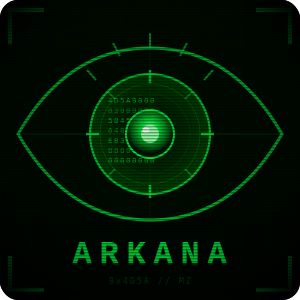

# Arkana - AI-Powered Binary Analysis


Point an AI at a binary and ask questions. Arkana gives Claude Code (or any MCP client) **190 analysis tools** — decompilation, emulation, string decoding, YARA scanning, and more — so you can investigate PE, ELF, Mach-O, .NET, Go, Rust, and shellcode samples by just describing what you want to know. No Ghidra scripts, no CLI flags, no context-switching between a dozen tools. Just results.

---

## Why Arkana

Malware analysis has traditionally required analysts to master a complex toolchain — Ghidra for decompilation, IDA Pro for disassembly, CyberChef for data transforms, pestudio for PE triage, CFF Explorer for header inspection, YARA for signatures, and dozens more. Each tool has its own interface, scripting language, and learning curve. Investigating a single sample might mean switching between 5-10 tools, manually correlating findings across disconnected workflows.

This creates three critical bottlenecks:

1. **Skill barrier** — Junior analysts spend months learning each tool before becoming productive. Even experienced analysts must memorise hundreds of commands, keyboard shortcuts, and scripting APIs across different tools.
2. **Context fragmentation** — Findings from one tool don't automatically inform analysis in another. The analyst becomes the integration layer, manually cross-referencing decompilation output with string analysis, import tables, and network IOCs.
3. **Repetitive drudgery** — The initial triage of every sample follows a predictable pattern (check hashes, scan signatures, extract strings, review imports, check entropy), yet analysts must manually execute these same steps every time.

Arkana eliminates these bottlenecks by putting **190 specialised analysis tools behind a single AI-driven interface** — the equivalent of an entire malware lab in one MCP server. Instead of learning 10 different tools, you describe what you want to know in natural language and the AI orchestrates the right tools automatically.

**What makes Arkana unique:**

1. **Breadth** — 190 tools spanning PE/ELF/Mach-O parsing, Angr-powered decompilation and symbolic execution, Binary Refinery's 200+ composable data transforms, YARA/Capa/FLOSS/PEiD signature engines, Qiling/Speakeasy emulation, .NET/Go/Rust specialised analysis, and VirusTotal integration.

2. **AI reasoning over results** — Unlike tools that just produce output, Arkana feeds results back to an AI that can reason about them. When the AI decompiles a function and sees `VirtualAlloc` followed by `memcpy` and an indirect call, it recognises the shellcode injection pattern, notes it as a finding, and suggests investigating the source buffer.

3. **Session continuity** — Analysis findings persist across the entire investigation. Notes, function summaries, and tool history survive context window limits and server restarts, enabling investigations that span hours or days without losing context.

**Who benefits:**

- **SOC analysts** triaging alerts — automated risk assessment with evidence in seconds
- **Malware analysts** doing deep RE — natural language drives decompilation, symbolic execution, and data transforms
- **Incident responders** under time pressure — rapid IOC and C2 config extraction from multiple samples
- **Junior analysts and learners** building skills — an interactive RE tutor guides you through hands-on analysis with Socratic questioning, structured lessons, and progress tracking
- **Threat intel teams** processing batches — automated config, hash, and network indicator extraction

---

## Key Features

- **Multi-format support** — PE, ELF, Mach-O, .NET, Go, Rust, and raw shellcode with auto-detection
- **Angr-powered analysis** — 39 tools for decompilation, CFG, symbolic execution, data-flow, slicing, and emulation
- **Comprehensive static analysis** — 24 PE structure tools, YARA/Capa/PEiD/FLOSS signatures, crypto detection, IOC export
- **Binary Refinery integration** — 23 context-efficient tools wrapping 200+ composable data transforms (encoding, crypto, compression, forensics)
- **Cross-platform emulation** — Speakeasy (Windows APIs) and Qiling (Windows/Linux/macOS, x86/x64/ARM/MIPS)
- **Session persistence** — Notes, tool history, and analysis cache survive restarts and context window limits
- **AI-optimised workflow** — Compact triage, smart function ranking, digest summaries, and guided next steps
- **Robust architecture** — Docker-first, thread-safe state, background tasks, pagination, smart truncation, graceful degradation

---

## Quick Start

The fastest way to get running with Claude Code and Docker:

```bash
# 1. Clone the repository
git clone https://github.com/JameZUK/Arkana.git
cd Arkana

# 2. Add Arkana to Claude Code (builds Docker image on first run)
claude mcp add --scope project arkana -- ./run.sh --samples ~/your-samples --stdio

# 3. Start Claude Code and analyse a binary
claude
```

Then ask:

```
> Open /your-samples/suspicious.exe and tell me if it's malicious
```

For other installation methods (local Python, minimal install) and detailed configuration, see the [Installation Guide](docs/installation.md).

---

## Documentation

| Document | Description |
|----------|-------------|
| **[Installation Guide](docs/installation.md)** | Docker, local, and minimal installation; modes of operation; multi-format binary support |
| **[Claude Code Integration](docs/claude-code.md)** | Setup via CLI and JSON config; analysis and learning skills; typical workflows and example queries |
| **[Configuration](docs/configuration.md)** | API keys, analysis cache, and command-line options |
| **[Tools Reference](docs/tools-reference.md)** | Complete catalog of all 190 MCP tools organised by category |
| **[Scenarios & Comparisons](docs/scenarios.md)** | Five real-world analysis walkthroughs; Arkana vs Ghidra, IDA Pro, CyberChef |
| **[Architecture](docs/architecture.md)** | Package structure, design principles, pagination and result limits |
| **[Security & Testing](docs/security.md)** | Path sandboxing, security measures, testing and CI/CD |
| **[Qiling Rootfs Setup](docs/QILING_ROOTFS.md)** | Windows DLL setup for Qiling cross-platform emulation |
| **[Contributing](docs/CONTRIBUTING.md)** | Contribution guidelines and development workflow |

---

## Contributing

Contributions are welcome!

1. Fork the repository.
2. Create a feature branch (`git checkout -b feature/your-enhancement`).
3. Commit your changes.
4. Push to the branch.
5. Open a Pull Request.

---

## Licence

Distributed under the MIT Licence. See `LICENSE` for more information.

---

## Disclaimer

This toolkit is provided "as-is" for educational and research purposes only. It is capable of executing parts of analysed binaries (via Angr emulation and symbolic execution) in a sandboxed environment. Always exercise caution when analysing untrusted files. The authors accept no responsibility for misuse or damages arising from the use of this software.
