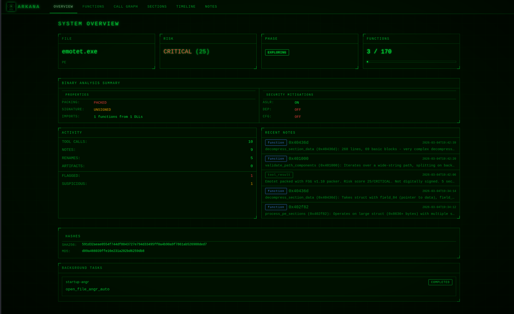

# Arkana - Your Entire Malware Analysis Lab, Behind One AI Prompt


[](LICENSE)
[](https://github.com/JameZUK/Arkana/actions/workflows/ci.yml)
[](https://www.python.org/)
[](docs/tools-reference.md)
[](https://github.com/JameZUK/Arkana)

> *"Analyse asyncrat.exe and tell me what it does"*

From a single prompt, Arkana opens the binary, triages it (CRITICAL -- 43/72 VT detections),
extracts the C2 server (`cveutb.sa.com`), identifies AES-256 encrypted communications via
MessagePack, maps 12 MITRE ATT&CK techniques, detects anti-VM checks for VMware/VirtualBox/
Sandboxie, finds the persistence mechanism (Registry Run key), and recovers the operator's
PDB path revealing a Vietnamese-speaking threat actor.
[See the full report.](docs/example-report-asyncrat.md)


Arkana is a [Model Context Protocol](https://modelcontextprotocol.io/) (MCP) server that gives **Claude Code** (or any MCP client) **210 analysis tools** -- decompilation, emulation, string decoding, YARA scanning, and more -- so you can investigate PE, ELF, Mach-O, .NET, Go, Rust, and shellcode samples by describing what you want to know. No Ghidra scripts, no CLI flags, no context-switching between a dozen tools. Just results.

---

## Why Arkana

**The problem:** Malware analysis means juggling Ghidra, IDA, CyberChef, YARA, and a dozen other tools -- each with its own interface, scripting language, and learning curve. Investigating a single sample might mean switching between 5-10 tools, manually correlating findings across disconnected workflows.

Arkana eliminates this by putting **210 specialised analysis tools behind a single AI-driven interface** -- the equivalent of an entire malware lab in one MCP server. Describe what you want to know in natural language and the AI orchestrates the right tools automatically.

**What makes it different:**

- **Breadth** -- 210 tools spanning PE/ELF/Mach-O parsing, angr-powered decompilation and symbolic execution, Binary Refinery's 200+ composable data transforms, YARA/capa/FLOSS/PEiD signature engines, Qiling/Speakeasy emulation, .NET/Go/Rust specialised analysis, cross-binary function similarity search, and VirusTotal integration.
- **AI reasoning over results** -- Unlike tools that just produce output, Arkana feeds results back to an AI that can reason about them. When it decompiles a function and sees `VirtualAlloc` followed by `memcpy` and an indirect call, it recognises the shellcode injection pattern, renames the function to `inject_shellcode`, and suggests investigating the source buffer.
- **Session continuity** -- Notes, function renames, custom type definitions, and tool history survive context window limits and server restarts, enabling investigations that span hours or days without losing context.

**Who benefits:**

- **SOC analysts** -- automated triage in seconds, not hours
- **Malware reversers** -- natural language drives decompilation, symbolic execution, and data transforms
- **Incident responders** -- rapid IOC and C2 extraction under time pressure
- **Learners** -- built-in interactive RE tutor with Socratic guidance and progress tracking
- **Threat intel teams** -- automated config, hash, and network indicator extraction

---

## Key Features

- **Multi-format support** -- PE, ELF, Mach-O, .NET, Go, Rust, and raw shellcode with auto-detection and pre-parse integrity checks (truncation, corruption, null-padding detection). Unknown formats (ZIP, PDF, PCAP) fall back to raw mode with clear guidance instead of crashing. LIEF serves as a fallback parser when pefile cannot handle malformed PEs.
- **Angr-powered analysis** -- 41 tools for decompilation, batch decompilation, CFG, symbolic execution, data-flow, slicing, and emulation
- **Comprehensive static analysis** -- 24 PE structure tools, YARA/capa/PEiD/FLOSS signatures, crypto detection, hex pattern search, IOC export
- **Binary Refinery integration** -- 23 context-efficient tools wrapping 200+ composable data transforms (encoding, crypto, compression, forensics)
- **Cross-platform emulation** -- Speakeasy (Windows APIs) and Qiling (Windows/Linux/macOS, x86/x64/ARM/MIPS)
- **Function similarity (BSim-style)** -- Architecture-independent function matching across binaries using CFG, API, VEX IR, string, and constant features with persistent SQLite signature database
- **Interactive annotation** -- Rename functions and variables, define custom structs/enums, add address labels -- all persisted across sessions and applied automatically in decompilation output
- **Session persistence** -- Notes, renames, custom types, tool history, and analysis cache survive restarts and context window limits
- **Auto-enrichment** -- Opening a file automatically triggers background classification, triage, MITRE mapping, IOC collection, library identification, and a decompilation sweep -- results are ready before you ask
- **AI-optimised workflow** -- Compact triage, smart function ranking, batch decompilation, digest summaries, and guided next steps
- **Robust architecture** -- Docker-first, thread-safe state, background tasks, pagination, smart truncation, graceful degradation
- **Web dashboard** -- Real-time CRT-themed web interface on port 8082 with binary summary, function triage with XREF analysis panel, dagre-layout call graph with tabbed sidebar, analysis timeline, strings explorer, and notes browser -- analyst flags feed back into AI tool suggestions

### How It Compares

| | Arkana | Ghidra | IDA Pro | CyberChef |
|---|---|---|---|---|
| **AI reasoning** | Native | No | No | No |
| **Decompilation** | Angr (multi-arch, batch) | Ghidra Decompiler | Hex-Rays ($$$) | No |
| **Function similarity** | BSim-style cross-binary | BSim (Java) | BinDiff/Lumina | No |
| **Data transforms** | 200+ via Refinery | Manual scripting | Manual scripting | 300+ (manual) |
| **Emulation** | Speakeasy + Qiling | Limited | No | No |
| **Learning curve** | Natural language | Months | Months | Moderate |
| **Cost** | Free & open source | Free | $1,800+/yr | Free |

Arkana complements rather than replaces Ghidra/IDA -- see [Scenarios & Comparisons](docs/scenarios.md) for detailed analysis.

### Web Dashboard

Arkana includes a real-time web dashboard that launches automatically on port 8082. It provides a visual companion to the AI-driven analysis, letting you observe and interact with the investigation as it happens.

- **Overview** -- Binary summary with risk score, packing status, security mitigations, key findings with function pivot links, and recent notes
- **Functions** -- Sortable function explorer with triage buttons (FLAG / SUS / CLN), XREF analysis panel, inline notes, full-text code search, and symbol tree view -- click XREF to see cross-references with suspicious API badges, clickable callers/callees that navigate to the target function, and associated strings, all without requiring decompilation first
- **Call Graph** -- Interactive Cytoscape.js call graph with dagre hierarchical layout, tabbed sidebar (INFO / XREFS / STRINGS / CODE) on node selection, enrichment score-based border thickness, neighbourhood highlighting with marching-ant edges, search, bookmarks, and PNG/SVG export
- **Sections** -- PE/ELF section permissions with anomaly highlighting (W+X detection) and entropy heatmap
- **Imports** -- DLL import tables with export/function grouping and clickable export addresses
- **Hex View** -- Infinite-scroll hex dump with jump-to-offset navigation
- **Strings** -- Unified string explorer with FLOSS detail panel (type breakdown, decoded/stack string preview), type/category filtering, sifter scores, and function column with links
- **CAPA** -- Capability matches grouped by namespace with function links
- **MITRE** -- ATT&CK technique matrix with IOC panel
- **Types** -- Custom struct/enum type editor for binary data parsing
- **Diff** -- Binary diff via angr BinDiff with file browser and manual path input
- **Timeline** -- Chronological log of every tool call and note, with expandable detail panels showing request parameters and result summaries
- **Notes** -- Category-filtered view of all analysis notes (general, function, tool_result, IOC, hypothesis, manual) with clickable address links
- **Global status bar** -- Active tool and background task progress visible from every page
- **Real-time updates** -- SSE-driven live refresh as the AI runs tools



The dashboard uses token-based authentication (persisted to `~/.arkana/dashboard_token`). Access URL with token is printed at server startup. See the [Dashboard Gallery](docs/dashboard.md) for screenshots of all views.

---

## Example Reports

Every report below was generated from a single prompt: *"Analyse this binary and tell me what it does."*

| Report | Sample | Highlights |
|--------|--------|-----------|
| [Trojan.Delshad BYOVD Loader](docs/example-report.md) | Multi-stage dropper | Payload carving, attack chain diagram, 12 ATT&CK techniques |
| [LockBit 3.0 Ransomware](docs/example-report-lockbit.md) | Packed ransomware | Entropy analysis, packing detection, stub extraction |
| [AsyncRAT .NET RAT](docs/example-report-asyncrat.md) | .NET RAT | C2 config extraction despite obfuscated metadata |
| [StealC Info Stealer](docs/example-report-stealc.md) | Credential stealer | 32 capa rules, browser/Steam targeting, crypto toolkit |

---

## Get Started in 4 Commands

Arkana works with **Claude Code** and any MCP-compatible client. The fastest way to get running with Claude Code and Docker:

```bash
# 1. Clone and build (first build takes a few minutes)
git clone https://github.com/JameZUK/Arkana.git
cd Arkana
./run.sh --build

# 2. Add Arkana to Claude Code
claude mcp add --scope project arkana -- ./run.sh --samples ~/your-samples --stdio

# 3. Start Claude Code and analyse a binary
claude
```

Then in Claude Code, use the `/arkana-analyse` skill to get the best results:

```
> /arkana-analyse suspicious.exe
```

Or just ask a question directly:

```
> Open suspicious.exe and tell me if it's malicious
```

There's also an `/arkana-learn` skill -- an interactive reverse engineering tutor that teaches you binary analysis hands-on using Arkana's tools.

For other MCP clients, local Python installation, and detailed configuration, see the [Installation Guide](docs/installation.md).

---

## Demos

**AsyncRAT analysis** -- single prompt to full triage, C2 extraction, and MITRE ATT&CK mapping:


<sub>Interactive playback: `asciinema play docs/demo-asyncrat.cast`</sub>

**Multi-phase investigation** -- deep analysis with decompilation, emulation, and structured findings:


<sub>Interactive playback: `asciinema play docs/demo-analysis.cast`</sub>

---

## Documentation

| Document | Description |
|----------|-------------|
| **[Installation Guide](docs/installation.md)** | Docker, local, and minimal installation; modes of operation; multi-format binary support |
| **[Claude Code Integration](docs/claude-code.md)** | Setup via CLI and JSON config; analysis and learning skills; typical workflows and example queries |
| **[Configuration](docs/configuration.md)** | API keys, analysis cache, and command-line options |
| **[Tools Reference](docs/tools-reference.md)** | Complete catalog of all 210 MCP tools organised by category |
| **[Scenarios & Comparisons](docs/scenarios.md)** | Five real-world analysis walkthroughs; Arkana vs Ghidra, IDA Pro, CyberChef |
| **[Architecture](docs/architecture.md)** | Package structure, design principles, pagination and result limits |
| **[Security & Testing](docs/security.md)** | Path sandboxing, security measures, testing and CI/CD |
| **[Web Dashboard](docs/dashboard.md)** | Real-time analysis dashboard on port 8082; function triage, call graph, timeline, notes |
| **[Qiling Rootfs Setup](docs/QILING_ROOTFS.md)** | Windows DLL setup for Qiling cross-platform emulation |
| **[Contributing](docs/CONTRIBUTING.md)** | Contribution guidelines and development workflow |

---

## Contributing

Contributions are welcome! See the [Contributing Guide](docs/CONTRIBUTING.md) for details.

1. Fork the repository
2. Create a feature branch (`git checkout -b feature/your-enhancement`)
3. Commit your changes
4. Open a Pull Request

---

## Licence

Distributed under the MIT Licence. See `LICENSE` for more information.

---

## Disclaimer

This toolkit is provided "as-is" for educational and research purposes only. It is capable of executing parts of analysed binaries (via angr emulation and symbolic execution) in a sandboxed environment. Always exercise caution when analysing untrusted files. The authors accept no responsibility for misuse or damages arising from the use of this software.

---

If Arkana is useful to you, consider giving it a star -- it helps others discover the project.

[Report a bug](https://github.com/JameZUK/Arkana/issues) | [Request a feature](https://github.com/JameZUK/Arkana/issues) | [Full tools reference](docs/tools-reference.md)
