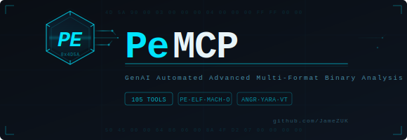

# PeMCP - GenAI Automated Advanced Multi-Format Binary Analysis



PeMCP is a professional-grade Python toolkit for in-depth static and dynamic analysis of **PE, ELF, Mach-O, .NET, Go, and Rust** binaries, plus raw shellcode. It operates as both a powerful CLI tool for generating comprehensive reports and as a **Model Context Protocol (MCP) server**, providing AI assistants and other MCP clients with **196 specialised tools** to interactively explore, decompile, and analyse binaries across all major platforms.

PeMCP bridges the gap between high-level AI reasoning and low-level binary instrumentation, turning any MCP-compatible client into a capable malware analyst.

---

## Table of Contents

- [Why PeMCP](#why-pemcp)
- [Key Features](#key-features)
- [Real-World Analysis Scenarios](#real-world-analysis-scenarios)
- [PeMCP vs Traditional Tools](#pemcp-vs-traditional-tools)
- [Quick Start with Claude Code](#quick-start-with-claude-code)
  - [Adding PeMCP via the CLI](#adding-pemcp-via-the-cli)
  - [Adding PeMCP via JSON Configuration](#adding-pemcp-via-json-configuration)
- [Analysis Skill for Claude Code](#analysis-skill-for-claude-code)
  - [What the Skill Does](#what-the-skill-does)
  - [Installing the Skill](#installing-the-skill)
  - [Using the Skill](#using-the-skill)
  - [Skill File Reference](#skill-file-reference)
- [Installation](#installation)
- [Modes of Operation](#modes-of-operation)
- [Configuration](#configuration)
- [MCP Tools Reference](#mcp-tools-reference)
- [Architecture & Design](#architecture--design)
  - [Pagination & Result Limits](#pagination--result-limits)
- [Multi-Format Analysis](#multi-format-analysis)
- [Testing](#testing)
- [Contributing](#contributing)
- [Licence](#licence)
- [Disclaimer](#disclaimer)

---

## Why PeMCP

### The Problem with Traditional Binary Analysis

Malware analysis has traditionally required analysts to master a complex toolchain — Ghidra for decompilation, IDA Pro for disassembly, CyberChef for data transforms, pestudio for PE triage, CFF Explorer for header inspection, YARA for signatures, and dozens more. Each tool has its own interface, scripting language, and learning curve. An analyst investigating a single sample might switch between 5-10 tools, manually correlating findings across disconnected workflows.

This creates three critical bottlenecks:

1. **Skill barrier** — Junior analysts spend months learning each tool before becoming productive. Even experienced analysts must memorise hundreds of commands, keyboard shortcuts, and scripting APIs across different tools.
2. **Context fragmentation** — Findings from one tool don't automatically inform analysis in another. The analyst becomes the integration layer, manually cross-referencing decompilation output with string analysis, import tables, and network IOCs.
3. **Repetitive drudgery** — The initial triage of every sample follows a predictable pattern (check hashes, scan signatures, extract strings, review imports, check entropy), yet analysts must manually execute these same steps every time.

### How PeMCP Changes the Game

PeMCP eliminates these bottlenecks by putting **196 specialised analysis tools behind a single AI-driven interface**. Instead of learning 10 different tools, you describe what you want to know in natural language and the AI orchestrates the right tools automatically.

**What makes PeMCP unique is the combination of three capabilities that no other single tool provides:**

1. **Breadth** — 196 tools spanning PE/ELF/Mach-O parsing, Angr-powered decompilation and symbolic execution, Binary Refinery's 200+ composable data transforms, YARA/Capa/FLOSS/PEiD signature engines, Qiling/Speakeasy emulation, .NET/Go/Rust specialised analysis, and VirusTotal integration. This is the equivalent of an entire malware lab in one MCP server.

2. **AI reasoning over results** — Unlike tools that just produce output, PeMCP feeds results back to an AI that can reason about them. When the AI decompiles a function and sees `VirtualAlloc` followed by `memcpy` and an indirect call, it doesn't just report the disassembly — it recognises the shellcode injection pattern, notes it as a finding, and suggests investigating the source buffer.

3. **Session continuity** — Analysis findings persist across the entire investigation. Notes, function summaries, and tool history survive context window limits and server restarts. The AI can call `get_analysis_digest()` at any point to recall everything learned so far, enabling investigations that span hours or days without losing context.

### Who Benefits

- **SOC analysts** triaging alerts — Ask "Is this file malicious?" and get an automated risk assessment with specific evidence in seconds instead of minutes.
- **Malware analysts** doing deep-dive reverse engineering — Use natural language to drive decompilation, symbolic execution, and data transformation without switching tools.
- **Incident responders** under time pressure — Rapidly extract IOCs, C2 configurations, and behavioural indicators from multiple samples in parallel.
- **Junior analysts** building skills — Learn by watching the AI explain its analysis choices, building intuition for which tools to use and why.
- **Threat intelligence teams** processing sample batches — Automate extraction of configs, hashes, and network indicators across malware families.

---

## Key Features

### Multi-Format Binary Support

PeMCP automatically detects and analyses binaries across all major platforms:

- **PE (Windows)** — Full parsing of DOS/NT Headers, Imports/Exports, Resources, TLS, Debug, Load Config, Rich Header, Overlay, and more.
- **ELF (Linux)** — Headers, sections, segments, symbols, dynamic dependencies, DWARF debug info.
- **Mach-O (macOS)** — Headers, load commands, segments, symbols, dynamic libraries, code signatures.
- **.NET Assemblies** — CLR headers, metadata tables, type/method definitions, CIL bytecode disassembly.
- **Go Binaries** — Compiler version, packages, function names, type definitions (works on stripped binaries via pclntab).
- **Rust Binaries** — Compiler version, crate dependencies, toolchain info, symbol demangling.
- **Raw Shellcode** — Architecture-aware loading with FLOSS string extraction.

### Advanced Binary Analysis (Powered by Angr)

39 tools powered by the **Angr** binary analysis framework, working across PE, ELF, and Mach-O:

- **Decompilation** — Convert assembly into human-readable C-like pseudocode on the fly.
- **Control Flow Graph (CFG)** — Generate and traverse function blocks and edges.
- **Symbolic Execution** — Automatically find inputs to reach specific code paths.
- **Emulation** — Execute functions with concrete arguments using the Unicorn engine.
- **Slicing & Dominators** — Perform forward/backward slicing to track data flow and identify critical code dependencies.
- **Reaching Definitions & Data Dependencies** — Track how values propagate through registers and memory.
- **Function Hooking** — Replace functions with custom SimProcedures for analysis.
- **Value Set Analysis** — Determine possible values of variables at each program point.
- **Binary Diffing** — Compare two binaries to find added/removed/modified functions.
- **Code Cave Detection** — Find unused space in binaries for patching.
- **C++ Class Recovery** — Identify vtables and class hierarchies.
- **Packing Detection** — Heuristic analysis of entropy and structure anomalies.

### Comprehensive Static Analysis

- **PE Structure** — 24 dedicated tools for every PE data directory and header.
- **Signatures** — Authenticode validation (Signify), certificate parsing (Cryptography), packer detection (PEiD), YARA scanning with bundled rules from [ReversingLabs](https://github.com/reversinglabs/reversinglabs-yara-rules) (MIT) and [Yara-Rules Community](https://github.com/Yara-Rules/rules) (GPL-2.0), and custom YARA rule execution.
- **Capabilities** — Integrated Capa analysis to map binary behaviours to the MITRE ATT&CK framework.
- **Strings** — FLOSS integration for extracting static, stack, tight, and decoded strings, ranked by relevance using StringSifter. VA-based string extraction for decompilation follow-up.
- **Crypto Analysis** — Detect crypto constants (AES S-box, DES, RC4), scan for API hashes, entropy analysis. Advanced crypto algorithm identification, automated key extraction, and brute-force decryption.
- **Deobfuscation** — Multi-byte XOR brute-forcing, format string detection, wide string extraction.
- **Payload Extraction** — Steganography detection, custom container parsing, and automated C2 configuration extraction.
- **IOC Export** — Structured IOC aggregation with JSON, CSV, and STIX 2.1 bundle export formats.
- **Unpacking** — Multi-method unpacking orchestration, PE reconstruction from memory dumps, and heuristic OEP detection.

### Extended Library Integrations

- **LIEF** — Multi-format binary parsing and modification (PE/ELF/Mach-O section editing).
- **Capstone** — Multi-architecture standalone disassembly (x86, ARM, MIPS, etc.).
- **Keystone** — Multi-architecture assembly (generate patches from mnemonics).
- **Speakeasy** — Windows API emulation for malware analysis (full PE and shellcode).
- **Qiling** — Cross-platform binary emulation (Windows/Linux/macOS, x86/x64/ARM/MIPS).
- **Un{i}packer** — Automatic PE unpacking (UPX, ASPack, FSG, etc.).
- **Binwalk** — Embedded file and firmware detection.
- **ppdeep/TLSH** — Fuzzy hashing for sample similarity comparison.
- **dnfile/dncil** — .NET metadata parsing and CIL bytecode disassembly.
- **pygore** — Go binary reverse engineering.
- **rustbininfo** — Rust binary metadata extraction.
- **pyelftools** — ELF and DWARF debug info parsing.
- **Binary Refinery** — 23 context-efficient tools (consolidated from 56 via dispatch pattern) for composable binary data transforms: encoding/decoding, crypto, compression, IOC extraction, PE/ELF/Mach-O section operations, .NET metadata, archive extraction, Office documents, PCAP/EVTX forensics, steganography, and multi-step pipelines. Only registered when binary-refinery is installed.

### Session Continuity & AI Progress Tracking

PeMCP is designed for **large binary corpus analysis** where AI clients need to maintain analytical context across long investigations and limited context windows:

- **Persistent Notes** — Record findings with `add_note()`, auto-summarise functions with `auto_note_function()`, and aggregate everything with `get_analysis_digest()`. Notes survive server restarts and are restored automatically when the same file is reopened.
- **Tool History** — Every tool invocation is recorded with parameters, result summaries, and timing. Use `get_tool_history()` to review what was done, or `get_session_summary()` for full session state.
- **Cross-Session Restoration** — When a previously analysed file is reopened, `open_file` returns a `session_context` field containing restored notes and prior tool history, enabling the AI to resume where it left off.
- **Analysis Digest** — `get_analysis_digest()` compiles all accumulated notes, triage findings, IOCs, coverage stats, and unexplored targets into a single context-efficient summary — what was *learned*, not just what tools ran.
- **Discoverability** — `list_tools_by_phase()` organises tools by workflow stage, `suggest_next_action()` recommends specific next steps based on session state, and `get_analysis_timeline()` merges tool history with notes into a chronological narrative.
- **Workflow Automation** — `generate_analysis_report()` produces a comprehensive Markdown report from accumulated findings, and `auto_name_sample()` suggests descriptive filenames based on detected capabilities and C2 indicators.
- **Project Export/Import** — Bundle analysis + notes + history + binary into a `.pemcp_project.tar.gz` for sharing or archiving with `export_project`.

### Dynamic File Loading, Caching & API Key Management

- **Auto-Detection** — `open_file` automatically detects PE/ELF/Mach-O from magic bytes. No need to specify the format.
- **No Pre-loading Required** — The MCP server starts without needing a file path. Use the `open_file` tool to load files dynamically.
- **Analysis Caching** — Results are cached to disk in `~/.pemcp/cache/`, keyed by SHA256 hash and compressed with gzip (~12x compression). Re-opening a previously analysed file loads instantly from cache.
- **Persistent Configuration** — API keys are stored securely in `~/.pemcp/config.json` and recalled automatically across sessions.
- **Progress Reporting** — Over 50 long-running tools report fine-grained progress to the MCP client in real time (percentage, stage descriptions). Tools running in background threads use a thread-safe `ProgressBridge` to push updates back to the async MCP context.

### Robust Architecture

- **Modular Package** — Clean `pemcp/` package structure with 39 tool modules, separated concerns (parsers, MCP tools, CLI, configuration).
- **Docker-First Design** — No interactive prompts. Dependencies are managed via Docker, making it container and CI/CD ready.
- **Thread-Safe State** — Centralised `AnalyzerState` class with locking for concurrent access.
- **Background Tasks** — Long-running operations (symbolic execution, Angr CFG) run asynchronously with heartbeat monitoring.
- **Pagination** — Tools that return lists support `limit` and `offset` parameters with LRU result caching, preventing response truncation and giving AI clients control over data volume per call (default limit 20 for most tools).
- **Smart Truncation** — MCP responses are automatically truncated to fit within 64KB limits whilst preserving structural integrity.
- **Graceful Degradation** — All 20+ optional libraries are detected at startup. Tools that require unavailable libraries return clear error messages instead of crashing.

---

## Real-World Analysis Scenarios

These scenarios demonstrate PeMCP's combined power across its tool categories. Each represents a common malware analysis task that traditionally requires multiple disconnected tools.

### Scenario 1: Triaging a Suspicious Email Attachment (2 minutes vs 30+ minutes)

**The situation:** A SOC analyst receives an alert about a suspicious `.doc` attachment. They need to determine if it's malicious and extract any IOCs.

**Traditional workflow:** Open in a sandbox VM, use `olevba` to extract macros, manually read VBA code, use CyberChef to decode Base64 payloads, use `strings` to find URLs, check hashes on VirusTotal — switching between 5+ tools.

**With PeMCP:**
```
Analyst: "Open this Office document and tell me if it's malicious"
```
PeMCP automatically:
1. `open_file("attachment.doc")` — detects OLE format
2. `get_triage_report(compact=True)` — instant risk assessment
3. `refinery_extract(operation='office', sub_operation='vba')` — extracts VBA macros
4. `refinery_deobfuscate_script(script_type='vba')` — deobfuscates the macro code
5. `refinery_extract_iocs()` — pulls URLs, IPs, domains from the deobfuscated script
6. `refinery_carve(operation='pattern', pattern='b64')` — finds and decodes Base64 payloads
7. `get_virustotal_report_for_loaded_file()` — checks community detection

The AI cross-references all findings: *"This document contains an obfuscated VBA macro that downloads a second-stage payload from hxxps://evil[.]com/payload.exe using PowerShell. The macro uses string concatenation and Chr() calls to evade static detection. Three unique C2 URLs were extracted."*

### Scenario 2: Extracting C2 Configuration from a Packed .NET RAT

**The situation:** A malware analyst has a .NET sample suspected to be AsyncRAT. The binary is packed and the C2 configuration is encrypted in string constants.

**Traditional workflow:** Use `de4dot` to deobfuscate, load in `dnSpy` to find the config class, manually identify the decryption routine, write a Python script to replicate the decryption, extract the C2 address — a process that can take 1-2 hours.

**With PeMCP:**
```
Analyst: "Analyse this .NET binary and extract the C2 configuration"
```
PeMCP orchestrates:
1. `open_file("sample.exe")` — detects .NET assembly
2. `dotnet_analyze()` — extracts CLR metadata, type/method definitions
3. `refinery_dotnet(operation='strings')` — extracts all .NET metadata strings
4. `refinery_dotnet(operation='fields')` — extracts constant field values (where RATs store encrypted configs)
5. `refinery_dotnet(operation='arrays')` — extracts byte array initialisers (AES keys, encrypted blobs)
6. `refinery_dotnet(operation='resources')` — checks for config stored in resources
7. `refinery_decrypt(algorithm='aes', key_hex='...', iv_hex='...')` — decrypts the config using extracted key material
8. `refinery_extract_iocs()` — extracts C2 URLs, ports, and mutex names from decrypted config

The AI correlates field names with known AsyncRAT config patterns: *"This is AsyncRAT v0.5.7B. The C2 server is 192.168.1[.]100:8808, with a backup at evil-c2[.]com:443. The mutex is 'AsyncMutex_6SI8OkPnk'. The AES-256 key was found in the Settings.Key field and the encrypted config was stored in Settings.Host, Settings.Port, and Settings.Pastebin fields."*

### Scenario 3: Analysing a Multi-Stage Dropper with Shellcode

**The situation:** A threat intel analyst has a PE dropper that unpacks multiple stages. Stage 1 is a packed PE, Stage 2 is XOR-encrypted shellcode in the overlay, and Stage 3 is a DLL downloaded to memory.

**With PeMCP:**
```
Analyst: "This looks like a multi-stage dropper. Help me unpack each stage."
```
PeMCP chains operations:
1. `open_file("dropper.exe")` — parses PE, background CFG starts
2. `get_triage_report()` — identifies high entropy sections, overlay data, suspicious imports (`VirtualAlloc`, `WriteProcessMemory`)
3. `detect_packing()` — confirms UPX packing on Stage 1
4. `auto_unpack_pe()` — unpacks Stage 1 via Un{i}packer
5. `refinery_pe_operations(operation='overlay')` — extracts Stage 2 from overlay
6. `refinery_xor(operation='guess_key')` — auto-detects the XOR key used on Stage 2
7. `refinery_xor(operation='apply', key_hex='...')` — decrypts Stage 2 shellcode
8. `refinery_executable(operation='disassemble')` — disassembles the decrypted shellcode
9. `emulate_shellcode_with_speakeasy()` — emulates the shellcode to capture API calls and network activity
10. `refinery_extract_iocs()` — extracts the Stage 3 download URL from emulation output

Each stage's findings are recorded with `auto_note_function()` and `add_note()`, so `get_analysis_digest()` provides a complete picture at any time.

### Scenario 4: Investigating a Go Binary on Linux

**The situation:** An IR team recovers a suspicious ELF binary from a compromised Linux server. It's a stripped Go binary with no symbols.

**With PeMCP:**
```
Analyst: "Analyse this Linux binary — it might be a backdoor"
```
1. `open_file("suspicious_elf")` — auto-detects ELF format
2. `elf_analyze()` — ELF headers, sections, segments, dynamic deps
3. `go_analyze()` — recovers Go compiler version, packages, and function names from `pclntab` (works on stripped binaries)
4. `get_triage_report()` — ELF-specific security checks (PIE, NX, RELRO, stack canaries)
5. `decompile_function_with_angr(address)` — decompile suspicious functions identified by package names
6. `refinery_extract_iocs()` — extract hardcoded IPs, domains, URLs
7. `get_capa_analysis_info()` — map capabilities to MITRE ATT&CK (file manipulation, process injection, network communication)

The AI recognises Go package names like `net/http`, `os/exec`, `crypto/tls` and correlates them with the decompiled functions: *"This is a Go-based reverse shell (compiled with Go 1.21.4). It establishes a TLS connection to C2 at 10.0.0[.]50:4443, receives commands via HTTP POST, and executes them via os/exec. It also has file exfiltration capabilities via the archive/zip package."*

### Scenario 5: Bulk IOC Extraction from a Forensic PCAP

**The situation:** An incident responder has a PCAP capture from a compromised network segment and needs to extract all malicious indicators.

**With PeMCP:**
```
Analyst: "Extract all IOCs and embedded files from this PCAP"
```
1. `refinery_forensic(operation='pcap')` — reassembles TCP streams, identifies protocols
2. `refinery_forensic(operation='pcap_http')` — extracts HTTP transactions with URLs, methods, and response bodies
3. `refinery_extract(operation='embedded')` — auto-detects embedded PE files, ZIPs, scripts in the extracted streams
4. `refinery_extract_iocs()` — extracts all URLs, IPs, domains, email addresses, hashes
5. `refinery_forensic(operation='defang')` — defangs all IOCs for safe sharing in reports

For each carved PE file, the analyst can immediately:
```
Analyst: "Open this carved PE and analyse it"
```
6. `open_file(carved_pe)` → `get_triage_report()` → `get_focused_imports()` → full analysis chain

---

## PeMCP vs Traditional Tools

### Comparison Matrix

| Capability | PeMCP | Ghidra | IDA Pro | pestudio | CyberChef | Binary Refinery CLI |
|---|---|---|---|---|---|---|
| **PE/ELF/Mach-O parsing** | 196 tools, auto-detect | Plugin-based | Plugin-based | PE only | No | No |
| **Decompilation** | Angr (auto, all archs) | Ghidra Decompiler | Hex-Rays ($$$) | No | No | No |
| **Symbolic execution** | Angr (automated) | Limited (Ghidra scripts) | No | No | No | No |
| **Data transforms** | 200+ via Binary Refinery | Manual scripting | Manual scripting | No | 300+ (manual) | 200+ (CLI) |
| **String analysis** | FLOSS + StringSifter ML ranking | Built-in (basic) | Built-in (basic) | Basic | No | Basic |
| **Signature scanning** | YARA + Capa + PEiD | YARA (plugin) | FLIRT signatures | Signatures | No | No |
| **Emulation** | Speakeasy + Qiling + Angr | Emulator (limited) | No | No | No | No |
| **AI reasoning** | Native (MCP protocol) | No | No | No | No | No |
| **Session persistence** | Notes + history + cache | Project files | IDB files | No | No | No |
| **Learning curve** | Natural language | Months | Months | Low | Moderate | Moderate |
| **Cost** | Free & open source | Free | $1,800+/year | Free | Free | Free |

### How PeMCP Complements (Not Replaces) Existing Tools

PeMCP is not meant to fully replace Ghidra or IDA Pro — those tools remain essential for deep interactive reverse engineering sessions where you need to manually rename variables, annotate code, and navigate complex control flow graphs in a visual GUI. Instead, PeMCP excels in different parts of the analysis lifecycle:

**Where PeMCP excels over Ghidra/IDA:**
- **Speed of initial triage** — PeMCP produces a comprehensive risk assessment in seconds. Ghidra takes 30+ seconds just to load and auto-analyse a binary, and IDA's auto-analysis can take minutes on large files.
- **Automated IOC extraction** — PeMCP extracts URLs, IPs, domains, hashes, and file paths automatically. In Ghidra/IDA, this requires custom scripts or manual searching.
- **Data transformation chains** — Decoding nested Base64 → XOR → zlib payloads is a single `refinery_pipeline` call. In Ghidra, you'd write a Jython script. In IDA, an IDAPython script. In CyberChef, you'd manually build a recipe.
- **Cross-tool correlation** — PeMCP's AI automatically connects findings: "The XOR key found in the .rdata section matches the key used to decrypt the config extracted from the .NET resources." No other tool does this automatically.
- **Multi-format support in one interface** — Analyse PE, ELF, Mach-O, .NET, Go, and Rust binaries without switching tools or learning different workflows.
- **Accessibility** — A junior analyst can ask "What does this function do?" and get an explanation. In Ghidra, they'd need to understand the decompiler output themselves.

**Where Ghidra/IDA still excel:**
- **Interactive visual navigation** — Ghidra's graph view, cross-reference browser, and function call trees are unmatched for manual code exploration.
- **Type reconstruction** — IDA's Hex-Rays decompiler produces higher-fidelity C pseudocode with better type propagation than Angr's decompiler.
- **Plugin ecosystems** — Ghidra has GhidraScript/Pyhidra, IDA has IDAPython — mature scripting for custom analysis workflows.
- **Debugging** — Both support live debugging. PeMCP is static/emulation-only.

**The ideal workflow combines both:**
1. **PeMCP for triage and automated analysis** — Get the risk assessment, extract IOCs, identify interesting functions, decode obfuscated data.
2. **Ghidra/IDA for targeted deep-dives** — When PeMCP identifies a critical function (e.g., "the decryption routine at 0x00401230"), open the binary in Ghidra to manually trace the algorithm and reconstruct data structures.

### PeMCP vs CyberChef / Binary Refinery CLI

CyberChef and Binary Refinery's command-line interface are powerful data transformation tools, but they require the analyst to know *which* transforms to apply and in *what order*. PeMCP wraps Binary Refinery's 200+ units behind an AI that can reason about the data:

- **CyberChef** — Browser-based, visual recipe builder. Great for known transform chains but requires manual operation selection. No binary analysis, no PE parsing, no decompilation.
- **Binary Refinery CLI** — Powerful pipe-based transforms (`data | b64 | xor[0x41] | zl`). Requires command-line expertise and knowledge of unit names. No AI reasoning.
- **PeMCP** — Wraps Binary Refinery into 23 context-efficient MCP tools, adds AI reasoning, and combines with PE parsing, decompilation, emulation, and signature scanning. The AI can look at encrypted data, hypothesise the encryption scheme, try `refinery_xor(operation='guess_key')`, and if that fails, try `refinery_auto_decrypt()`, all without the analyst knowing which specific refinery units to use.

---

## Quick Start with Claude Code

PeMCP integrates seamlessly with [Claude Code](https://docs.anthropic.com/en/docs/claude-code) via stdio transport. You can configure PeMCP using the `claude mcp add` CLI command or by editing JSON configuration files directly.

### Adding PeMCP via the CLI

The fastest way to add PeMCP to Claude Code is with the `claude mcp add` command.

**Add to the current project (recommended):**

```bash
claude mcp add --scope project pemcp -- python /path/to/PeMCP/PeMCP.py --mcp-server --samples-path /path/to/samples
```

**Add with a VirusTotal API key:**

```bash
claude mcp add --scope project -e VT_API_KEY=your-key-here pemcp -- python /path/to/PeMCP/PeMCP.py --mcp-server --samples-path /path/to/samples
```

**Add globally for all projects (user scope):**

```bash
claude mcp add --scope user pemcp -- python /path/to/PeMCP/PeMCP.py --mcp-server
```

**Add using Docker (via `run.sh` helper):**

```bash
claude mcp add --scope project pemcp -- /path/to/PeMCP/run.sh --stdio
```

**Add using Docker with a custom samples directory:**

```bash
claude mcp add --scope project pemcp -- /path/to/PeMCP/run.sh --samples /path/to/your/samples --stdio
```

The `run.sh` helper auto-detects Docker or Podman, builds the image if needed, and handles volume mounts and environment setup. The `--samples` flag mounts any local directory read-only into the container, mirroring the host folder name (e.g. `--samples ~/Downloads` mounts at `/Downloads`). To pass a VirusTotal API key, set it in your environment or `.env` file:

```bash
claude mcp add --scope project -e VT_API_KEY=your-key-here pemcp -- /path/to/PeMCP/run.sh --samples ~/malware-zoo --stdio
```

**Add a remote HTTP server:**

```bash
claude mcp add --transport http --scope project pemcp http://127.0.0.1:8082/mcp
```

**Verify the server was added:**

```bash
claude mcp list
```

**Remove the server:**

```bash
claude mcp remove pemcp
```

### Adding PeMCP via JSON Configuration

Alternatively, you can configure PeMCP by editing JSON files directly.

#### 1. Project-Level Configuration (Recommended)

Add a `.mcp.json` file to your project root (an example is included in this repository):

```json
{
  "mcpServers": {
    "pemcp": {
      "type": "stdio",
      "command": "python",
      "args": ["PeMCP.py", "--mcp-server"],
      "env": {
        "VT_API_KEY": ""
      }
    }
  }
}
```

Adjust the `command` path if PeMCP is installed elsewhere. Use `--samples-path` to point at your samples directory so the `list_samples` tool can discover files, or set the `PEMCP_SAMPLES` environment variable:

```json
{
  "mcpServers": {
    "pemcp": {
      "type": "stdio",
      "command": "python",
      "args": ["/path/to/PeMCP/PeMCP.py", "--mcp-server", "--samples-path", "/path/to/samples"],
      "env": {
        "VT_API_KEY": "your-api-key-here"
      }
    }
  }
}
```

#### 2. User-Level Configuration

For system-wide availability across all projects, add PeMCP to `~/.claude.json`:

```json
{
  "mcpServers": {
    "pemcp": {
      "type": "stdio",
      "command": "python",
      "args": ["/absolute/path/to/PeMCP/PeMCP.py", "--mcp-server"]
    }
  }
}
```

#### 3. Docker Configuration (via `run.sh`)

To use the Docker image with Claude Code, point the configuration at the `run.sh` helper script. Use `--samples` to specify where your binaries live on the host — the container path mirrors the host folder name (e.g. `--samples ~/Downloads` → `/Downloads`):

```json
{
  "mcpServers": {
    "pemcp": {
      "type": "stdio",
      "command": "/path/to/PeMCP/run.sh",
      "args": ["--samples", "/path/to/your/samples", "--stdio"],
      "env": {
        "VT_API_KEY": "your-api-key-here"
      }
    }
  }
}
```

Then in Claude Code, load files using the container path (which mirrors the host folder name):

```
open_file("/samples/malware.exe")
```

If `--samples` is omitted, the `./samples/` directory next to `run.sh` is mounted by default (at `/samples`). You can also set the `PEMCP_SAMPLES` environment variable instead of using the flag.

The `run.sh` helper automatically detects Docker or Podman, builds the image on first run, runs as your host UID (not root), and persists the analysis cache and configuration in `~/.pemcp` on the host (bind-mounted into the container). Use `--cache <dir>` or `PEMCP_CACHE` to override the location.

### Typical Workflow

Once configured, you can interact with PeMCP through Claude Code naturally:

1. **"What samples are available?"** — Claude calls `list_samples` to discover files in the configured samples directory
2. **"Open this sample for analysis"** — Claude calls `open_file` with the path (auto-detects PE/ELF/Mach-O). If `session_context` is returned, Claude knows to call `get_analysis_digest()` to review previous findings
3. **"What format is this?"** — Claude calls `detect_binary_format` to identify format and suggest tools
4. **"What does this binary do?"** — Claude retrieves the triage report (key findings are auto-saved as notes)
5. **"Decompile the main function"** — Claude uses Angr tools to decompile, then calls `auto_note_function(address)` to record a summary
6. **"Summarise what we've found"** — Claude calls `get_analysis_digest()` for an aggregated view of all findings
7. **"Is this a .NET binary?"** — Claude calls `dotnet_analyze` for CLR metadata and CIL disassembly
8. **"Analyse this Go binary"** — Claude calls `go_analyze` for packages, functions, compiler version
9. **"Check if it's on VirusTotal"** — Claude queries the VT API
10. **"Export this analysis"** — Claude calls `export_project` to save analysis + notes + history as a portable archive
11. **"Close the file"** — Claude calls `close_file` to free resources (notes and history are persisted to cache)

API keys can be set interactively: *"Set my VirusTotal API key to abc123"* — Claude calls `set_api_key`, and the key persists across sessions.

### Example Natural Language Queries

PeMCP understands analytical intent, not just tool commands. Here are examples of what you can ask:

**Triage & Classification:**
- *"Is this file malicious? Give me a quick assessment."*
- *"What kind of binary is this — is it a service, a DLL, an installer?"*
- *"Show me the most suspicious imports — skip the boring Windows API stuff."*
- *"What capabilities does MITRE ATT&CK map to this sample?"*

**Data Decoding & Decryption:**
- *"There's a Base64 blob at offset 0x1000 — decode it."*
- *"This data looks XOR encrypted. Can you figure out the key?"*
- *"Decode this: first Base64, then XOR with key 0x41, then decompress."* → uses `refinery_pipeline`
- *"Decrypt this AES-CBC ciphertext. The key is in the .rdata section."*

**Reverse Engineering:**
- *"Decompile the function at 0x00401230 and explain what it does."*
- *"What functions call VirtualAlloc? Which ones look suspicious?"*
- *"Find all the string references in the main function."*
- *"Is there shellcode injection happening? Check for VirtualAlloc → WriteProcessMemory patterns."*

**Forensics & IOC Extraction:**
- *"Extract all URLs, IPs, and domain names from this binary."*
- *"Parse this PCAP file and show me the HTTP transactions."*
- *"Extract the VBA macros from this Word document and deobfuscate them."*
- *"What's in this Windows Event Log? Show me the security events."*

**Multi-Stage Analysis:**
- *"This binary has overlay data — extract and analyse it."*
- *"Unpack this UPX-packed binary and re-analyse."*
- *"The .NET resources contain an encrypted payload — extract and decrypt it."*
- *"Emulate this shellcode and tell me what APIs it calls."*

---

## Analysis Skill for Claude Code

PeMCP ships with an **analysis skill** — a structured workflow that teaches Claude Code how to use PeMCP's 196 tools methodically, rather than relying on the model to figure it out from tool descriptions alone.

Without the skill, Claude Code can still call PeMCP tools individually, but it won't follow a structured analysis methodology, may miss important steps, and won't know PeMCP-specific patterns like session persistence, note-taking discipline, or unpacking cascades.

### What the Skill Does

The skill provides Claude Code with:

- **Goal-adaptive workflow** — Detects whether you want malware triage, deep reverse engineering, vulnerability auditing, firmware analysis, threat intel extraction, or binary comparison, and adjusts tool selection and depth accordingly.
- **Phased analysis** — Structured progression from environment discovery → identification → unpacking → mapping → deep dive → extraction → research → reporting, with clear decision points between phases.
- **Evidence-first methodology** — All findings must cite specific tool output. Indicators (VirusTotal detections, capa matches, YARA hits) are treated as leads to investigate, not conclusions. Extraction of C2 configs and decoded payloads includes the full chain of evidence (where the data was, what algorithm/key was used, how the key was obtained).
- **Multi-file workflows** — Guidance for dropper-payload relationships, DLL sideloading investigations, campaign sample comparison, and shellcode extraction from loaders, including cross-file reference discovery (searching strings and imports for companion filenames).
- **Context management** — Automatic note-taking after every decompilation, periodic digest calls to synthesise findings, and session persistence awareness.
- **Comprehensive tool coverage** — A complete reference for all 196 tools organised by use case, plus specialised guides for C2 config extraction, unpacking strategies, and safe online research methodology.

### Installing the Skill

The skill files live in `.claude/skills/analyze/` within the PeMCP repository. If you cloned the repo, they're already in place — no additional installation is needed.

**Verify the skill is present:**

```bash
ls .claude/skills/analyze/
```

You should see:

```
SKILL.md              # Core workflow — phases, operating principles, goal detection
tooling-reference.md  # Complete 196-tool catalog by use case
c2-extraction.md      # C2 config decoding patterns by malware family
unpacking-guide.md    # Packer identification and unpacking pipelines
online-research.md    # Safe online research and decoder translation
```

**If you're using PeMCP from a different working directory**, the skill won't auto-load since Claude Code skills are project-relative. You have two options:

1. **Run Claude Code from the PeMCP directory** (simplest):
   ```bash
   cd /path/to/PeMCP
   claude
   ```

2. **Copy the skill into your own project**:
   ```bash
   cp -r /path/to/PeMCP/.claude/skills /path/to/your/project/.claude/skills
   ```

### Using the Skill

**Automatic invocation** — The skill triggers automatically when Claude Code detects binary analysis context (PeMCP tools in the conversation, or keywords like "malware", "binary", "analyse", "PE", "ELF", "decompile", etc.). Just start talking about analysis and the skill activates.

**Manual invocation** — Type `/analyze` in Claude Code to explicitly activate the skill:

```
/analyze
```

**Example sessions:**

Quick malware triage:
```
> Open /samples/suspicious.exe and tell me if it's malicious
```

Deep reverse engineering:
```
> I need to fully reverse engineer this binary — find the crypto routines,
> extract any configs, and document how it works
```

Targeted extraction:
```
> This is AsyncRAT. Extract the C2 config and show me how you got it
```

Multi-file investigation:
```
> I have a dropper (loader.exe) and its payload (data.bin) in /samples —
> analyse them together
```

The skill runs autonomously through Phases 0-3 (environment discovery, identification, unpacking, mapping). Before entering the deep dive phase, it pauses to present findings so far and asks whether you want to proceed deeper and which areas to focus on. After analysis, it presents a concise evidence-backed summary and offers to generate a detailed report or export the session.

### Skill File Reference

| File | Purpose |
|------|---------|
| [`SKILL.md`](.claude/skills/analyze/SKILL.md) | Core workflow orchestration — operating principles, 8 analysis phases, goal detection, reporting format, multi-file workflows, context management |
| [`tooling-reference.md`](.claude/skills/analyze/tooling-reference.md) | Complete catalog of all 196 MCP tools organised by use case with brief descriptions and key parameters |
| [`c2-extraction.md`](.claude/skills/analyze/c2-extraction.md) | C2 config storage patterns, family-specific extraction strategies (Agent Tesla, AsyncRAT, Cobalt Strike, Emotet, Remcos, etc.), generic unknown-family approach, validation checklist |
| [`unpacking-guide.md`](.claude/skills/analyze/unpacking-guide.md) | Packer identification indicators, 5-method unpacking cascade (auto → orchestrated → emulation-based → emulation analysis → manual OEP), special cases for multi-layer packing, .NET obfuscators, shellcode loaders |
| [`online-research.md`](.claude/skills/analyze/online-research.md) | When and how to research online, search query patterns, read-and-understand methodology, decoder operation → PeMCP tool translation table, safety rules |

---

## Installation

### Option A: Docker (Recommended)

Docker handles all complex dependencies (Angr, Unicorn, Vivisect) automatically.

#### Quick Start with `run.sh`

The included `run.sh` helper auto-detects Docker or Podman and handles image building, volume mounts, and environment setup:

```bash
# Start HTTP MCP server (builds image if needed)
./run.sh

# Start stdio MCP server (for Claude Code)
./run.sh --stdio

# Mount a custom samples directory (read-only, mirrors host folder name)
./run.sh --samples ~/malware-zoo --stdio

# Analyse a file in CLI mode
./run.sh --analyze samples/suspicious.exe

# Open a shell in the container
./run.sh --shell

# Build/rebuild the image
./run.sh --build
```

Set environment variables as needed:

```bash
VT_API_KEY=abc123 PEMCP_PORT=9000 ./run.sh
PEMCP_SAMPLES=~/malware-zoo ./run.sh --stdio
```

Or copy `.env.example` to `.env` and fill in your values — `run.sh` loads it automatically.

#### Docker Compose

For more control, use Docker Compose directly:

```bash
# Start HTTP MCP server
docker compose up pemcp-http

# Start stdio MCP server
docker compose run --rm -i pemcp-stdio

# Build only
docker compose build
```

The `docker-compose.yml` defines two services:
- **`pemcp-http`** — Network-accessible MCP server with healthcheck and restart policy
- **`pemcp-stdio`** — For Claude Code / MCP client integration (behind the `stdio` profile)

Both services bind-mount `~/.pemcp` from the host for persistent cache and configuration (override with `PEMCP_CACHE`).

#### Manual Docker Commands

For most use cases, the `run.sh` helper is the recommended way to run PeMCP in Docker. It handles image building, volume mounts, environment variables, and runtime detection automatically:

```bash
# Build/rebuild the image
./run.sh --build

# Start HTTP MCP server (builds image if needed)
./run.sh

# Start stdio MCP server (for Claude Code)
./run.sh --stdio

# Analyse a file in CLI mode
./run.sh --analyze samples/suspicious.exe

# Open a shell in the container
./run.sh --shell
```

If you need to run Docker directly (e.g. for custom volume mounts or networking), the equivalent commands are:

```bash
# Build the image
docker build -t pemcp-toolkit .

# Run as MCP server (streamable-http)
docker run --rm -it \
  --user "$(id -u):$(id -g)" \
  -e HOME=/app/home \
  -p 8082:8082 \
  -v "$(pwd)/samples:/samples:ro" \
  -v "$HOME/.pemcp:/app/home/.pemcp:rw" \
  -e VT_API_KEY="your_key" \
  pemcp-toolkit \
  --mcp-server \
  --mcp-transport streamable-http \
  --mcp-host 0.0.0.0 \
  --samples-path /samples

# Run as MCP server (stdio, for Claude Code)
docker run --rm -i \
  --user "$(id -u):$(id -g)" \
  -e HOME=/app/home \
  -v "$(pwd)/samples:/samples:ro" \
  -v "$HOME/.pemcp:/app/home/.pemcp:rw" \
  pemcp-toolkit \
  --mcp-server \
  --samples-path /samples
```

> **Note:** The `-v $HOME/.pemcp:/app/home/.pemcp:rw` mount persists the analysis cache, notes, and API key configuration in your home directory. Without it, cached results and stored keys are lost when the container is removed. The `run.sh` helper configures this bind mount automatically (creating `~/.pemcp` if needed).

### Option B: Local Installation

Requires Python 3.10+ and cmake (for building Unicorn/Angr bindings).

```bash
# Install system dependencies (Ubuntu/Debian)
sudo apt-get install build-essential libssl-dev cmake

# Install Python packages
pip install -r requirements.txt
```

### Option C: Minimal Installation

For basic PE analysis without heavy dependencies:

```bash
pip install pefile networkx "mcp[cli]"
```

Optional packages can be added individually:
- `pip install cryptography signify` — Digital signature analysis
- `pip install yara-python` — YARA scanning (bundled rules from ReversingLabs and Yara-Rules Community are auto-downloaded on first run)
- `pip install requests` — VirusTotal integration
- `pip install rapidfuzz` — Fuzzy string search
- `pip install flare-capa` — Capability detection
- `pip install flare-floss vivisect` — Advanced string extraction
- `pip install stringsifter joblib numpy` — ML-based string ranking
- `pip install "angr[unicorn]"` — Decompilation, CFG, symbolic execution
- `pip install lief` — Multi-format binary parsing (PE/ELF/Mach-O)
- `pip install capstone` — Multi-architecture disassembly
- `pip install keystone-engine` — Multi-architecture assembly
- `pip install speakeasy-emulator` — Windows API emulation
- `pip install ppdeep py-tlsh` — Fuzzy hashing (ssdeep/TLSH)
- `pip install dnfile dncil` — .NET assembly analysis
- `pip install pygore` — Go binary analysis
- `pip install rustbininfo rust-demangler` — Rust binary analysis
- `pip install pyelftools` — ELF/DWARF analysis
- `pip install binwalk` — Embedded file detection
- `pip install unipacker` — Automatic PE unpacking
- `pip install qiling` — Cross-platform binary emulation (requires isolated venv with unicorn 1.x)
- `pip install dotnetfile` — .NET PE metadata
- `pip install binary-refinery` — Composable binary data transforms (encoding, crypto, compression, IOC extraction)

---

## Modes of Operation

### CLI Mode (One-Shot Report)

Generates a comprehensive, human-readable report. Requires `--input-file`.

```bash
python PeMCP.py --input-file malware.exe --verbose > report.txt
```

### MCP Server Mode (Interactive)

Starts the MCP server. The `--input-file` is optional — files can be loaded dynamically using the `open_file` tool.

```bash
# Start without a file (recommended for Claude Code)
python PeMCP.py --mcp-server

# Start with a samples directory (enables the list_samples tool)
python PeMCP.py --mcp-server --samples-path ./samples

# Start with a pre-loaded file
python PeMCP.py --mcp-server --input-file malware.exe

# Start with streamable-http transport (for network access)
python PeMCP.py --mcp-server --mcp-transport streamable-http --mcp-host 0.0.0.0 --mcp-port 8082 --samples-path ./samples
```

#### Transport Options

| Transport | Flag | Use Case |
|---|---|---|
| **stdio** (default) | `--mcp-transport stdio` | Claude Code, local MCP clients |
| **streamable-http** | `--mcp-transport streamable-http` | Network access, Docker, remote clients |
| **sse** (deprecated) | `--mcp-transport sse` | Legacy support only; use streamable-http instead |

---

## Configuration

### API Keys

PeMCP stores API keys persistently in `~/.pemcp/config.json` with restricted file permissions (owner-only). Environment variables always take priority over stored values.

**Setting keys via MCP tools:**
- Use the `set_api_key` tool: `set_api_key("vt_api_key", "your-key-here")`
- Use the `get_config` tool to view current configuration (keys are masked)

**Setting keys via environment variables:**
- `VT_API_KEY` — VirusTotal API key (overrides stored value)

**Setting keys via `.mcp.json`:**
```json
{
  "mcpServers": {
    "pemcp": {
      "type": "stdio",
      "command": "python",
      "args": ["PeMCP.py", "--mcp-server"],
      "env": {
        "VT_API_KEY": "your-key-here"
      }
    }
  }
}
```

### Analysis Cache

PeMCP caches analysis results to disk so that re-opening a previously analysed file is near-instant. Cache entries are stored as gzip-compressed JSON in `~/.pemcp/cache/`, keyed by the SHA256 hash of the file contents.

**How it works:**

1. When `open_file` is called, PeMCP computes the SHA256 of the file.
2. If a cached result exists for that hash, it is loaded directly (typically under 10 ms).
3. If no cache exists, the full analysis runs and the result is stored for future use.
4. Cache entries are automatically invalidated when the PeMCP version changes (parser updates).
5. LRU eviction removes the oldest entries when the cache exceeds its size limit.

**Cache configuration** (via `~/.pemcp/config.json` or environment variables):

| Setting | Environment Variable | Default | Description |
|---|---|---|---|
| `cache_enabled` | `PEMCP_CACHE_ENABLED` | `true` | Set to `"false"` to disable caching entirely |
| `cache_max_size_mb` | `PEMCP_CACHE_MAX_SIZE_MB` | `500` | Maximum total cache size in MB |

**Cache management MCP tools:**

| Tool | Description |
|---|---|
| `get_cache_stats` | View cache size, entry count, and per-file details |
| `clear_analysis_cache` | Remove all cached results |
| `remove_cached_analysis` | Remove a specific entry by SHA256 hash |

**Bypassing the cache:**

```
open_file("/path/to/binary", use_cache=False)  # Force fresh analysis
```

**Docker persistence:**

In Docker, the cache lives at `/app/home/.pemcp/cache/` inside the container, which is bind-mounted to `~/.pemcp` on the host. The `run.sh` helper sets this up automatically (creating the directory if needed):

```bash
# run.sh handles the bind mount automatically
./run.sh --stdio

# Override cache location
./run.sh --cache /path/to/cache --stdio

# Equivalent manual docker command (if not using run.sh)
docker run --rm -i \
  --user "$(id -u):$(id -g)" \
  -e HOME=/app/home \
  -v "$HOME/.pemcp:/app/home/.pemcp:rw" \
  -v "$(pwd)/samples:/samples:ro" \
  pemcp-toolkit --mcp-server --samples-path /samples
```

### Command-Line Options

| Option | Description |
|---|---|
| `--input-file PATH` | File to analyse (required for CLI, optional for MCP) |
| `--mode {auto,pe,elf,macho,shellcode}` | Analysis mode (default: auto, detects from magic bytes) |
| `--mcp-server` | Start in MCP server mode |
| `--mcp-transport {stdio,streamable-http,sse}` | Transport protocol (default: stdio) |
| `--mcp-host HOST` | Server host for HTTP transports (default: 127.0.0.1) |
| `--mcp-port PORT` | Server port for HTTP transports (default: 8082) |
| `--allowed-paths PATH [PATH ...]` | Restrict `open_file` to these directories (security sandbox for HTTP mode) |
| `--samples-path PATH` | Path to the samples directory. Enables the `list_samples` tool for AI clients to discover available files. Falls back to the `PEMCP_SAMPLES` environment variable if not set. |
| `--skip-capa` | Skip capa capability analysis |
| `--skip-floss` | Skip FLOSS string analysis |
| `--skip-peid` | Skip PEiD signature scanning |
| `-y, --yara-rules PATH` | Custom YARA rule file or directory. If not provided, uses bundled rules from ReversingLabs (MIT) and Yara-Rules Community (GPL-2.0), downloading them on first run |
| `--skip-yara` | Skip YARA scanning |
| `-v, --verbose` | Enable verbose output |

---

## MCP Tools Reference

PeMCP exposes **196 tools** organised into the following categories.

### File Management & Sample Discovery

| Tool | Description |
|---|---|
| `open_file` | Load and analyse a binary (PE/ELF/Mach-O/shellcode). Auto-detects format. For PE files, returns `quick_indicators` (hashes, entropy, packing likelihood, import count, signature status, capa severity count). |
| `close_file` | Close the loaded file and clear analysis data from memory. |
| `reanalyze_loaded_pe_file` | Re-run PE analysis with different options (skip/enable specific analyses). |
| `detect_binary_format` | Auto-detect binary format and suggest appropriate analysis tools. |
| `list_samples` | List files in the configured samples directory. Supports flat (top-level only) and recursive listing, glob pattern filtering (e.g. `*.exe`), and returns file metadata including size and magic-byte format hints (PE/ELF/Mach-O/ZIP/etc.). Paginated with `limit` and `offset`. Configured via `--samples-path` or `PEMCP_SAMPLES`. |

### Configuration & Utilities

| Tool | Description |
|---|---|
| `set_api_key` | Store an API key persistently in `~/.pemcp/config.json`. |
| `get_config` | View current configuration, available libraries, and loaded file status. |
| `get_current_datetime` | Retrieve current UTC and local date/time. |
| `check_task_status` | Monitor progress of background tasks (e.g., Angr CFG generation). |
| `get_extended_capabilities` | List all available tools and library versions. |
| `get_cache_stats` | View analysis cache statistics (entries, size, utilization). |
| `clear_analysis_cache` | Clear the entire disk-based analysis cache. |
| `remove_cached_analysis` | Remove a specific cached analysis by SHA256 hash. |

### PE Structure Analysis (3 tools)

| Tool | Description |
|---|---|
| `get_analyzed_file_summary` | High-level summary with counts of sections, imports, matches. Paginated (default limit 20). |
| `get_full_analysis_results` | Complete analysis data (all keys, with size guard). Requires explicit `limit`. |
| `get_pe_data` | **Unified data retrieval** — retrieve any PE analysis key by name (e.g., `get_pe_data(key='imports')`). Use `key='list'` to discover all 25 available keys with descriptions and sizes. Supports `limit` (default 20) and `offset` (default 0) for pagination. Replaces 25 individual `get_*_info` tools. |

Available `get_pe_data` keys: `file_hashes`, `dos_header`, `nt_headers`, `data_directories`, `sections`, `imports`, `exports`, `resources_summary`, `version_info`, `debug_info`, `digital_signature`, `peid_matches`, `yara_matches`, `rich_header`, `delay_load_imports`, `tls_info`, `load_config`, `com_descriptor`, `overlay_data`, `base_relocations`, `bound_imports`, `exception_data`, `coff_symbols`, `checksum_verification`, `pefile_warnings`.

### PE Extended Analysis (14 tools)

Many PE extended analysis tools support pagination via `limit` and `offset` parameters.

| Tool | Description |
|---|---|
| `get_section_permissions` | Human-readable section permission matrix (RWX). Paginated (default limit 20). |
| `get_pe_metadata` | Compilation timestamps, linker info, subsystem, DLL characteristics. |
| `extract_resources` | Extract and decode PE resources by type. Paginated (default limit 20). |
| `extract_manifest` | Extract and parse embedded application manifest XML. |
| `get_load_config_details` | Extended load config (SEH, CFG, RFG, CET details). |
| `extract_wide_strings` | Extract UTF-16LE wide strings from the binary. Paginated (default limit 20). |
| `detect_format_strings` | Detect printf/scanf format strings (format string vuln hunting). Paginated (default limit 20). |
| `detect_compression_headers` | Detect embedded compressed data (zlib, gzip, LZMA, etc.). Paginated (default limit 30). |
| `deobfuscate_xor_multi_byte` | Multi-byte XOR deobfuscation with known key. |
| `bruteforce_xor_key` | Brute-force single and multi-byte XOR keys against known plaintext. Paginated (default limit 10). |
| `detect_crypto_constants` | Detect crypto constants (AES S-box, DES, SHA, RC4, etc.). Paginated (default limit 20). |
| `analyze_entropy_by_offset` | Sliding-window entropy analysis to detect packed/encrypted regions. Paginated (default limit 50). |
| `scan_for_api_hashes` | Detect API hashing patterns (ROR13, CRC32, DJB2, FNV). Paginated (default limit 20). |
| `get_import_hash_analysis` | Import hash (imphash) with per-DLL analysis and anomaly detection. |

### Signature & Capability Analysis

| Tool | Description |
|---|---|
| `get_capa_analysis_info` | Capa capability rules overview with filtering. Paginated (default limit 20). |
| `get_capa_rule_match_details` | Detailed match info for a specific Capa rule. |

> **Note:** PEiD matches and YARA matches are now accessed via `get_pe_data(key='peid_matches')` and `get_pe_data(key='yara_matches')`.

### String Analysis (13 tools)

All string tools that return lists support pagination via `limit` (default 20) and `offset` (default 0) parameters. See [Pagination & Result Limits](#pagination--result-limits) for details.

| Tool | Description |
|---|---|
| `get_floss_analysis_info` | FLOSS results (static, stack, tight, decoded strings). Paginated (default limit 20). |
| `extract_strings_from_binary` | Extract printable ASCII strings, optionally ranked. Requires explicit `limit`. |
| `search_for_specific_strings` | Search for specific strings within the binary. |
| `search_floss_strings` | Regex search across FLOSS strings with score filtering. Paginated (default limit 20). |
| `get_top_sifted_strings` | ML-ranked strings from all sources with granular filtering. Requires explicit `limit`. |
| `get_strings_for_function` | All strings referenced by a specific function. Paginated (default limit 20). |
| `get_string_usage_context` | Disassembly context showing where a string is used. Paginated (default limit 20). |
| `fuzzy_search_strings` | Fuzzy matching to find similar strings. Requires explicit `limit`. |
| `find_and_decode_encoded_strings` | Multi-layer Base64/Hex/XOR decoding with heuristics. |
| `get_strings_summary` | Categorised string intelligence — groups strings by type (URLs, IPs, file paths, registry keys, mutex names, base64 blobs) with counts and top examples. |
| `search_yara_custom` | Compile and run custom YARA rules (provided as a string) against the loaded binary. Returns matching rules with offsets. Useful for validating hypotheses about byte patterns or structures. Paginated (default limit 20). |
| `get_string_at_va` | Extract a string at a virtual address by resolving VA to file offset. Reads bytes until null terminator with auto-encoding detection (ASCII/UTF-16LE). Useful when decompilation references a string pointer. |

### Triage & Forensics

| Tool | Description |
|---|---|
| `get_triage_report` | **Comprehensive automated triage** (25+ dimensions) — packing assessment, digital signatures, timestamp anomalies, Rich header fingerprint, suspicious imports & delay-load evasion, capa capabilities, network IOCs, section anomalies, overlay/appended data analysis, resource anomalies (nested PE detection), YARA matches, header corruption detection, TLS callback detection, security mitigations (ASLR/DEP/CFG/CET/XFG), version info spoofing, .NET indicators, export anomalies, high-value strings, ELF security features (PIE/NX/RELRO/canaries), Mach-O security (code signing/PIE), cumulative risk score, and format-aware tool suggestions. Paginated (default limit 20). |
| `classify_binary_purpose` | Classify binary type (GUI app, console app, DLL, service, driver, installer, .NET assembly) from headers, imports, and resources. |
| `get_virustotal_report_for_loaded_file` | Query VirusTotal for the file hash. |

### Deobfuscation & Utilities

| Tool | Description |
|---|---|
| `deobfuscate_base64` | Decode hex-encoded Base64 data. |
| `deobfuscate_xor_single_byte` | XOR-decrypt hex data with a single byte key. |
| `is_mostly_printable_ascii` | Check if a string is mostly printable. |
| `get_hex_dump` | Hex dump of a file region. |

### Binary Analysis — Core Angr (16 tools)

All angr tools that return lists support pagination via `limit` and `offset` parameters. The default `limit` is 20 for most tools. See [Pagination & Result Limits](#pagination--result-limits) for the full default table.

| Tool | Description |
|---|---|
| `list_angr_analyses` | **Discovery tool** — lists all available angr analysis capabilities grouped by category (decompilation, CFG, symbolic, slicing, forensic, hooks, modification) with parameter descriptions. Call this first to understand available analyses. |
| `decompile_function_with_angr` | C-like pseudocode for a function at a given address. |
| `get_function_cfg` | Control flow graph (nodes and edges) for a function. |
| `find_path_to_address` | Symbolic execution to find inputs reaching a target address. |
| `emulate_function_execution` | Emulate a function with concrete arguments. |
| `analyze_binary_loops` | Detect and characterise loops in the binary. Paginated (default limit 20). |
| `get_function_xrefs` | Cross-references (callers and callees) for a function. Paginated (default limit 20). |
| `get_backward_slice` | All code blocks that can reach a target address. Paginated (default limit 20). |
| `get_forward_slice` | All code reachable from a source address. Paginated (default limit 20). |
| `get_dominators` | Dominator blocks that must execute to reach a target. |
| `get_function_complexity_list` | Functions ranked by complexity (block/edge count). Paginated (default limit 20). |
| `extract_function_constants` | Hardcoded constants and string references in a function. Paginated (default limit 20). |
| `get_global_data_refs` | Global memory addresses read/written by a function. Paginated (default limit 20). |
| `scan_for_indirect_jumps` | Indirect jumps/calls (dynamic control flow) in a function. Paginated (default limit 20). |
| `patch_binary_memory` | Patch the loaded binary in memory with new bytes. |
| `get_cross_reference_map` | Multi-dimensional cross-reference — for one or more functions, returns API calls, string refs, callers, callees, suspicious imports, and complexity in a single response. |

### Binary Analysis — Extended Angr (24 tools)

| Tool | Description |
|---|---|
| `get_reaching_definitions` | Track how values propagate through registers and memory. Paginated (default limit 20). |
| `get_data_dependencies` | Data dependency analysis (def-use chains) for a function. Paginated (default limit 20). |
| `hook_function` | Replace a function with a custom SimProcedure. |
| `list_hooks` | List all active function hooks. |
| `unhook_function` | Remove a previously set hook. |
| `get_calling_conventions` | Detect calling conventions for functions. Paginated (default limit 20). |
| `get_function_variables` | Recover local variables and parameters. Paginated (default limit 80). |
| `disassemble_at_address` | Disassemble N instructions at a given address (default 30 instructions). |
| `identify_library_functions` | Identify standard library functions (libc, etc.). Paginated (default limit 20). |
| `get_control_dependencies` | Control dependency analysis for a function. Paginated (default limit 20). |
| `propagate_constants` | Constant propagation analysis. Paginated (default limit 80). |
| `diff_binaries` | Compare two binaries for added/removed/modified functions. Paginated (default limit 20). |
| `detect_self_modifying_code` | Detect code that writes to executable memory. Paginated (default limit 20). |
| `find_code_caves` | Find unused executable space for patching. Paginated (default limit 20). |
| `get_call_graph` | Generate full or filtered inter-procedural call graph. Paginated (default limit 50). |
| `find_path_with_custom_input` | Symbolic execution with custom constraints. |
| `emulate_with_watchpoints` | Emulate with memory/register watchpoints. |
| `get_annotated_disassembly` | Rich disassembly with resolved names and comments. Paginated (default limit 300). |
| `get_value_set_analysis` | Determine possible values at program points. Computationally expensive; consider `get_reaching_definitions` or `propagate_constants` for lighter analysis. Paginated (default limit 80). |
| `detect_packing` | Heuristic packing/encryption detection (not paginated). |
| `save_patched_binary` | Save a patched binary to disk. |
| `identify_cpp_classes` | Recover C++ vtables and class hierarchies. Paginated (default limit 20). |
| `get_function_map` | Smart function ranking — scores every function by interestingness (complexity, suspicious API calls, string refs, xref count) and groups by purpose. Paginated (default limit 30). |
| `find_anti_debug_comprehensive` | Comprehensive anti-analysis and anti-debug technique detection — checks specific API patterns (IsDebuggerPresent, NtQueryInformationProcess, timing checks, PEB access), TLS callbacks, and known evasion techniques. Returns a detailed inventory with severity ratings. |

### Extended Library Tools (13 tools)

| Tool | Description |
|---|---|
| `parse_binary_with_lief` | Multi-format binary parsing with LIEF (PE/ELF/Mach-O). |
| `modify_pe_section` | Modify PE section properties (name, characteristics). |
| `disassemble_raw_bytes` | Disassemble raw bytes with Capstone (any architecture). Paginated (default limit 20). |
| `assemble_instruction` | Assemble mnemonics to bytes with Keystone. |
| `patch_with_assembly` | Assemble and patch instructions into the binary. |
| `compute_similarity_hashes` | Compute ssdeep and TLSH fuzzy hashes. |
| `compare_file_similarity` | Compare two files using fuzzy hash similarity. |
| `emulate_pe_with_windows_apis` | Full Windows API emulation with Speakeasy. Paginated (default limit 20). |
| `emulate_shellcode_with_speakeasy` | Emulate shellcode with Windows API hooks. Paginated (default limit 20). |
| `auto_unpack_pe` | Automatically unpack packed PEs (UPX, ASPack, FSG, etc.). |
| `parse_dotnet_metadata` | Parse .NET metadata with dotnetfile. Paginated (default limit 20). |
| `scan_for_embedded_files` | Detect embedded files/firmware with Binwalk. Paginated (default limit 20). |
| `get_extended_capabilities` | List all available tools and library versions. |

### Qiling Cross-Platform Emulation (8 tools)

| Tool | Description |
|---|---|
| `emulate_binary_with_qiling` | Full OS emulation of PE/ELF/Mach-O binaries with behavioural report (API calls, file/registry/network activity). Cross-platform — unlike Speakeasy (Windows-only), Qiling handles Linux ELF and macOS Mach-O as well. Paginated (default limit 20). |
| `emulate_shellcode_with_qiling` | Multi-architecture shellcode emulation (x86, x64, ARM, ARM64, MIPS) with API/syscall capture. Paginated (default limit 20). |
| `qiling_trace_execution` | Instruction-level execution tracing with addresses, sizes, and raw bytes for each executed instruction. Paginated (default limit 50). |
| `qiling_hook_api_calls` | Hook specific APIs/syscalls to capture arguments and return values during emulation. Paginated (default limit 20). |
| `qiling_dump_unpacked_binary` | Dynamic unpacking via emulation — handles custom/unknown packers that YARA-based unipacker cannot identify. |
| `qiling_resolve_api_hashes` | Resolve API hash values (ROR13, CRC32, DJB2, FNV-1a) against known DLL exports. |
| `qiling_memory_search` | Run a binary then search process memory for decrypted strings, C2 URLs, keys, or byte patterns. Paginated (default limit 20). |
| `qiling_setup_check` | Check Qiling Framework setup status — venv availability, rootfs directory structure, and essential DLLs for each architecture. Provides specific copy commands for missing DLLs. |

> **Note:** Qiling runs in an isolated venv (`/app/qiling-venv`) with unicorn 1.x, keeping the main environment's unicorn 2.x intact for angr. Linux rootfs is pre-populated at Docker build time. Windows PE emulation requires real DLL files copied from a Windows installation — see `docs/QILING_ROOTFS.md` for setup instructions. Registry hive stubs are auto-generated at runtime.

### Multi-Format Binary Analysis (9 tools)

All multi-format analysis tools support pagination via `limit` (default 20) and `offset` (default 0) parameters.

| Tool | Description |
|---|---|
| `detect_binary_format` | Auto-detect format (PE/.NET/ELF/Mach-O/Go/Rust) from magic bytes. |
| `dotnet_analyze` | Comprehensive .NET metadata: CLR header, types, methods, assembly refs, user strings. Paginated (default limit 20). |
| `dotnet_disassemble_method` | Disassemble .NET CIL bytecode to human-readable opcodes. Paginated (default limit 20). |
| `go_analyze` | Go binary analysis: compiler version, packages, functions (works on stripped binaries). Paginated (default limit 20). |
| `rust_analyze` | Rust binary metadata: compiler version, crate dependencies, toolchain. |
| `rust_demangle_symbols` | Demangle Rust symbol names to human-readable form. Paginated (default limit 20). |
| `elf_analyze` | Comprehensive ELF analysis: headers, sections, segments, symbols, dynamic deps. Paginated (default limit 20). |
| `elf_dwarf_info` | Extract DWARF debug info: compilation units, functions, source files. Paginated (default limit 20). |
| `macho_analyze` | Mach-O analysis: headers, load commands, segments, symbols, dylibs, code signatures. Paginated (default limit 20). |

### Binary Refinery — Data Transforms (23 tools)

PeMCP integrates the full power of [Binary Refinery](https://github.com/binref/refinery) — a library of **200+ composable binary transformation units** — through 23 context-efficient MCP tools. Binary Refinery is used extensively by professional malware analysts for tasks like decrypting multi-layer obfuscation, extracting payloads from documents, unpacking installers, and parsing forensic artifacts. PeMCP makes these capabilities accessible through natural language, with the AI selecting the right units automatically.

All tools accept data as hex input or operate on the currently loaded file. All Refinery tools support pagination via `limit` (default 20) and `offset` (default 0) parameters. **Only registered when binary-refinery is installed** (lazy registration saves context tokens when absent).

> **Context efficiency:** 56 individual tools were consolidated into 23 using the dispatch pattern (`operation=...` parameter), saving ~33 tool definitions (~15-20K tokens) from the MCP catalog.

#### Core Transforms (11 tools)

| Tool | Description |
|---|---|
| `refinery_codec` | Encode or decode data using 18 encodings (b64, hex, b32, b58, b62, b85, a85, b92, url, esc, u16, uuenc, netbios, cp1252, wshenc, morse, htmlesc, z85). Use `direction='decode'` (default) or `direction='encode'`. Covers the encoding schemes most commonly encountered in malware obfuscation. |
| `refinery_decrypt` | Decrypt data using **35 cipher algorithms**: AES, DES, 3DES, RC4, Blowfish, Camellia, CAST, ChaCha20, Salsa20, Serpent, TEA/XTEA/XXTEA, RC2/RC5/RC6, SM4, Rabbit, SEAL, GOST, Fernet, Speck, HC-128/HC-256, ISAAC, Sosemanuk, Vigenere, ROT, Rijndael, Chaskey, and more. Supports ECB/CBC/CTR/CFB/OFB/GCM block modes. This covers virtually every encryption scheme found in real-world malware. |
| `refinery_xor` | XOR operations — the single most common obfuscation in malware. `operation='apply'` to XOR with a known key, or `operation='guess_key'` to automatically detect the XOR key using frequency analysis and known-plaintext attacks. The key guessing is effective against single-byte, multi-byte, and rolling XOR schemes. |
| `refinery_decompress` | Decompress data with 23 algorithms including auto-detection. Supports: zlib, bz2, LZMA, LZ4, Brotli, Zstandard, aPLib, LZNT1 (Windows NTFS compression), LZO, BriefLZ, LZF, LZJB, LZW, LZX (CAB), NRV (UPX), QuickLZ, SZDD (old MS), FastLZ, JCALG. The `auto` mode probes all formats. |
| `refinery_extract_iocs` | Extract IOCs from binary data: URLs, IPv4/IPv6 addresses, domain names, email addresses, file paths, hostnames, MD5/SHA1/SHA256 hashes, and GUIDs. Uses Binary Refinery's `xtp` pattern extractor which is more accurate than simple regex matching. |
| `refinery_carve` | Carve embedded data from binaries. `operation='pattern'` carves encoded blobs (Base64, hex, Base32, Base85, URL-encoded, int arrays, strings). `operation='files'` carves embedded file types (PE, ZIP, 7z, RTF, JSON, XML, LNK, DER certificates). Essential for extracting dropped payloads and embedded configs. |
| `refinery_pe_operations` | PE-specific operations: extract overlay data (common payload hiding spot), extract PE metadata, extract resources, strip debug/certificate data, debloat inflated binaries, extract Authenticode signatures. |
| `refinery_deobfuscate_script` | Deobfuscate malicious scripts: PowerShell (ps1), VBA macros (vba), and JavaScript (js). Uses dedicated deobfuscation engines that handle string concatenation, array lookups, arithmetic obfuscation, and encoding layers commonly used by malware droppers. |
| `refinery_hash` | Compute cryptographic hashes: MD5, SHA-1, SHA-256, SHA-384, SHA-512, CRC32, Adler32. |
| `refinery_pipeline` | **Multi-step transformation chains** — execute an ordered sequence of transforms in a single call. Example: `['b64', 'xor:41', 'zl']` decodes Base64, XORs with key 0x41, then decompresses with zlib. Supports all encoding, compression, and cipher units. This mirrors Binary Refinery's pipe operator (`data \| b64 \| xor[0x41] \| zl`) in a single API call. |
| `refinery_list_units` | Discovery tool — list all available Binary Refinery unit categories and units installed on the system, with counts per category. |

#### Advanced Transforms (8 tools)

| Tool | Description |
|---|---|
| `refinery_regex_extract` | Extract regex matches from binary data with named group support. Useful for extracting structured data (config values, encoded strings) from decompiled code or memory dumps. |
| `refinery_regex_replace` | Find and replace using regex in binary data with backreference support. |
| `refinery_auto_decrypt` | **Automatic decryption** — uses frequency analysis, known plaintext attacks, and file signature detection to automatically recover XOR/SUB encryption keys and decrypt data. Particularly effective against malware that XOR-encrypts payloads with repeating keys. |
| `refinery_key_derive` | Derive cryptographic keys from passwords using PBKDF2, HKDF, or HMAC with configurable hash algorithms (SHA-256, SHA-1, SHA-512, MD5). Essential for decrypting malware configs protected with password-derived keys. |
| `refinery_string_operations` | Binary string operations: snip (byte slicing), trim, replace, case conversion. Useful for extracting sub-sections of decoded data. |
| `refinery_pretty_print` | Pretty-print structured data (JSON, XML, JavaScript) for readability. Useful after decoding config files or protocol data. |
| `refinery_decompile` | Decompile compiled scripts: Python bytecode (`.pyc` files) to source code, and AutoIt scripts (`.a3x` compiled scripts). Both are common vectors for malware distribution. |
| `refinery_extract_domains` | Extract DNS domain names using wire-format parsing (more accurate than regex for DNS data). |

#### .NET Analysis (1 dispatched tool, 10 operations)

The `refinery_dotnet` tool provides deep .NET/CLR analysis — critical for analysing the large volume of .NET malware (Agent Tesla, AsyncRAT, Quasar RAT, RedLine Stealer, and many more).

| Tool | Operations |
|---|---|
| `refinery_dotnet` | **headers** — CLR metadata tables, assembly info, type/method definitions. **resources** — embedded .NET resources (images, configs, encrypted payloads). **managed_resources** — sub-files from ResourceManager containers. **strings** — all strings from #Strings and #US metadata streams. **blobs** — binary data from #Blob stream. **disassemble** — CIL/MSIL bytecode disassembly per method. **fields** — constant field values (where RATs store C2 URLs, encryption keys). **arrays** — byte-array initialisers (shellcode, encrypted payloads). **sfx** — unpack .NET single-file application bundles. **deserialize** — deserialize BinaryFormatter data to JSON. |

#### Executable Operations (1 dispatched tool, 7 operations)

| Tool | Operations |
|---|---|
| `refinery_executable` | **sections** — extract sections/segments from PE, ELF, or Mach-O with entropy calculation per section. **virtual_read** — read bytes at a virtual address. **file_to_virtual** — convert file offset to virtual address (and back). **disassemble** — native disassembly (x86/x64/ARM) via Capstone. **disassemble_cil** — .NET CIL/MSIL bytecode disassembly. **entropy_map** — visual entropy heatmap of the binary (identifies packed/encrypted regions at a glance). **stego** — extract hidden data from images via LSB steganography. |

#### Archive & Document Extraction (1 dispatched tool, 7 operations)

The `refinery_extract` tool handles every container format commonly encountered in malware delivery chains.

| Tool | Operations |
|---|---|
| `refinery_extract` | **archive** — extract from ZIP, 7z, TAR, gzip, CAB, ISO, CPIO, CHM, ACE (with password support). **installer** — unpack NSIS, InnoSetup, PyInstaller, Nuitka, Node.js, ASAR, minidumps. **office** — extract OLE streams, VBA macros, VBA p-code, strings, text, metadata, Excel cells, RTF objects, OneNote attachments. **office_decrypt** — decrypt password-protected Office documents. **xlm_deobfuscate** — deobfuscate Excel 4.0 (XLM) macros. **pdf** — extract objects and streams from PDFs (with optional decryption). **embedded** — auto-detect and extract all embedded files (PE, ZIP, ELF, PDF, OLE). |

#### Forensic Parsing (1 dispatched tool, 9 operations)

| Tool | Operations |
|---|---|
| `refinery_forensic` | **pcap** — parse PCAP files and reassemble TCP streams. **pcap_http** — extract HTTP requests/responses with URLs, methods, and bodies. **evtx** — parse Windows Event Log files. **registry** — parse Windows Registry hives (SAM, SYSTEM, NTUSER.DAT). **lnk** — parse Windows shortcut files (common malware delivery vector). **defang** — defang IOCs for safe sharing in reports. **url_guards** — strip URL protection wrappers (Microsoft SafeLinks, ProofPoint, etc.). **protobuf** — decode Protocol Buffer messages without a schema. **msgpack** — decode MessagePack binary data to JSON. |

#### Binary Refinery Power Combinations

The real power of PeMCP's Binary Refinery integration emerges when tools are chained together. Here are patterns the AI uses automatically:

**Decode multi-layer obfuscation:**
`refinery_carve(pattern='b64')` → `refinery_xor(operation='guess_key')` → `refinery_decompress(algorithm='auto')` → `refinery_extract_iocs()`

**Extract and analyse Office malware:**
`refinery_extract(operation='office', sub_operation='vba')` → `refinery_deobfuscate_script(script_type='vba')` → `refinery_carve(pattern='b64')` → `refinery_extract_iocs()`

**Decrypt .NET RAT configuration:**
`refinery_dotnet(operation='fields')` → `refinery_dotnet(operation='arrays')` → `refinery_decrypt(algorithm='aes')` → `refinery_extract_iocs()`

**Parse forensic artifacts:**
`refinery_forensic(operation='pcap_http')` → `refinery_extract(operation='embedded')` → per-file: `open_file()` → `get_triage_report()`

### Cryptographic Analysis (3 tools)

| Tool | Description |
|---|---|
| `identify_crypto_algorithm` | Identify cryptographic algorithms via S-box scanning, key schedule patterns, hash constants, CRC tables, and crypto API imports. Returns confidence-scored detections. Paginated (default limit 20). |
| `auto_extract_crypto_keys` | Search for potential cryptographic keys near identified constants using entropy-based heuristics. Returns key candidates with offset, entropy, and confidence scores. Paginated (default limit 20). |
| `brute_force_simple_crypto` | Brute-force XOR (single/multi-byte), RC4, ADD/SUB/ROL/ROR transforms against the loaded binary. Validates results by checking for PE headers, readable strings, and known patterns. Supports known-plaintext XOR key detection. Paginated (default limit 10). |

### Payload Extraction (3 tools)

| Tool | Description |
|---|---|
| `extract_steganography` | Detect data hidden after image EOF markers (PNG IEND, JPEG FFD9, GIF trailer), BMP size mismatches, and PE overlay data. Returns payload entropy, magic bytes, and extraction hints. Paginated (default limit 10). |
| `parse_custom_container` | Parse binary data following common malware container patterns: `delimiter_size_payload`, `size_payload`, or `fixed_chunks`. Auto-detects delimiters and chunk sizes with entropy analysis. Paginated (default limit 20). |
| `extract_config_automated` | Extract potential C2 configuration data using regex patterns — IPs, URLs, domains, registry keys, file paths, mutexes, and base64-encoded config blobs. Auto-saves significant findings as notes. Paginated (default limit 20). |

### IOC Export (1 tool)

| Tool | Description |
|---|---|
| `get_iocs_structured` | Aggregate IOCs from triage, string analysis, config extraction, and notes into a deduplicated, categorised collection. Supports three export formats: **JSON**, **CSV**, and **STIX 2.1 Bundle**. |

### Unpacking & OEP Detection (3 tools)

| Tool | Description |
|---|---|
| `try_all_unpackers` | Orchestrate multiple unpacking methods (Unipacker, Binary Refinery vstack, PE overlay extraction) and return the best result with method comparison. |
| `reconstruct_pe_from_dump` | Reconstruct a valid PE from a memory dump by fixing headers using LIEF — realigns sections, fixes SizeOfImage/SizeOfHeaders, and adjusts base address. |
| `find_oep_heuristic` | Detect Original Entry Point of packed binaries using multiple heuristics: tail-jump detection, section-hop analysis, entropy transitions, and known packer patterns. Returns confidence-scored candidates. Paginated (default limit 10). |

### Binary Comparison (1 tool)

| Tool | Description |
|---|---|
| `diff_payloads` | Compare two binary payloads byte-by-byte — reports identical/different regions, similarity percentage, and XOR relationship detection. For PE files, includes structural comparison (sections, imports). |

### Workflow & Reporting (2 tools)

| Tool | Description |
|---|---|
| `generate_analysis_report` | Generate a comprehensive analysis report from accumulated findings in Markdown or plain text — includes file info, risk assessment, key findings, explored functions, IOCs, analyst notes, and timeline. |
| `auto_name_sample` | Suggest a descriptive filename based on detected capabilities, classification, and C2 indicators (e.g. `service_keylogger_c2_192.168.105.250.dll`). |

### AI-Optimised Analysis — Streamlined Tools

These tools are designed for progressive, context-efficient analysis by AI clients with limited context windows. They provide summaries first, details on demand, and cross-reference data across multiple analysis dimensions. All list-returning tools support pagination via `limit` and `offset` parameters.

| Tool | Description |
|---|---|
| `get_triage_report(compact=True)` | **Compact triage** — risk level, score, top findings, and next-tool suggestions in ~2KB instead of ~20KB. Use `compact=False` for the full report. Paginated (default limit 20). |
| `get_focused_imports` | **Filtered import view** — returns only security-relevant imports categorised by threat behaviour (process injection, networking, crypto, anti-analysis, etc.), filtering out thousands of benign imports. Paginated (default limit 20). |
| `get_strings_summary` | **Categorised string intelligence** — groups strings by type (URLs, IPs, file paths, registry keys, mutex names, base64 blobs) with counts and top examples per category. |
| `get_function_map` | **Smart function ranking** — scores every function by interestingness (complexity, suspicious API calls, string refs, xref count, entry point status) and groups by purpose. Falls back to import-based categorisation when angr is unavailable. Paginated (default limit 30). |
| `get_cross_reference_map` | **Multi-dimensional cross-reference** — for one or more functions, returns API calls, string refs, callers, callees, suspicious imports, and complexity in a single response. |
| `auto_note_function` | **Auto-summarise a function** — generates a one-line behavioral summary from API call patterns and saves it as a persistent note for later aggregation. |
| `get_analysis_digest` | **Running analysis summary** — aggregates triage findings, function notes, IOCs, coverage stats, and unexplored high-priority targets into a context-efficient digest. Call periodically to refresh understanding. |
| `get_function_complexity_list(compact=True)` | **Compact complexity list** — returns minimal per-function data (addr, name, blocks) instead of the full structure. Paginated (default limit 20). |
| `list_tools_by_phase(phase)` | **Tool discovery** — browse all tools grouped by analysis phase (triage, explore, deep-dive, context, utility). Helps find the right tool for the current stage. |
| `suggest_next_action()` | **Smart recommendations** — analyses current session state (loaded file, notes, tool history) and recommends 3-5 specific next steps. |
| `get_analysis_timeline()` | **Investigation narrative** — merges tool history with notes into a single chronological timeline showing the full analysis story. Paginated (default limit 20). |

#### Recommended AI Workflow

1. **`get_config()`** — discover writable paths, container environment, and available libraries
2. **`open_file(path)`** — load binary, auto-starts background angr CFG. If `session_context` is present, call `get_analysis_digest()` first to review previous findings.
3. **`get_triage_report(compact=True)`** — initial risk assessment in ~2KB. **Key findings are auto-saved as notes.**
4. **`get_focused_imports()`** — understand what suspicious APIs are imported
5. **`get_strings_summary()`** — categorised string overview
6. **`get_function_map()`** — find the most interesting functions to investigate (default limit 30; use `limit` and `offset` to page through results)
7. **`decompile_function_with_angr(address)`** — deep-dive into each target
8. **`auto_note_function(address)`** — **ALWAYS call after each decompilation** to record what you learned
9. **`add_note(content, category='tool_result')`** — record any important manual findings (decoded IOCs, anti-debug tricks, etc.)
10. **`get_analysis_digest()`** — call every 3-5 decompilations to refresh your understanding

> **Pagination tip:** Most tools default to returning 20 items per page. If results indicate `"has_more": true` in the `_pagination` block, call the same tool with an incremented `offset` to fetch the next page.

### Session Persistence & Notes

Notes and tool history are the primary mechanism for preserving analysis context across sessions and managing long-running investigations within limited context windows. All notes and history persist to disk automatically.

**How notes work:**
- **Automatic**: `get_triage_report()` auto-saves risk assessment, critical imports, and IOCs as `tool_result` notes
- **Function summaries**: `auto_note_function(address)` generates and saves one-line behavioral summaries from API patterns — call this after every decompilation
- **Manual findings**: `add_note(content, category='tool_result')` records specific observations (decoded C2 URLs, crypto keys, evasion techniques)
- **Aggregation**: `get_analysis_digest()` compiles all notes into an actionable summary with coverage stats and unexplored targets
- **Persistence**: Notes survive server restarts. When the same file is reopened, all previous notes and history are restored automatically
- **Export**: `export_project` bundles analysis + notes + history + optionally the binary into a `.pemcp_project.tar.gz` for sharing

| Tool | Description |
|---|---|
| `add_note` | Record a finding or observation (persisted to disk cache, survives restarts). |
| `get_notes` | Retrieve notes, filtered by category or address. Paginated (default limit 20). |
| `update_note` / `delete_note` | Modify or remove notes. |
| `auto_note_function` | Auto-generate and save a one-line function summary from API patterns. |
| `get_tool_history` | View the history of tools run during this session. Paginated (default limit 20). |
| `clear_tool_history` | Clear the tool invocation history for the current session. |
| `get_session_summary` | Full session state: file info, notes, tool history, angr status, analysis phase. |
| `get_analysis_digest` | Accumulated findings digest — what was *learned*, not just what tools ran. |
| `get_progress_overview` | Lightweight progress snapshot — analysis phase, note count, tool history count, and coverage percentage. |
| `list_tools_by_phase` | Browse available tools organised by analysis phase (triage, explore, deep-dive, context, utility). Helps discover the right tool for your current workflow stage. |
| `suggest_next_action` | Analyse current session state and recommend 3-5 specific next steps based on what has already been done and what remains unexplored. |
| `get_analysis_timeline` | Merge tool history with notes into a single chronological timeline. Paginated (default limit 20). |
| `export_project` | Export session (analysis + notes + history + optionally the binary) as `.pemcp_project.tar.gz`. |
| `import_project` | Import a previously exported project archive. |

---

## Architecture & Design

### Package Structure

```
PeMCP.py                        # Entry point (thin wrapper)
pemcp/
├── __init__.py                 # Package metadata
├── __main__.py                 # python -m pemcp support
├── state.py                    # Thread-safe AnalyzerState
├── config.py                   # Imports, availability flags, constants
├── cache.py                    # Disk-based analysis cache (gzip/LRU)
├── user_config.py              # Persistent API key storage (~/.pemcp/)
├── utils.py                    # Utility functions
├── hashing.py                  # ssdeep implementation
├── mock.py                     # MockPE for non-PE/shellcode mode
├── background.py               # Background task management
├── resources.py                # PEiD/capa/YARA rule downloads
├── parsers/
│   ├── pe.py                   # PE structure parsing
│   ├── capa.py                 # Capa integration
│   ├── floss.py                # FLOSS integration
│   ├── signatures.py           # PEiD/YARA scanning
│   └── strings.py              # String utilities
├── cli/
│   └── printers.py             # CLI output formatting
└── mcp/
    ├── __init__.py
    ├── server.py                — MCP server setup, response truncation & validation helpers
    ├── _angr_helpers.py         — Shared angr utilities (project/CFG init, address resolution)
    ├── _format_helpers.py       — Shared binary format helpers
    ├── _refinery_helpers.py     — Shared Binary Refinery utilities (hex conversion, safety limits)
    ├── _progress_bridge.py      — Thread-safe MCP progress bridge for background tools
    ├── _category_maps.py        — Category mappings for tool organisation
    ├── _input_helpers.py        — Hex/int parameter parsing, LRU result cache, pagination utilities
    ├── tools_pe.py              — File management & PE data retrieval (7 tools)
    ├── tools_pe_extended.py     — Extended PE analysis (14 tools)
    ├── tools_strings.py         — String analysis, capa, fuzzy search & custom YARA (13 tools)
    ├── tools_angr.py            — Core angr tools (16 tools)
    ├── tools_angr_disasm.py     — Angr disassembly & function recovery (6 tools)
    ├── tools_angr_dataflow.py   — Angr data flow analysis (5 tools)
    ├── tools_angr_hooks.py      — Angr function hooking (3 tools)
    ├── tools_angr_forensic.py   — Angr forensic & advanced analysis (10 tools)
    ├── tools_new_libs.py        — LIEF/Capstone/Keystone/Speakeasy (13 tools)
    ├── tools_qiling.py          — Qiling cross-platform emulation (8 tools)
    ├── tools_dotnet.py          — .NET analysis (dnfile/dncil, 2 tools)
    ├── tools_go.py              — Go binary analysis (pygore, 1 tool)
    ├── tools_rust.py            — Rust binary analysis (2 tools)
    ├── tools_elf.py             — ELF analysis (pyelftools, 2 tools)
    ├── tools_macho.py           — Mach-O analysis (LIEF, 1 tool)
    ├── tools_format_detect.py   — Auto binary format detection (1 tool)
    ├── tools_virustotal.py      — VirusTotal API integration (1 tool)
    ├── tools_deobfuscation.py   — Hex dump & deobfuscation tools (5 tools)
    ├── tools_triage.py          — Comprehensive triage report (1 tool)
    ├── tools_cache.py           — Analysis cache management (3 tools)
    ├── tools_config.py          — Configuration & utility tools (4 tools)
    ├── tools_classification.py  — Binary purpose classification (1 tool)
    ├── tools_samples.py         — Sample directory listing & discovery (1 tool)
    ├── tools_notes.py           — Persistent notes management (5 tools)
    ├── tools_history.py         — Tool invocation history (2 tools)
    ├── tools_session.py         — Session summary, analysis digest & discoverability (6 tools)
    ├── tools_export.py          — Project export/import (2 tools)
    ├── tools_crypto.py          — Cryptographic algorithm identification & key extraction (3 tools)
    ├── tools_payload.py         — Steganography, container parsing & config extraction (3 tools)
    ├── tools_ioc.py             — Structured IOC export (JSON/CSV/STIX) (1 tool)
    ├── tools_unpack.py          — Multi-method unpacking & OEP detection (3 tools)
    ├── tools_diff.py            — Binary payload comparison (1 tool)
    ├── tools_workflow.py        — Report generation & sample naming (2 tools)
    ├── tools_refinery.py        — Binary Refinery core transforms (11 tools)
    ├── tools_refinery_advanced.py — Refinery advanced transforms (8 tools)
    ├── tools_refinery_dotnet.py — Refinery .NET analysis (1 dispatched tool)
    ├── tools_refinery_executable.py — Refinery executable operations (1 dispatched tool)
    ├── tools_refinery_extract.py — Refinery archive/document extraction (1 dispatched tool)
    └── tools_refinery_forensic.py — Refinery forensic parsing (1 dispatched tool)
```

### Design Principles

- **Single-File Analysis Context** — The server holds one file in memory via `AnalyzerState`. All tools operate on this shared context. Use `open_file` and `close_file` to switch between files.
- **Disk-Based Caching** — Analysis results are cached in `~/.pemcp/cache/` as gzip-compressed JSON, keyed by SHA256. Re-opening a previously analysed file loads from cache in under 10 ms. LRU eviction keeps cache size bounded.
- **Lazy Loading** — Heavy analysis (Angr CFG) runs in the background. The server is usable immediately.
- **Smart Truncation** — MCP responses exceeding 64KB are intelligently truncated (lists shortened, strings clipped) whilst preserving structure.
- **Graceful Degradation** — Optional libraries (Angr, Capa, FLOSS, etc.) are detected at startup. Tools that require unavailable libraries return clear error messages instead of crashing.

### Pagination & Result Limits

Most tools that return lists of results support **pagination** via `limit` and `offset` parameters. This prevents response truncation and gives AI clients control over how much data they receive per call.

#### How Pagination Works

Every paginated tool response includes a `_pagination` metadata block:

```json
{
  "results": [ ... ],
  "count": 20,
  "_pagination": {
    "total": 150,
    "offset": 0,
    "limit": 20,
    "returned": 20,
    "has_more": true
  }
}
```

To fetch the next page, call the same tool with `offset=20` (or whatever `offset + limit` is). Continue until `has_more` is `false`.

#### Default Limits

The default `limit` varies by tool to balance context efficiency with completeness:

| Default `limit` | Tools |
|---|---|
| **20** | Most tools — `get_pe_data`, `get_floss_analysis_info`, `get_capa_analysis_info`, `get_function_xrefs`, `get_backward_slice`, `get_forward_slice`, `get_function_complexity_list`, `extract_function_constants`, `get_global_data_refs`, `scan_for_indirect_jumps`, `get_reaching_definitions`, `get_data_dependencies`, `get_control_dependencies`, `identify_library_functions`, `diff_binaries`, `detect_self_modifying_code`, `find_code_caves`, `identify_cpp_classes`, `identify_crypto_algorithm`, `auto_extract_crypto_keys`, all Refinery tools, all multi-format analysis tools (`dotnet_analyze`, `elf_analyze`, `macho_analyze`, `go_analyze`), `get_notes`, `get_tool_history`, `get_triage_report`, and more |
| **30** | `get_function_map` (function ranking), `disassemble_at_address` (instructions) |
| **50** | `get_call_graph` (call graph edges), `analyze_entropy_by_offset`, `qiling_trace_execution` |
| **80** | `get_value_set_analysis`, `propagate_constants`, `get_function_variables` |
| **300** | `get_annotated_disassembly` (rich disassembly blocks) |
| **10** | `brute_force_simple_crypto`, `extract_steganography`, `bruteforce_xor_key`, `find_oep_heuristic` |

The hard upper bound on `limit` is **100,000** (enforced in `get_pe_data` and string tools) to prevent excessive memory allocation.

#### Result Caching (LRU)

Paginated results are cached in an **LRU cache** (5 slots per tool) so that paging through results doesn't re-compute the full dataset on each call. The cache is keyed by tool name and non-pagination parameters — changing `offset` or `limit` hits the same cache entry. The internal maximum cached items per result set is **5,000**.

#### Session & State Limits

| Setting | Value | Description |
|---|---|---|
| `MAX_COMPLETED_TASKS` | 50 | Maximum completed/failed background tasks retained per session |
| `MAX_TOOL_HISTORY` | 500 | Maximum tool invocation history entries retained per session |
| `SESSION_TTL_SECONDS` | 3600 | Session lifetime before cleanup (1 hour) |
| `MAX_MCP_RESPONSE_SIZE_KB` | 64 | MCP response size limit per the protocol specification |
| `PEMCP_MAX_CONCURRENT_ANALYSES` | 3 | Concurrent heavy analysis semaphore (configurable via environment variable) |

---

## Multi-Format Analysis

### Auto-Detection (Recommended)

PeMCP automatically detects the binary format from magic bytes:

```
open_file("/path/to/binary")  # Auto-detects PE, ELF, or Mach-O
```

### ELF Binaries (Linux)

```bash
# CLI mode
python PeMCP.py --input-file binary.elf --mode elf

# MCP mode — use elf_analyze, elf_dwarf_info, plus all angr tools
open_file("/path/to/binary", mode="elf")
```

### Mach-O Binaries (macOS)

```bash
# CLI mode
python PeMCP.py --input-file binary.macho --mode macho

# MCP mode — use macho_analyze, plus all angr tools
open_file("/path/to/binary", mode="macho")
```

### .NET, Go, and Rust Binaries

These format-specific tools work on any loaded binary:

```
dotnet_analyze("/path/to/assembly.exe")     # .NET CLR metadata
go_analyze("/path/to/go-binary")            # Go packages and functions
rust_analyze("/path/to/rust-binary")        # Rust crate dependencies
```

### Shellcode Analysis

PeMCP supports raw shellcode analysis:

```bash
# CLI mode
python PeMCP.py --input-file shellcode.bin --mode shellcode

# MCP server mode with architecture hint
python PeMCP.py --mcp-server --input-file shellcode.bin --mode shellcode --floss-format sc64
```

In MCP mode, you can also open shellcode dynamically:

```
open_file("/path/to/shellcode.bin", mode="shellcode")
```

Use `--floss-format sc64` (64-bit) or `--floss-format sc32` (32-bit) to provide architecture hints to FLOSS and Angr.

---

## Security

### Path Sandboxing

When running PeMCP in HTTP mode (`--mcp-transport streamable-http`), any MCP client can call `open_file` to read files on the server. Use `--allowed-paths` to restrict access:

```bash
# Only allow access to /samples and /tmp
python PeMCP.py --mcp-server --mcp-transport streamable-http \
  --allowed-paths /samples /tmp

# Docker with sandboxing (via run.sh — extra flags are passed through)
./run.sh --allowed-paths /samples

# Equivalent manual docker command
docker run --rm -it -p 8082:8082 \
  --user "$(id -u):$(id -g)" \
  -e HOME=/app/home \
  -v "$(pwd)/samples:/samples:ro" \
  pemcp-toolkit \
  --mcp-server --mcp-transport streamable-http --mcp-host 0.0.0.0 \
  --allowed-paths /samples \
  --samples-path /samples
```

If `--allowed-paths` is not set in HTTP mode, PeMCP logs a warning at startup.

### Other Security Measures

- **Non-root Docker**: The `run.sh` helper runs the container as your host UID/GID (`--user "$(id -u):$(id -g)"`), never as root.
- **API key storage**: Keys are stored in `~/.pemcp/config.json` with 0o600 (owner-only) permissions.
- **Zip-slip protection**: Archive extraction validates member paths against directory traversal.
- **No hardcoded secrets**: API keys are sourced from environment variables or the config file.

### Testing & CI/CD

PeMCP has two layers of testing, with automated CI via **GitHub Actions**:

- **Unit tests** (`tests/`) — 398 fast tests covering core modules (utils, cache, state, hashing, parsers, MCP helpers), plus parametrized edge-case tests and concurrency tests for session isolation. No server or binary samples required. Run in ~2 seconds.
- **Integration tests** (`mcp_test_client.py`) — End-to-end tests for all 196 MCP tools against a running server, organised into 19 test categories with pytest markers.
- **CI/CD** (`.github/workflows/ci.yml`) — Automated unit tests on Python 3.10/3.11/3.12, coverage enforcement (60% floor), and syntax checking on every push and PR.

```bash
# Run unit tests (no server needed)
pytest tests/ -v

# Run unit tests with coverage
pytest tests/ -v --cov=pemcp --cov-report=term-missing

# Run integration tests (requires running server)
pytest mcp_test_client.py -v
```

For detailed instructions on running tests, writing new tests, coverage, CI/CD, environment variables, test categories, markers, and troubleshooting, see **[TESTING.md](TESTING.md)**.

---

## Contributing

Contributions are welcome!

1. Fork the repository.
2. Create a feature branch (`git checkout -b feature/your-enhancement`).
3. Commit your changes.
4. Push to the branch.
5. Open a Pull Request.

---

## Licence

Distributed under the MIT Licence. See `LICENSE` for more information.

---

## Disclaimer

This toolkit is provided "as-is" for educational and research purposes only. It is capable of executing parts of analysed binaries (via Angr emulation and symbolic execution) in a sandboxed environment. Always exercise caution when analysing untrusted files. The authors accept no responsibility for misuse or damages arising from the use of this software.
