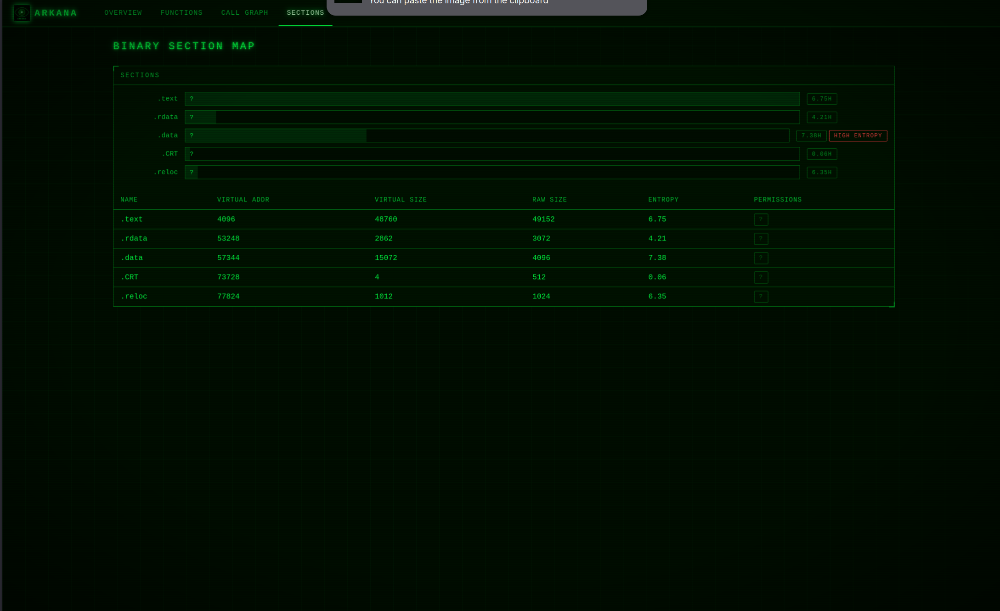
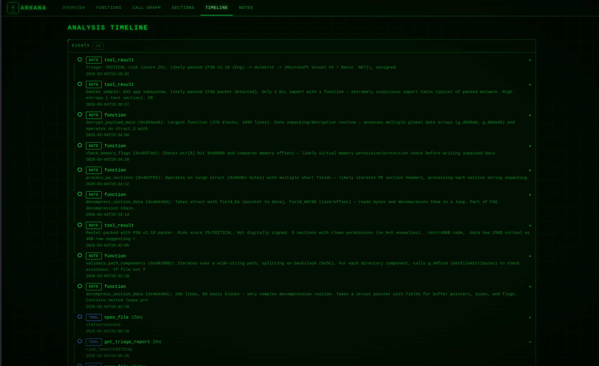

# Web Dashboard

Arkana includes a real-time CRT-themed web dashboard that launches automatically on port 8082. It provides a visual companion to the AI-driven analysis, letting you observe and interact with the investigation as it happens.

The dashboard uses token-based authentication (persisted to `~/.arkana/dashboard_token`). The access URL with token is printed at server startup and available via the `get_config()` MCP tool.

---

## Overview

Binary summary with risk score, packing status, security mitigations, key findings, and recent notes.

---

## Functions

Sortable function explorer with triage buttons (FLAG / SUS / CLN). Flagged functions are automatically prioritised by the AI in subsequent analysis via `get_session_summary()`, `get_analysis_digest()`, and `suggest_next_action()`.

Each function row has an **XREF** button that opens an inline analysis panel with three tabs:

- **XREFS** -- Cross-references showing callers and callees, enriched with triage dots (colour-coded by triage status), complexity scores, and suspicious API detection. Suspicious APIs are flagged with risk badges (CRITICAL / HIGH / MEDIUM) and categorised (process injection, credential theft, anti-analysis, etc.). All callers and callees are clickable -- clicking navigates to that function in the table with a highlight flash animation.
- **STRINGS** -- Strings associated with the function, with type badges (STATIC / STACK / TIGHT).
- **CODE** -- Decompiled source (requires clicking DEC to trigger decompilation).

The XREF panel opens without requiring decompilation, enabling fast cross-reference exploration. Panel state (open/closed, active tab) survives table filter and sort changes.

---

## Call Graph

Interactive Cytoscape.js call graph with dagre hierarchical layout. Nodes are coloured by triage status, with explored/renamed nodes visually distinguished.

Clicking a node opens a **tabbed sidebar** with four tabs:

- **INFO** -- Address, name, complexity, caller/callee counts, triage badge, and clickable caller/callee list that navigates the graph.
- **XREFS** -- Enriched cross-references with suspicious API detection (same data as the Functions page XREF panel).
- **STRINGS** -- Strings associated with the selected function.
- **CODE** -- Decompiled source via the decompile overlay.

Additional features: search with match highlighting, right-click context menu (decompile, triage, focus 2-hop neighbourhood), bookmarks, minimap, layout switching (dagre / breadthfirst / cose / circle), keyboard navigation (arrow keys, Tab, Escape), and PNG/SVG export.

---

## Sections

PE/ELF section permissions with anomaly highlighting (W+X detection).

---

## Timeline

Chronological log of every tool call and note, with expandable detail panels showing request parameters and result summaries. Expanded state is preserved across live refreshes.

---

## Imports

DLL import tables with export/function grouping, showing imported functions organised by DLL.

---

## Strings

Unified string explorer combining ASCII strings, FLOSS static, stack, decoded, and tight strings. Features include:

- **FLOSS detail panel** -- Collapsible panel above the string table showing FLOSS analysis status, type breakdown (STATIC / STACK / DECODED / TIGHT counts), top decoded and stack strings, and analysis metadata. Auto-refreshes while FLOSS analysis is running.
- **Filtering** -- Filter by string type, category, and free-text search.
- **Sifter scores** -- StringSifter relevance scoring for prioritising interesting strings.
- **Pagination** -- Large string sets are paginated for performance.

---

## Notes

Category-filtered view of all analysis notes (function, tool_result, IOC, hypothesis, manual).

---

## Global Status Bar

A persistent status bar between the navigation and content area shows the currently active MCP tool and any running background tasks with progress bars. Visible from every page, it auto-refreshes every 3 seconds via htmx and collapses when idle.
