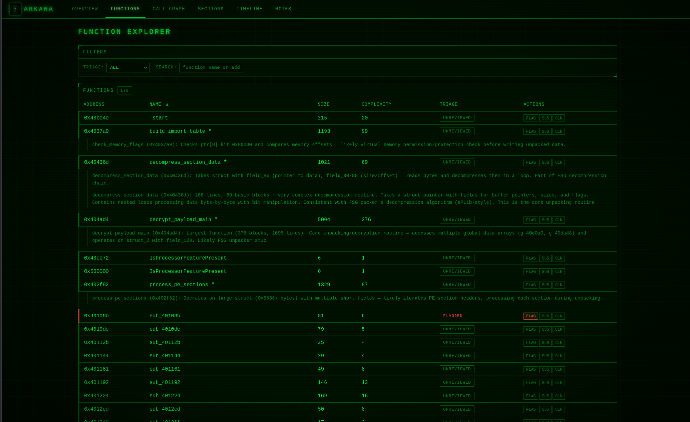
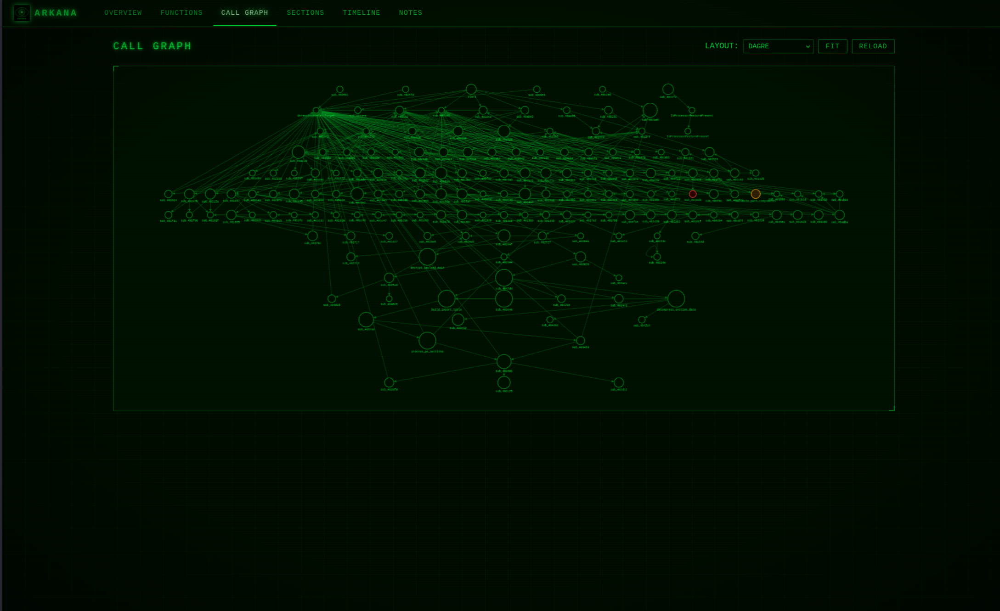
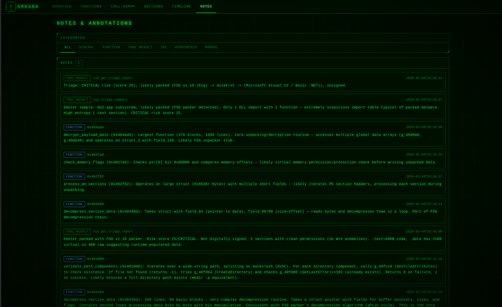

# Web Dashboard

Arkana includes a real-time CRT-themed web dashboard that launches automatically on port 8082. It provides a visual companion to the AI-driven analysis, letting you observe and interact with the investigation as it happens.

The dashboard uses token-based authentication (persisted to `~/.arkana/dashboard_token`). The access URL with token is printed at server startup and available via the `get_config()` MCP tool.

---

## Overview

Binary summary with risk score, packing status, security mitigations, key findings with clickable function pivot links (`→ func_name`), recent notes with clickable addresses, and an analysis digest panel with AI-generated conclusion (synthesised from classification, triage findings, IOCs, and hypothesis notes). A full-width **File Identity banner** at the top shows the filename (handles long SHA256-hash filenames), format/size/language, SHA256 and MD5 hashes with copy buttons, and the AI's hypothesis assessment (falling back to generic classification). Below it, compact stat cards show RISK, PHASE, and FUNCTIONS.

---

## Functions

Sortable function explorer with triage buttons (FLAG / SUS / CLN), enrichment score column, inline notes, full-text code search, and symbol tree view (TABLE/TREE toggle with 6 category groups). Supports `?highlight=0xADDR` deep linking from other pages. Flagged functions are automatically prioritised by the AI in subsequent analysis via `get_session_summary()`, `get_analysis_digest()`, and `suggest_next_action()`.

Each function row has an **XREF** button that opens an inline analysis panel with three tabs:

- **XREFS** -- Cross-references showing callers and callees, enriched with triage dots (colour-coded by triage status), complexity scores, and suspicious API detection. Suspicious APIs are flagged with risk badges (CRITICAL / HIGH / MEDIUM) and categorised (process injection, credential theft, anti-analysis, etc.). All callers and callees are clickable -- clicking navigates to that function in the table with a highlight flash animation.
- **STRINGS** -- Strings associated with the function, with type badges (STATIC / STACK / TIGHT).
- **CODE** -- Decompiled source (requires clicking DEC to trigger decompilation).

The XREF panel opens without requiring decompilation, enabling fast cross-reference exploration. Panel state (open/closed, active tab) survives table filter and sort changes.

---

## Call Graph

Interactive Cytoscape.js call graph with dagre hierarchical layout. Nodes are coloured by triage status, with explored/renamed nodes visually distinguished. Enrichment score drives border thickness (higher-score nodes have thicker borders). Supports `?focus=0xADDR` deep linking.

Clicking a node opens a **tabbed sidebar** with four tabs:

- **INFO** -- Address, name, complexity, caller/callee counts, triage badge, and clickable caller/callee list that navigates the graph.
- **XREFS** -- Enriched cross-references with suspicious API detection (same data as the Functions page XREF panel).
- **STRINGS** -- Strings associated with the selected function.
- **CODE** -- Decompiled source via the decompile overlay.

Additional features: search with match highlighting, right-click context menu (decompile, triage, focus 2-hop neighbourhood), bookmarks, minimap, layout switching (dagre / breadthfirst / cose / circle), keyboard navigation (arrow keys, Tab, Escape), and PNG/SVG export.

---

## Sections

PE/ELF section permissions with anomaly highlighting (W+X detection) and entropy heatmap with clickable cells linking to hex view.

---

## Hex View

Infinite-scroll hex dump with 16 bytes per row. Loads 4096-byte chunks on demand, keeps a maximum of 64KB in the DOM (trims from the opposite end). Jump-to-offset navigation for quick access to specific file locations.

---

## CAPA

Capa capability matches grouped by namespace with clickable function links. Shows the mapping between binary behaviours and the MITRE ATT&CK framework.

---

## MITRE

ATT&CK technique matrix with IOC panel. Aggregates findings from capa, import classification, behavioural indicators, and string matches into a visual technique grid.

---

## Types

Custom struct and enum type editor for defining binary data structures. Create structs with typed fields (uint8-64, cstring, wstring, ipv4, bytes, padding) and enums with name-to-integer mappings. Apply types at file offsets to parse binary data.

---

## Diff

Binary diff powered by angr BinDiff. File browser (BROWSE tab) to select a comparison binary from the samples directory, or manual path entry (MANUAL PATH tab). Shows identical, differing, and unmatched functions.

---

## Timeline

Chronological log of every tool call and note, with expandable detail panels showing request parameters and result summaries. Expanded state is preserved across live refreshes.

---

## Imports

DLL import tables with export/function grouping, showing imported functions organised by DLL. Export addresses are clickable, linking to the containing function on the Functions page.

---

## Strings

Unified string explorer combining ASCII strings, FLOSS static, stack, decoded, and tight strings. Features include:

- **FLOSS detail panel** -- Collapsible panel above the string table showing FLOSS analysis status, type breakdown (STATIC / STACK / DECODED / TIGHT counts), top decoded and stack strings, and analysis metadata. Auto-refreshes while FLOSS analysis is running.
- **Filtering** -- Filter by string type, category, and free-text search.
- **Sifter scores** -- StringSifter relevance scoring for prioritising interesting strings.
- **Function column** -- Clickable links showing which function references each string.
- **Pagination** -- Large string sets are paginated for performance.

---

## Notes

Category-filtered view of all analysis notes (general, function, tool_result, IOC, hypothesis, manual). Addresses are clickable when they resolve to a known function, linking to the Functions page.

---

## Global Status Bar

A persistent status bar between the navigation and content area shows the currently active MCP tool and any running background tasks with progress bars. Visible from every page, it auto-refreshes every 3 seconds via htmx and collapses when idle.
