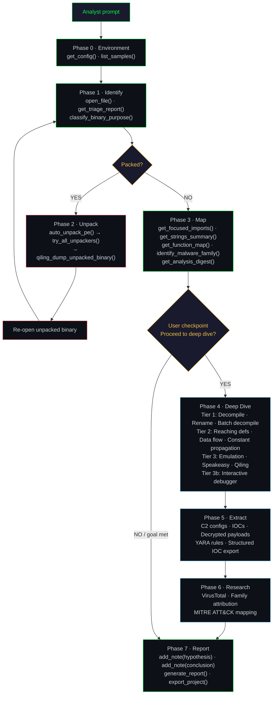

# Analysis Methodology

When you give Arkana a prompt like *"Analyse this binary and tell me what it does"*, the AI doesn't call a single tool and report the output. It executes a structured, multi-phase methodology -- the same workflow a professional malware analyst follows, orchestrated automatically across 260 specialised tools.

This page documents the full analysis pipeline: what happens at each phase, which tools are called, what decisions are made, and what guardrails prevent unreliable results.

---

## Pipeline Overview



The AI adapts depth to the goal. A quick triage may stop after Phase 3. Deep reverse engineering progresses through every tier. A CTF challenge may spend most of its time in the interactive debugger. The pipeline is the same -- the depth varies.

---

## Phase 0: Environment Discovery

**Purpose:** Establish what libraries, paths, and prior context are available before touching the binary.

| Tool | Purpose |
|------|---------|
| `get_config()` | Discover available libraries (angr, capa, FLOSS, Qiling, Speakeasy, LIEF, Refinery), execution mode (Docker vs host), and path mappings |
| `list_samples()` | Discover files in the configured samples directory |
| `get_analysis_digest()` | If a file was previously analysed and `open_file` returns `session_context`, review prior findings before repeating work |

**Key decision:** If a library is missing, tools return actionable alternatives. No angr → fall back to `disassemble_at_address`. No Qiling → use Speakeasy. No capa → use `get_focused_imports` + `get_strings_summary`.

---

## Phase 1: Identify

**Purpose:** Determine what the binary is, how risky it is, and whether it's packed.

| Step | Tool | What it returns |
|------|------|-----------------|
| Load | `open_file(path)` | Format detection, hashes, file integrity assessment (corrupt/partial/healthy), quick indicators. Auto-enrichment starts in the background |
| Triage | `get_triage_report(compact=True)` | ~2KB assessment: packing status, suspicious imports by risk level, capa matches mapped to ATT&CK, network IOCs, signature status, risk score |
| Classify | `classify_binary_purpose()` | Binary category (RAT, stealer, loader, legitimate tool, etc.) |
| Format-specific | `dotnet_analyze()`, `elf_analyze()`, `macho_analyze()`, `go_analyze()`, `rust_analyze()`, `vb6_analyze()` | Metadata and structure for the detected format |
| Reputation | `get_virustotal_report_for_loaded_file()` | Community detections and tags (if VT API key configured and risk score warrants it) |

**Background auto-enrichment:** When `open_file()` is called, Arkana immediately begins background work -- classification, risk scoring, MITRE ATT&CK mapping, IOC extraction, library function identification (FLIRT), and a decompilation sweep of ranked functions. By the time the AI asks its next question, many results are already cached and returned instantly.

**Decision point:** If triage detects packing (high entropy, minimal imports, PEiD match), proceed to Phase 2. Otherwise skip to Phase 3.

---

## Phase 2: Unpack / Prepare

**Purpose:** Obtain an unpacked binary suitable for static analysis. The AI does not attempt to decompile or extract configs from packed code -- packing defeats static analysis by design.

The AI follows a strict method cascade, stopping at the first success:

| Priority | Tool | Best for |
|----------|------|----------|
| 1 | `auto_unpack_pe()` | Known packers (UPX, ASPack, PECompact, Themida) identified by PEiD |
| 2 | `try_all_unpackers()` | Orchestrates multiple methods automatically including heuristic approaches |
| 3 | `qiling_dump_unpacked_binary()` | Custom/unknown packers -- emulates to OEP then dumps from memory |
| 4 | Emulation-based analysis | When unpacking fails: `emulate_binary_with_qiling()` or `emulate_pe_with_windows_apis()` to observe runtime behaviour |
| 5 | Manual OEP recovery | Last resort: `find_oep_heuristic()` + `emulate_with_watchpoints()` + `reconstruct_pe_from_dump()` |

After successful unpacking, the AI re-opens the unpacked binary and repeats Phase 1. Multi-layer packing triggers repeated Phase 2 passes.

**If all methods fail:** The AI reports what is known (packer ID, entropy, VT results, any extracted strings/IOCs) and states that deeper analysis is blocked by packing. It does not guess at the payload.

---

## Phase 3: Map

**Purpose:** Build a structural understanding of the binary's capabilities, imports, strings, and function layout before committing to expensive decompilation.

| Tool | What it provides |
|------|-----------------|
| `get_focused_imports()` | Security-relevant imports categorised by threat behaviour (networking, injection, crypto, persistence, anti-analysis) with risk levels |
| `get_strings_summary()` | Categorised string intelligence -- URLs, paths, registry keys, crypto constants, debug messages |
| `get_top_sifted_strings()` | ML-ranked strings by analytical value |
| `get_function_map(limit=15)` | Functions ranked by interestingness -- this becomes the decompilation priority list |
| `get_capa_analysis_info()` | Capability matches mapped to MITRE ATT&CK techniques |
| `identify_malware_family()` | Family attribution via API hash algorithm/seed, config encryption, constants, and YARA indicators |
| `batch_decompile(addresses, search="pattern")` | Sweep top-ranked functions for specific patterns (e.g., `xor`, `VirtualAlloc`, `connect`) without fully reading each one |
| `get_analysis_digest()` | Synthesise all findings so far before the deep dive |

**Goal-adaptive ordering:** The AI reorders these tools based on the analysis goal:

| Goal | Recommended order |
|------|-------------------|
| Malware triage | Imports → Strings → Capabilities → Synthesise |
| Deep reverse engineering | Functions → Imports → Structure → Strings → Crypto → Capabilities → Synthesise |
| Vulnerability audit | Functions → Imports → Strings (format strings) → Structure → Synthesise |
| Threat intel | Strings → Capabilities → Imports → Synthesise |

---

## Phase 4: Deep Dive

**Purpose:** Understand specific functions, trace data flow, and emulate runtime behaviour. This is the most time-intensive phase.

**Checkpoint:** Before entering Phase 4, the AI pauses to present its Phase 3 findings and asks the user whether to proceed, specifying which functions or areas look most interesting. This prevents wasting time on functions the analyst doesn't care about.

### Tier 1: Static Analysis (start here)

| Tool | Purpose |
|------|---------|
| `decompile_function_with_angr(address)` | C-like pseudocode with pagination and `search` parameter for grep-within-function |
| `batch_decompile(addresses)` | Decompile up to 20 functions per call; `search` returns only matching functions |
| `auto_note_function(address)` | **Mandatory** -- record a summary note after every decompilation |
| `rename_function(address, name)` | Assign meaningful names (e.g., `sub_401830` → `decrypt_c2_config`) |
| `rename_variable(func_addr, old, new)` | Rename cryptic variables for readability |
| `get_function_xrefs(address)` | Callers and callees |
| `get_annotated_disassembly(address)` | Assembly-level view with variable names, xrefs, and `search` support |
| `get_function_cfg(address)` | Control flow graph |

### Tier 2: Data Flow (when static reading is insufficient)

| Tool | Purpose |
|------|---------|
| `get_reaching_definitions(address)` | Where does each variable's value originate? |
| `propagate_constants(address)` | Resolve constant values through computation |
| `get_data_dependencies(address)` | Def-use chains |
| `get_control_dependencies(address)` | Which conditions control which blocks? |
| `get_backward_slice(address, variable)` | Trace data origin backward |
| `get_forward_slice(address, variable)` | Trace data propagation forward |
| `find_dangerous_data_flows(address)` | Trace untrusted inputs (recv, fread) to dangerous sinks (strcpy, system) |
| `detect_control_flow_flattening(address)` | Detect CFF obfuscation patterns |
| `detect_opaque_predicates(address)` | Identify always-true/false branches via Z3 constraint solving |

### Tier 3: Emulation (when static + data flow aren't enough)

| Tool | Purpose |
|------|---------|
| `emulate_function_execution(address, args)` | Concrete function execution |
| `emulate_binary_with_qiling()` | Full binary emulation with API tracking |
| `emulate_pe_with_windows_apis()` | PE emulation with Windows API simulation (Speakeasy) |
| `emulate_shellcode_with_speakeasy()` | Shellcode emulation |
| `qiling_hook_api_calls()` | Hook specific APIs during emulation |
| `qiling_memory_search()` | Search emulation memory for decrypted data |
| `find_path_to_address(target)` | Symbolic execution to find inputs that reach a target |

### Tier 3b: Interactive Debugger (when step-through control is needed)

A persistent Qiling subprocess that survives across MCP calls -- set breakpoints, step through code, inspect memory, snapshot state, queue input, and search memory incrementally.

| Tool | Purpose |
|------|---------|
| `debug_start(path)` | Start a debug session with CRT and I/O stubs |
| `debug_set_breakpoint(address)` | Break at addresses of interest |
| `debug_set_input(text)` | Queue stdin/console input |
| `debug_continue()` | Run to next breakpoint |
| `debug_read_state()` | Inspect registers and current instruction |
| `debug_read_memory(address, length)` | Read memory at any address |
| `debug_snapshot_save(name)` / `debug_snapshot_diff(a, b)` | Save and compare state at different execution points |
| `debug_get_api_trace()` | Review all Windows API calls |
| `debug_search_memory(pattern)` | Find decrypted strings/data in memory |
| `debug_stop()` | End the session |

### Decision Matrix

| Scenario | Recommended tier |
|----------|-----------------|
| Understanding function purpose | Tier 1 |
| Tracing crypto key derivation | Tier 2 (reaching definitions + backward slice) |
| Resolving dynamic API calls | Tier 3 (emulate or qiling_resolve_api_hashes) |
| Decrypting runtime-only strings | Tier 3 (emulate + memory search) |
| Extracting config from encrypted blob | Tier 2 first, Tier 3 if key not resolved |
| Stepping through a decryption loop | Tier 3b (debug step + read memory) |
| Supplying specific input during emulation | Tier 3b (debug set input + continue) |
| Comparing state before/after a function call | Tier 3b (snapshot save / diff) |

---

## Phase 5: Extract

**Purpose:** Pull out IOCs, C2 configurations, decrypted payloads, and detection signatures.

**Evidence gate:** Before calling any manual decryption tool, the AI must have:
1. Decompiled the function that performs the decryption
2. Identified the algorithm **from the code** (not from guessing)
3. Identified the key/IV source **from the code** (not from brute-forcing)
4. Identified the encrypted data location and size **from the code**

If any of these are missing, the AI returns to Phase 4.

| Tool | Purpose |
|------|---------|
| `extract_config_automated()` | Auto-detect and extract C2 configurations |
| `extract_config_for_family(family)` | Family-specific config extraction after attribution |
| `get_iocs_structured()` | Aggregate all IOCs into structured export formats |
| `find_and_decode_encoded_strings()` | Decode Base64/hex/XOR obfuscated strings |
| `auto_extract_crypto_keys()` | Extract embedded crypto keys |
| `generate_yara_rule()` | Generate detection signatures from the binary |
| `refinery_decrypt()` / `refinery_xor()` / `refinery_pipeline()` | Data transforms for evidence-backed decryption |

---

## Phase 6: Research

**Purpose:** Correlate findings with external intelligence when automated extraction is insufficient.

**Entry condition:** Automated extraction returned nothing useful, but VT detections, YARA matches, or string patterns suggest a known malware family.

| Tool | Purpose |
|------|---------|
| `get_virustotal_report_for_loaded_file()` | Community detections, tags, and first-seen dates |
| `identify_malware_family()` | Family attribution with confidence scoring |
| `verify_malware_attribution()` | Cross-validate family identification |
| `map_mitre_attack()` | ATT&CK technique mapping with Navigator layer export |
| `compute_similarity_hashes()` | Similarity hashing for cross-sample correlation |
| `find_similar_functions()` / `query_signature_db()` | Cross-binary function matching |

---

## Phase 7: Report

**Purpose:** Synthesise all findings into structured output with full evidence chains.

| Step | Tool | Purpose |
|------|------|---------|
| Hypothesis | `add_note(category="hypothesis", content="...")` | Store a one-paragraph verdict (feeds the dashboard overview) |
| Conclusion | `add_note(category="conclusion", content="...")` | Store the full detailed write-up in markdown |
| Digest | `get_analysis_digest()` | Aggregate all findings for review |
| Report | `generate_report()` | Structured markdown report: executive summary, risk, findings, IOCs, MITRE, timeline |
| Export | `export_project()` | Portable archive of all notes, history, findings, and extracted artefacts |

**Goal-adapted reporting:**

| Goal | Report focus |
|------|-------------|
| Malware triage | Verdict + evidence + IOC table + validated capabilities |
| Deep RE | Function-by-function findings, call graphs, data flows, algorithms |
| Vulnerability audit | Attack surface, unsafe functions, hardening assessment |
| Threat intel | Verified attribution, C2 infrastructure, YARA/Sigma rules, IOC export |

---

## Built-in Guardrails

The analysis skill enforces strict methodology constraints that prevent the AI from cutting corners or producing unreliable results:

**Evidence-first, no speculation**
Every claim must cite specific tool output. The AI cannot say *"this binary probably injects into processes"* -- it must decompile the function, show the `VirtualAllocEx` → `WriteProcessMemory` → `CreateRemoteThread` call chain, and cite the addresses. If something is unknown, it says so.

**Indicators are leads, not conclusions**
VirusTotal detections, capa matches, YARA hits, and risk scores are treated as pointers for investigation, not proof. A capa match for "process injection" means a byte pattern was found -- the AI still decompiles the relevant function to confirm the behaviour.

**No speculative decryption**
The AI cannot attempt to decrypt, decompress, or decode embedded data without concrete evidence from decompiled code showing the algorithm, key source, and data location. Entropy analysis and "this looks encrypted" are not sufficient grounds to begin decryption -- the actual decryption function must be found first.

**Unpack before analysing**
When triage detects packing, the AI must unpack before attempting decompilation or config extraction. Packed code defeats static analysis by design. The AI follows the unpacking cascade rather than guessing at encrypted content.

**Fair interpretation**
Flagged APIs and behaviours are assessed in context. `IsDebuggerPresent` in a Rust binary's panic handler is a compiler artefact, not anti-analysis. `VirtualProtect` in any loader is a functional requirement, not evasion. The AI distinguishes between capability (what an API *can* do) and intent (what the developer *meant* it to do).

**Deep dive checkpoint**
Before entering the time-intensive Phase 4, the AI pauses to present its findings and asks the user whether to proceed. This prevents burning analysis time on functions the analyst doesn't care about.

**Mandatory note-taking**
After every decompilation, the AI records a summary note. When it discovers any finding, it adds a note. Notes survive context window limits and server restarts, ensuring nothing is lost during investigations that span hours or days.

---

## Annotated Example: AsyncRAT Analysis

The following walkthrough shows how the pipeline applies to a real sample -- the AsyncRAT .NET RAT from the [example reports](examples/example-report-asyncrat.md). Each step is annotated with its phase.

---

### Phase 0 → Phase 1: Open and Identify

```
Analyst: "Analyse asyncrat.exe and tell me what it does"
```

The AI calls `get_config()` to confirm available libraries, then:

| Tool call | Result |
|-----------|--------|
| `open_file("asyncrat.exe")` | PE32 .NET CIL, 34KB, CLR v4.0.30319, unsigned. File integrity: healthy. Auto-enrichment starts in background |
| `get_triage_report(compact=True)` | Risk: CRITICAL (57/100). 1 import from mscoree.dll (.NET stub). YARA: Njrat, VMWare_Detection, VirtualBox_Detection, Sandboxie_Detection, anti_dbg. Packing: not packed (max entropy 4.89) |
| `classify_binary_purpose()` | .NET RAT / Remote Access Trojan |

**Decision:** Not packed (entropy 4.89, minimal imports expected for .NET) → skip Phase 2, proceed to Phase 3.

---

### Phase 3: Map the Binary

| Tool call | Key findings |
|-----------|-------------|
| `dotnet_analyze()` | Metadata stripped: 0 type definitions, 0 method definitions, 0 user strings. But 10 assembly references intact (MessagePackLib, System.Net.Http, System.Management, System.Drawing) and 30 member references readable |
| `get_strings_summary()` | C2 domain: `cveutb.sa.com`. VM detection paths: `Vmmouse.sys`, `VBoxGuest.sys`, `SbieDll.dll`. Registry persistence: `SOFTWARE\Microsoft\Windows\CurrentVersion\Run`. Install path: `C:\Windows\ett1h.exe`. PDB path reveals Vietnamese-speaking operator |
| `get_focused_imports()` | .NET binary -- only mscoree.dll import. Member references reveal: `AesCryptoServiceProvider`, `HMACSHA256`, `Thread.Sleep`, `FromBase64String`, `CheckRemoteDebuggerPresent` |
| `get_capa_analysis_info()` | Matches for encrypted communication, Base64 encoding, mutex creation, file system operations |
| `get_virustotal_report_for_loaded_file()` | 43/72 detections. Label: `trojan.msil/asyncrat`. Tags: `long-sleeps`, `detect-debug-environment` |
| `get_analysis_digest()` | Synthesised: .NET RAT with AES-256 encrypted C2 to cveutb.sa.com, anti-VM suite, registry persistence |

---

### Phase 4: Targeted Deep Dive (Tier 1)

The AI presents Phase 3 findings and the user confirms interest in the C2 communication and crypto implementation:

| Tool call | Finding |
|-----------|---------|
| `get_floss_analysis_info()` | Decoded strings reveal two 64-character hex keys (SHA-256 hashes) -- server certificate hash and encryption key derivative |
| `batch_decompile(top_functions, search="AES\|Crypt\|encrypt")` | Identifies AES-256 + HMACSHA256 encryption functions and MessagePack serialisation |
| `auto_note_function(addr)` | Records: "AES-256 encryption with CBC mode, key derived from embedded SHA-256 hash" |
| `rename_function(addr, "encrypt_c2_message")` | Renamed for clarity in subsequent output |

---

### Phase 5: Extract

| Tool call | Extraction |
|-----------|-----------|
| `get_iocs_structured()` | C2: `cveutb.sa.com`. Connectivity check: `https://www.google.com/`. User-Agent: Chrome 128 spoof. Install path: `C:\Windows\ett1h.exe`. Mutex: `MutexControl` |
| Crypto keys extracted from string analysis | Key 1: `E65CA7C06AE3E9BA...` Key 2: `1DB2A1F9902B35F8...` |

---

### Phase 6: Research and Attribution

| Tool call | Result |
|-----------|--------|
| `map_mitre_attack()` | 12 techniques mapped: T1082 (System Discovery), T1518.001 (Security Software Discovery), T1497.001 (VM Evasion), T1622 (Debugger Evasion), T1573.001 (Encrypted Channel), T1547.001 (Registry Run Keys), T1036.005 (Masquerading), T1056.001 (Keylogging), T1113 (Screen Capture), T1132.001 (Data Encoding), T1105 (Ingress Tool Transfer), T1071.001 (Application Layer Protocol) |
| PDB path analysis | `D:\Cong Viec\malware\AsyncRAT-C-Sharp\malware chuan 2\...` -- Vietnamese: "Cong Viec" = "Work", "malware chuan 2" = "standard malware 2". Built from public AsyncRAT repository |

---

### Phase 7: Report

```
Tool: add_note(category="hypothesis", content="AsyncRAT v0.5.7B .NET RAT.
C2: cveutb.sa.com via AES-256/HMACSHA256 encrypted MessagePack. Anti-VM
(VMware/VirtualBox/Sandboxie), debugger detection, registry Run key persistence
to C:\Windows\ett1h.exe. PDB path reveals Vietnamese-speaking operator building
from public AsyncRAT source. 43/72 VT detections. 12 MITRE ATT&CK techniques.")
```

```
Tool: generate_report()
```

**Output:** Structured markdown report with executive summary, sample information, .NET assembly analysis, capabilities (C2, crypto, anti-analysis, persistence), YARA matches, MITRE ATT&CK mapping, and IOCs -- all backed by specific tool output with addresses and evidence chains.

[Read the full generated report →](examples/example-report-asyncrat.md)

---

## Further Reading

- [Scenarios & Comparisons](examples/scenarios.md) -- Seven detailed real-world walkthroughs
- [Tools Reference](tools-reference.md) -- Complete catalog of all 284 tools
- [Example Reports](../README.md#example-reports) -- Full reports generated from single prompts
- [Claude Code Integration](claude-code.md) -- Setup and configuration guide
