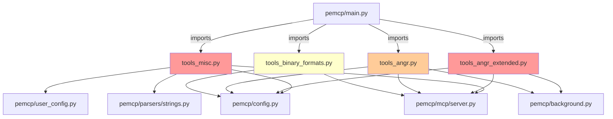

# REFACTORING ANALYSIS REPORT
**Generated**: 10-02-2026 12:00:00
**Target File(s)**: `pemcp/mcp/tools_misc.py`, `pemcp/mcp/tools_angr_extended.py`, `pemcp/mcp/tools_angr.py`, `pemcp/mcp/tools_binary_formats.py`
**Analyst**: Claude Refactoring Specialist
**Report ID**: refactor_mcp_tools_10-02-2026_120000

---

## EXECUTIVE SUMMARY

This report analyses the four largest MCP tool modules in the PeMCP binary analysis toolkit, totalling **6,347 lines of code** across **61 tools**. The codebase is well-architected with clean dependency separation, but several modules have grown beyond maintainable thresholds. The primary concerns are:

1. **`tools_misc.py` (2,136 LOC)**: A catch-all module mixing 6 unrelated domains (VirusTotal, deobfuscation, triage, caching, config, binary classification). Contains `get_triage_report` — a ~1,100-line god function.
2. **`tools_angr_extended.py` (2,118 LOC)**: 22 tools covering data flow, hooking, diffing, and class recovery. Already phase-organized internally but could benefit from module-level separation.
3. **`tools_angr.py` (1,077 LOC)**: 15 core angr tools with duplicated initialization patterns shared with `tools_angr_extended.py`.
4. **`tools_binary_formats.py` (1,016 LOC)**: 9 tools covering 5 binary formats (.NET, Go, Rust, ELF, Mach-O). Clean internal separation already exists.

**Recommended approach**: Multi-file modular refactoring, prioritizing `tools_misc.py` (highest risk/reward ratio).

---

## CODEBASE-WIDE CONTEXT

### Related Files Discovery
- **Target files imported by**: 1 file (`pemcp/main.py` — for tool registration)
- **Target files import from**: 5 internal modules (`pemcp.config`, `pemcp.mcp.server`, `pemcp.background`, `pemcp.parsers.strings`, `pemcp.user_config`)
- **Tightly coupled modules**: None between targets — each target is fully independent
- **Circular dependencies detected**: **No** — clean dependency graph

### Dependency Graph



### Additional Refactoring Candidates

| Priority | File | Lines | Complexity | Reason | Relationship to Target |
|----------|------|-------|------------|--------|------------------------|
| HIGH | `pemcp/mcp/tools_misc.py` | 2,136 | CRITICAL | God function, 6 mixed concerns | Primary target |
| HIGH | `pemcp/mcp/tools_angr_extended.py` | 2,118 | HIGH | 22 tools, 4 distinct phases | Primary target |
| MEDIUM | `pemcp/mcp/tools_angr.py` | 1,077 | MEDIUM | Duplicated patterns with angr_extended | Primary target |
| MEDIUM | `pemcp/mcp/tools_binary_formats.py` | 1,016 | LOW-MEDIUM | 5 independent format domains | Primary target |
| MEDIUM | `pemcp/mcp/tools_strings.py` | 957 | MEDIUM | Could share deobfuscation with misc | Same module group |
| MEDIUM | `pemcp/mcp/tools_pe_extended.py` | 947 | MEDIUM | Same pattern as tools_pe | Same module group |
| LOW | `pemcp/cli/printers.py` | 650 | MEDIUM | Single 650-line function | Different subsystem |

### Recommended Approach
- **Refactoring Strategy**: Multi-file modular (domain-driven decomposition)
- **Rationale**: All 4 targets are leaf modules with no cross-imports. Splitting them creates no circular dependency risk. The auto-registration via `@tool_decorator` means new modules only need to be imported in `main.py`.
- **Additional files to include**: `pemcp/main.py` (import statements must be updated)

---

## CURRENT STATE ANALYSIS

### File Metrics Summary Table

| Metric | tools_misc | tools_angr_ext | tools_angr | tools_binary_fmt | Target | Status |
|--------|-----------|---------------|------------|-----------------|--------|--------|
| Total Lines | 2,136 | 2,118 | 1,077 | 1,016 | <500 | ❌❌✅✅ |
| Functions/Tools | 15 + 2 helpers | 22 + 4 helpers | 15 | 9 + 3 helpers | <20 | ✅✅✅✅ |
| Max Function Length | ~1,100 (triage) | ~180 (watchpoints) | ~120 (loops) | ~135 (dotnet) | <100 | ❌⚠️⚠️⚠️ |
| Distinct Domains | 6 | 4 | 3 | 5 | 1-2 | ❌⚠️⚠️❌ |
| Helper Functions | 2 | 4 | 0 | 3 | N/A | — |
| External Deps | 3 conditional | 2 conditional | 3 conditional | 7 conditional | — | — |

### Code Smell Analysis

| Code Smell | Count | Severity | Examples |
|------------|-------|----------|----------|
| God Function | 1 | **CRITICAL** | `get_triage_report()` — 1,100 lines, 25+ analysis sections |
| Long Parameter Lists | 1 | MEDIUM | `find_and_decode_encoded_strings()` — 13 parameters |
| Feature Envy | 2 | MEDIUM | tools_misc reads `state.pe_data` deeply for triage; tools_angr_ext duplicates init patterns |
| Duplicate Code | 3 patterns | HIGH | RVA-to-VA resolution (5 occurrences), background task boilerplate (8 occurrences), angr project init (10+ occurrences) |
| Mixed Concerns | 1 file | HIGH | tools_misc mixes VT API, deobfuscation, triage, caching, config, classification |
| Dead Loop | 1 | LOW | `tools_misc.py:1659-1666` — for loop with immediate break, no useful work |
| Magic Constants | 5+ | LOW | Inline dicts: SUSPICIOUS_IMPORTS_DB, PACKER_SECTION_NAMES, COMMON_DLLS, SPOOFED_COMPANIES |

### Test Coverage Analysis

| File/Module | Coverage | Missing Lines | Critical Gaps |
|-------------|----------|---------------|---------------|
| `tools_misc.py` | ~15% (integration only) | All unit paths | `get_triage_report` untested in isolation |
| `tools_angr_extended.py` | ~5% (integration only) | Nearly all | All 22 tools lack unit tests |
| `tools_angr.py` | ~10% (integration only) | Most paths | Symbolic execution paths untested |
| `tools_binary_formats.py` | ~5% (integration only) | Nearly all | All format parsers untested |
| **Test file** | `mcp_test_client.py` (412 LOC) | Integration tests only | Requires running MCP server |

**Testing Environment**:
- Framework: `pytest` + `httpx` + MCP SDK
- Test type: Integration tests only (MCP protocol over SSE)
- Coverage tools: None configured (`requirements-test.txt` exists but no coverage config)
- **Critical gap**: Zero unit tests — all testing requires a running MCP server with a loaded binary

---

## COMPLEXITY ANALYSIS

### Function-Level Metrics — tools_misc.py

| Function/Class | Lines | Cyclomatic | Cognitive | Parameters | Nesting | Risk |
|----------------|-------|------------|-----------|------------|---------|------|
| `get_triage_report()` | ~1,100 | **~55** | **~90** | 2 | 6 | **CRITICAL** |
| `classify_binary_purpose()` | ~180 | ~25 | ~40 | 0 | 5 | HIGH |
| `find_and_decode_encoded_strings()` | ~140 | ~18 | ~30 | 13 | 5 | HIGH |
| `get_virustotal_report_for_loaded_file()` | ~125 | ~12 | ~20 | 0 | 4 | MEDIUM |
| `get_hex_dump()` | ~57 | ~8 | ~12 | 4 | 3 | LOW |
| `deobfuscate_xor_single_byte()` | ~57 | ~6 | ~10 | 2 | 3 | LOW |
| `deobfuscate_base64()` | ~37 | ~4 | ~6 | 1 | 2 | LOW |
| `is_mostly_printable_ascii()` | ~17 | ~3 | ~4 | 2 | 1 | LOW |
| `get_current_datetime()` | ~3 | 1 | 1 | 0 | 0 | LOW |
| `check_task_status()` | ~33 | ~4 | ~6 | 1 | 2 | LOW |
| `set_api_key()` | ~19 | ~3 | ~4 | 2 | 1 | LOW |
| `get_config()` | ~12 | 1 | 1 | 0 | 0 | LOW |
| `get_cache_stats()` | ~3 | 1 | 1 | 0 | 0 | LOW |
| `clear_analysis_cache()` | ~8 | 1 | 1 | 0 | 0 | LOW |
| `remove_cached_analysis()` | ~11 | ~3 | ~4 | 1 | 1 | LOW |

### Function-Level Metrics — tools_angr_extended.py

| Function/Class | Lines | Cyclomatic | Cognitive | Parameters | Nesting | Risk |
|----------------|-------|------------|-----------|------------|---------|------|
| `identify_cpp_classes()` | ~112 | ~15 | ~25 | 2 | 5 | HIGH |
| `find_path_with_custom_input()` | ~120 | ~14 | ~22 | 6 | 4 | HIGH |
| `emulate_with_watchpoints()` | ~160 | ~14 | ~20 | 6 | 4 | HIGH |
| `get_reaching_definitions()` | ~90 | ~10 | ~16 | 4 | 4 | MEDIUM |
| `get_data_dependencies()` | ~115 | ~10 | ~16 | 4 | 4 | MEDIUM |
| `diff_binaries()` | ~85 | ~8 | ~14 | 2 | 3 | MEDIUM |
| `detect_packing()` | ~110 | ~12 | ~18 | 0 | 4 | MEDIUM |
| `find_code_caves()` | ~85 | ~10 | ~16 | 2 | 5 | MEDIUM |
| `get_call_graph()` | ~95 | ~8 | ~12 | 3 | 3 | MEDIUM |
| `get_annotated_disassembly()` | ~82 | ~8 | ~12 | 1 | 3 | MEDIUM |
| `detect_self_modifying_code()` | ~63 | ~6 | ~10 | 1 | 4 | LOW |
| Other tools (12) | 30-60 | 3-6 | 4-10 | 1-3 | 2-3 | LOW |

### Function-Level Metrics — tools_angr.py

| Function/Class | Lines | Cyclomatic | Cognitive | Parameters | Nesting | Risk |
|----------------|-------|------------|-----------|------------|---------|------|
| `analyze_binary_loops()` | ~120 | ~12 | ~20 | 4 | 4 | MEDIUM |
| `find_path_to_address()` | ~100 | ~10 | ~16 | 4 | 4 | MEDIUM |
| `emulate_function_execution()` | ~90 | ~8 | ~14 | 4 | 3 | MEDIUM |
| `list_angr_analyses()` | ~125 | 3 | 3 | 1 | 1 | LOW (data-only) |
| Other tools (11) | 30-70 | 3-8 | 4-12 | 1-3 | 2-3 | LOW |

### Function-Level Metrics — tools_binary_formats.py

| Function/Class | Lines | Cyclomatic | Cognitive | Parameters | Nesting | Risk |
|----------------|-------|------------|-----------|------------|---------|------|
| `dotnet_analyze()` | ~135 | ~12 | ~18 | 2 | 5 | MEDIUM |
| `elf_analyze()` | ~120 | ~8 | ~14 | 2 | 4 | MEDIUM |
| `macho_analyze()` | ~120 | ~8 | ~12 | 2 | 3 | MEDIUM |
| `detect_binary_format()` | ~95 | ~10 | ~14 | 1 | 4 | MEDIUM |
| Other tools (5) | 40-80 | 3-8 | 4-10 | 1-3 | 2-3 | LOW |

### Hotspot Identification (Priority Matrix)

```
High Complexity + High Change Frequency = CRITICAL
  → get_triage_report (tools_misc.py) — 6 commits, ~55 cyclomatic
  → classify_binary_purpose (tools_misc.py) — frequently expanded

High Complexity + Low Change Frequency = HIGH
  → identify_cpp_classes (tools_angr_extended.py) — 3 commits, ~15 cyclomatic
  → find_and_decode_encoded_strings (tools_misc.py) — complex but stable

Low Complexity + High Change Frequency = MEDIUM
  → list_angr_analyses (tools_angr.py) — updated when new tools added
  → get_config (tools_misc.py) — updated with new features

Low Complexity + Low Change Frequency = LOW
  → deobfuscate_base64, deobfuscate_xor — stable utility functions
  → rust_demangle_symbols, elf_dwarf_info — stable and focused
```

### Duplicated Code Patterns

#### Pattern 1: Angr Project/CFG Initialization (~10 occurrences)
```python
# Appears in tools_angr.py (7x) and partially in tools_angr_extended.py
if state.angr_project is None:
    state.angr_project = angr.Project(state.filepath, auto_load_libs=False)
if state.angr_cfg is None:
    state.angr_cfg = state.angr_project.analyses.CFGFast(normalize=True)
```
- `tools_angr_extended.py` consolidated this into `_ensure_project_and_cfg()` helper
- `tools_angr.py` still repeats it inline in 7 functions

#### Pattern 2: RVA-to-VA Address Resolution (~5 occurrences)
```python
addr_to_use = target_addr
if addr_to_use not in state.angr_cfg.functions:
    if state.pe_object and hasattr(state.pe_object, 'OPTIONAL_HEADER'):
        image_base = state.pe_object.OPTIONAL_HEADER.ImageBase
        potential_va = target_addr + image_base
        if potential_va in state.angr_cfg.functions:
            addr_to_use = potential_va
```
- `tools_angr_extended.py` consolidated this into `_resolve_function_address()` helper
- `tools_angr.py` still inlines this in `decompile_function_with_angr`, `get_function_cfg`

#### Pattern 3: Background Task Boilerplate (~8 occurrences)
```python
if run_in_background:
    task_id = str(uuid.uuid4())
    state.set_task(task_id, {
        "status": "running", "progress_percent": 0,
        "progress_message": "Initializing...",
        "created_at": datetime.datetime.now(datetime.timezone.utc).isoformat(),
        "tool": "tool_name",
    })
    asyncio.create_task(_run_background_task_wrapper(task_id, _inner_func))
    return {"status": "queued", "task_id": task_id, "message": "..."}
```
- Repeated across 8 tools in `tools_angr.py` and `tools_angr_extended.py`
- Could be extracted to a shared decorator or helper

### Dependency Analysis

| Module | Imports From | Imported By | Afferent | Efferent | Instability |
|--------|-------------|-------------|----------|----------|-------------|
| tools_misc.py | 4 internal + 3 external | 1 (main.py) | 1 | 7 | 0.88 |
| tools_angr_extended.py | 3 internal + 2 external | 1 (main.py) | 1 | 5 | 0.83 |
| tools_angr.py | 3 internal + 3 external | 1 (main.py) | 1 | 6 | 0.86 |
| tools_binary_formats.py | 2 internal + 7 external | 1 (main.py) | 1 | 9 | 0.90 |

All modules have high instability scores (dependent on many, depended on by few), which is appropriate for leaf modules that should be easy to modify.

---

## REFACTORING PLAN

### Phase 1: Test Coverage Establishment (Pre-Requisite)

**Current state**: Zero unit tests. Only integration tests that require a running MCP server.

#### Tasks (To Be Done During Execution):
1. Create `tests/` directory with `conftest.py` providing mock `state`, `Context`, and `analysis_cache` fixtures
2. Create mock PE data fixtures (`tests/fixtures/mock_pe_data.py`) with representative `state.pe_data` dictionaries
3. Write unit tests for `get_triage_report` internal logic blocks (at least the risk-scoring subsections)
4. Write unit tests for `find_and_decode_encoded_strings` with known encoded inputs
5. Write unit tests for `classify_binary_purpose` with different PE header configurations
6. Write unit tests for `_is_mostly_printable_ascii_sync` and deobfuscation helpers
7. Write unit tests for shared helpers: `_ensure_project_and_cfg`, `_resolve_function_address`, `_parse_addr`
8. Target: 80% coverage on functions to be refactored before any code is moved

**Environment Requirements**:
- Python virtual environment with `pip install -e .` for dev install
- `pytest` + `pytest-asyncio` for async tool testing
- `pytest-cov` for coverage measurement
- Command: `pytest tests/ --cov=pemcp --cov-report=html`

### Phase 2: Extract `tools_misc.py` Into Domain Modules (HIGHEST PRIORITY)

This is the highest-impact refactoring: splitting the 2,136-line catch-all into 5 focused modules.

#### Task 2.1: Extract VirusTotal Tools → `tools_virustotal.py`

- **Source**: `tools_misc.py` lines 32-175
- **Target**: `pemcp/mcp/tools_virustotal.py`
- **Functions to extract**:
  - `get_virustotal_report_for_loaded_file()`
- **Imports to move**: `requests`, `REQUESTS_AVAILABLE`, `VT_API_URL_FILE_REPORT`, `get_config_value`
- **Risk Level**: LOW
- **Tests Required**: 3 unit tests (success, not found, API key missing)

#### Task 2.2: Extract Deobfuscation Tools → `tools_deobfuscation.py`

- **Source**: `tools_misc.py` lines 238-570
- **Target**: `pemcp/mcp/tools_deobfuscation.py`
- **Functions to extract**:
  - `deobfuscate_base64()`
  - `deobfuscate_xor_single_byte()`
  - `is_mostly_printable_ascii()`
  - `_is_mostly_printable_ascii_sync()` (helper)
  - `find_and_decode_encoded_strings()`
- **Imports to move**: `base64`, `codecs`, `STRINGSIFTER_AVAILABLE`, `stringsifter`, `joblib`, `_decode_single_byte_xor`
- **Risk Level**: LOW
- **Tests Required**: 8 unit tests (base64 decode, XOR decode, printable check, multi-layer decoding)

#### Task 2.3: Extract Triage Report → `tools_triage.py`

- **Source**: `tools_misc.py` lines 572-1745
- **Target**: `pemcp/mcp/tools_triage.py`
- **Functions to extract**:
  - `SUSPICIOUS_IMPORTS_DB` (constant dict)
  - `get_triage_report()`
- **Sub-extraction strategy for `get_triage_report`**:
  This ~1,100-line function MUST be decomposed into smaller private helpers within the new module:

  | Helper Function | Source Lines | Responsibility |
  |----------------|-------------|----------------|
  | `_triage_file_info()` | 712-731 | Basic file info collection |
  | `_triage_timestamp_analysis()` | 733-795 | Timestamp anomaly detection |
  | `_triage_packing_assessment()` | 797-860 | Entropy/PEiD/packing analysis |
  | `_triage_digital_signature()` | 862-918 | Signature & Rich header |
  | `_triage_suspicious_imports()` | 920-957 | Import risk categorization |
  | `_triage_capa_capabilities()` | 959-992 | Capa MITRE ATT&CK analysis |
  | `_triage_network_iocs()` | 994-1056 | Network IOC extraction |
  | `_triage_section_anomalies()` | 1058-1081 | Section W+X, size mismatches |
  | `_triage_overlay_analysis()` | 1083-1131 | Overlay / appended data |
  | `_triage_import_anomalies()` | 1133-1176 | Ordinal-only, unusual DLLs |
  | `_triage_resource_anomalies()` | 1178-1238 | Nested PEs, large RCDATA |
  | `_triage_yara_matches()` | 1240-1259 | YARA rule matches |
  | `_triage_header_anomalies()` | 1261-1336 | Corruption detection |
  | `_triage_tls_callbacks()` | 1338-1358 | TLS callback detection |
  | `_triage_security_mitigations()` | 1360-1399 | ASLR/DEP/CFG/CET analysis |
  | `_triage_delay_load()` | 1401-1440 | Delay-load suspicious APIs |
  | `_triage_version_info()` | 1442-1502 | Version info anomalies |
  | `_triage_dotnet_indicators()` | 1504-1522 | .NET assembly detection |
  | `_triage_export_anomalies()` | 1524-1559 | Export analysis |
  | `_triage_elf_security()` | 1561-1607 | ELF security features |
  | `_triage_macho_security()` | 1609-1653 | Mach-O security features |
  | `_triage_high_value_strings()` | 1655-1688 | ML-ranked strings |
  | `_triage_risk_and_suggestions()` | 1690-1745 | Risk score & tool suggestions |

  The main `get_triage_report` function becomes an orchestrator:
  ```python
  @tool_decorator
  async def get_triage_report(ctx, sifter_score_threshold=8.0, indicator_limit=20):
      risk_score = 0
      triage = {}

      triage["file_info"] = _triage_file_info()
      triage["timestamp_analysis"], rs = _triage_timestamp_analysis()
      risk_score += rs
      # ... orchestrate all sub-analyses ...

      triage["risk_score"] = risk_score
      triage["risk_level"] = _calculate_risk_level(risk_score)
      triage["suggested_next_tools"] = _suggest_tools(triage)
      return await _check_mcp_response_size(ctx, triage, "get_triage_report")
  ```

- **Risk Level**: **HIGH** (this is the most complex extraction)
- **Tests Required**: 23 unit tests (one per helper + orchestrator)

#### Task 2.4: Extract Cache Management → `tools_cache.py`

- **Source**: `tools_misc.py` lines 1875-1948
- **Target**: `pemcp/mcp/tools_cache.py`
- **Functions to extract**:
  - `get_cache_stats()`
  - `clear_analysis_cache()`
  - `remove_cached_analysis()`
- **Risk Level**: LOW
- **Tests Required**: 3 unit tests

#### Task 2.5: Extract Config & Utility Tools → `tools_config.py`

- **Source**: `tools_misc.py` lines 1747-1873
- **Target**: `pemcp/mcp/tools_config.py`
- **Functions to extract**:
  - `get_current_datetime()`
  - `check_task_status()`
  - `set_api_key()`
  - `get_config()`
- **Risk Level**: LOW
- **Tests Required**: 4 unit tests

#### Task 2.6: Extract Binary Classification → `tools_classification.py`

- **Source**: `tools_misc.py` lines 1950-2137
- **Target**: `pemcp/mcp/tools_classification.py`
- **Functions to extract**:
  - `classify_binary_purpose()`
- **Risk Level**: LOW
- **Tests Required**: 5 unit tests (DLL, GUI, Console, Service, Driver detection)

#### Task 2.7: Update `main.py` Imports

Replace:
```python
import pemcp.mcp.tools_misc
```
With:
```python
import pemcp.mcp.tools_virustotal
import pemcp.mcp.tools_deobfuscation
import pemcp.mcp.tools_triage
import pemcp.mcp.tools_cache
import pemcp.mcp.tools_config
import pemcp.mcp.tools_classification
```

#### Task 2.8: Delete original `tools_misc.py`

After all tests pass with the new modules.

### Phase 3: Consolidate Shared Angr Helpers

Extract duplicated patterns from `tools_angr.py` and `tools_angr_extended.py` into shared utilities.

#### Task 3.1: Create `pemcp/mcp/_angr_helpers.py`

Extract these shared patterns:
```python
# From tools_angr_extended.py (already extracted there):
def _ensure_project_and_cfg(): ...
def _resolve_function_address(target_addr): ...
def _parse_addr(hex_string, name="address"): ...

# NEW: Extract background task boilerplate
def _queue_background_task(tool_name, inner_func, message): ...
```

#### Task 3.2: Update `tools_angr.py` to use shared helpers

Replace 7 inline `angr_project`/`angr_cfg` initialization blocks with calls to `_ensure_project_and_cfg()`.
Replace 2 inline RVA resolution blocks with calls to `_resolve_function_address()`.

- **Risk Level**: MEDIUM
- **Tests Required**: Run existing integration tests after each replacement

#### Task 3.3: Update `tools_angr_extended.py` to import from shared helpers

Move helper definitions to `_angr_helpers.py`, import in both modules.

### Phase 4: Split `tools_angr_extended.py` by Domain (OPTIONAL)

This phase is lower priority as the file already has good internal phase-based organization.

#### Option A: Split into 4 domain modules

| New Module | Tools | Lines | Domain |
|------------|-------|-------|--------|
| `tools_angr_disasm.py` | disassemble_at_address, get_annotated_disassembly, get_calling_conventions, get_function_variables, identify_library_functions | ~400 | Disassembly & Recovery |
| `tools_angr_dataflow.py` | get_reaching_definitions, get_data_dependencies, get_control_dependencies, propagate_constants, get_value_set_analysis | ~500 | Data Flow Analysis |
| `tools_angr_hooks.py` | hook_function, list_hooks, unhook_function | ~120 | Function Hooking |
| `tools_angr_forensic.py` | diff_binaries, detect_self_modifying_code, find_code_caves, detect_packing, save_patched_binary, find_path_with_custom_input, emulate_with_watchpoints, identify_cpp_classes, get_call_graph | ~1,000 | Forensic & Advanced |

#### Option B: Keep as single file with improved internal organization

Add clear section separators and docstrings. This is acceptable since `tools_angr_extended.py` already has good phase-based organization.

**Recommended**: Option A if doing full refactoring, Option B if time-constrained.

### Phase 5: Split `tools_binary_formats.py` by Format (OPTIONAL)

This is the lowest priority since the file is well-organized internally.

| New Module | Tools | Lines | Format |
|------------|-------|-------|--------|
| `tools_dotnet.py` | dotnet_analyze, dotnet_disassemble_method | ~240 | .NET |
| `tools_go.py` | go_analyze | ~110 | Go |
| `tools_rust.py` | rust_analyze, rust_demangle_symbols | ~115 | Rust |
| `tools_elf.py` | elf_analyze, elf_dwarf_info | ~200 | ELF |
| `tools_macho.py` | macho_analyze | ~120 | Mach-O |
| `tools_format_detect.py` | detect_binary_format, shared _check_lib, _get_filepath | ~120 | Auto-detect |

**Note**: Each format module would need its own availability flag imports. The `_check_lib` and `_get_filepath` helpers should move to a shared location (e.g., `pemcp/mcp/_format_helpers.py`).

---

## RISK ASSESSMENT

### Risk Matrix

| Risk | Likelihood | Impact | Score | Mitigation |
|------|------------|--------|-------|------------|
| Breaking tool registration | Low | **Critical** | 4 | Verify all tools appear in `list_tools` after each split |
| Breaking API compatibility | Low | High | 3 | Tool names and signatures MUST NOT change |
| Import path issues | Medium | Medium | 4 | Thorough import testing; keep `__init__.py` exports |
| `get_triage_report` decomposition bugs | **High** | High | **9** | Write unit tests BEFORE decomposing; compare output |
| Missing tool in `main.py` imports | Medium | High | 6 | Automated test that counts registered tools |
| Performance regression from extra imports | Low | Low | 1 | Python caches imports; negligible impact |
| Test coverage gaps during refactoring | **High** | Medium | 6 | Establish baseline tests BEFORE any refactoring |

### Technical Risks

1. **Breaking `get_triage_report` orchestration**: The ~1,100-line function accumulates a `risk_score` variable across all sections. Decomposing into helpers requires passing and accumulating this correctly.
   - **Mitigation**: Each helper returns `(section_data, risk_score_delta)`. Orchestrator sums deltas.

2. **Conditional import breakage**: `tools_misc.py` conditionally imports `requests`, `stringsifter`, `joblib`. These must move with their consuming functions.
   - **Mitigation**: Move conditional imports to the exact module that uses them.

3. **`SUSPICIOUS_IMPORTS_DB` shared constant**: Used by both `get_triage_report` and potentially re-usable by other tools.
   - **Mitigation**: Place in `tools_triage.py` as a module-level constant (its only consumer).

### Rollback Strategy

1. **Git branch protection**: Create feature branch `refactor/tools-decomposition`
2. **Incremental commits**: One commit per extracted module (6+ commits for Phase 2)
3. **Verification at each step**:
   - Run `python -c "from pemcp.main import mcp_server; print(len(mcp_server.list_tools()))"` to verify tool count
   - Run integration test suite: `pytest mcp_test_client.py` (if server is available)
   - Run new unit tests: `pytest tests/`
4. **Easy revert**: Each extraction is atomic and independently revertible

---

## IMPLEMENTATION CHECKLIST

```json
[
  {"id": "0", "content": "Review and approve refactoring plan", "priority": "critical"},
  {"id": "1", "content": "Create backup files in backup_temp/ directory", "priority": "critical"},
  {"id": "2", "content": "Set up feature branch 'refactor/tools-decomposition'", "priority": "high"},
  {"id": "3", "content": "Create tests/ directory with conftest.py and mock fixtures", "priority": "high"},
  {"id": "4", "content": "Write unit tests for get_triage_report subsections", "priority": "high"},
  {"id": "5", "content": "Write unit tests for deobfuscation and classification functions", "priority": "high"},
  {"id": "6", "content": "Extract tools_virustotal.py from tools_misc.py", "priority": "high"},
  {"id": "7", "content": "Extract tools_deobfuscation.py from tools_misc.py", "priority": "high"},
  {"id": "8", "content": "Extract tools_triage.py and decompose get_triage_report", "priority": "high"},
  {"id": "9", "content": "Extract tools_cache.py from tools_misc.py", "priority": "high"},
  {"id": "10", "content": "Extract tools_config.py from tools_misc.py", "priority": "high"},
  {"id": "11", "content": "Extract tools_classification.py from tools_misc.py", "priority": "high"},
  {"id": "12", "content": "Update main.py imports for new modules", "priority": "high"},
  {"id": "13", "content": "Delete original tools_misc.py after verification", "priority": "high"},
  {"id": "14", "content": "Create _angr_helpers.py with shared patterns", "priority": "medium"},
  {"id": "15", "content": "Refactor tools_angr.py to use shared helpers", "priority": "medium"},
  {"id": "16", "content": "Refactor tools_angr_extended.py to import shared helpers", "priority": "medium"},
  {"id": "17", "content": "Validate all 104+ tools register correctly", "priority": "high"},
  {"id": "18", "content": "Run full integration test suite", "priority": "high"},
  {"id": "19", "content": "Update project documentation (README, architecture)", "priority": "medium"},
  {"id": "20", "content": "Verify documentation accuracy and consistency", "priority": "medium"}
]
```

---

## POST-REFACTORING TARGET ARCHITECTURE

### Before (Current)
```
pemcp/mcp/
├── server.py              (184 LOC) — MCP server setup
├── tools_pe.py            (791 LOC) — File mgmt & PE data
├── tools_pe_extended.py   (947 LOC) — Extended PE analysis
├── tools_strings.py       (957 LOC) — String analysis
├── tools_angr.py          (1,077 LOC) — Core angr tools
├── tools_angr_extended.py (2,118 LOC) — Extended angr tools
├── tools_new_libs.py      (882 LOC) — LIEF/Capstone/Speakeasy
├── tools_binary_formats.py(1,016 LOC) — .NET/Go/Rust/ELF/Mach-O
└── tools_misc.py          (2,136 LOC) — EVERYTHING ELSE ← Problem
```

### After (Target — Phase 2 only)
```
pemcp/mcp/
├── server.py              (184 LOC) — MCP server setup
├── tools_pe.py            (791 LOC) — File mgmt & PE data
├── tools_pe_extended.py   (947 LOC) — Extended PE analysis
├── tools_strings.py       (957 LOC) — String analysis
├── tools_angr.py          (1,077 LOC) — Core angr tools (→ Phase 3: ~900 LOC)
├── tools_angr_extended.py (2,118 LOC) — Extended angr tools (→ Phase 4: split)
├── tools_new_libs.py      (882 LOC) — LIEF/Capstone/Speakeasy
├── tools_binary_formats.py(1,016 LOC) — .NET/Go/Rust/ELF/Mach-O (→ Phase 5: split)
├── tools_virustotal.py    (~145 LOC) — VirusTotal API
├── tools_deobfuscation.py (~330 LOC) — Deobfuscation & encoding
├── tools_triage.py        (~1,200 LOC) — Triage report (decomposed)
├── tools_cache.py         (~75 LOC)  — Cache management
├── tools_config.py        (~130 LOC) — Config & utility tools
└── tools_classification.py(~190 LOC) — Binary purpose classification
```

### After (Target — Full refactoring, all phases)
```
pemcp/mcp/
├── server.py              (184 LOC) — MCP server setup
├── _angr_helpers.py       (~80 LOC)  — Shared angr utilities
├── _format_helpers.py     (~30 LOC)  — Shared format utilities
├── tools_pe.py            (791 LOC)
├── tools_pe_extended.py   (947 LOC)
├── tools_strings.py       (957 LOC)
├── tools_angr.py          (~900 LOC) — Core angr (using shared helpers)
├── tools_angr_disasm.py   (~400 LOC) — Disassembly & recovery
├── tools_angr_dataflow.py (~500 LOC) — Data flow analysis
├── tools_angr_hooks.py    (~120 LOC) — Function hooking
├── tools_angr_forensic.py (~1,000 LOC) — Forensic & advanced
├── tools_new_libs.py      (882 LOC)
├── tools_dotnet.py        (~240 LOC)
├── tools_go.py            (~110 LOC)
├── tools_rust.py          (~115 LOC)
├── tools_elf.py           (~200 LOC)
├── tools_macho.py         (~120 LOC)
├── tools_format_detect.py (~120 LOC)
├── tools_virustotal.py    (~145 LOC)
├── tools_deobfuscation.py (~330 LOC)
├── tools_triage.py        (~1,200 LOC) — Triage (decomposed into helpers)
├── tools_cache.py         (~75 LOC)
├── tools_config.py        (~130 LOC)
└── tools_classification.py(~190 LOC)
```

---

## BACKUP STRATEGY

**MANDATORY before any refactoring execution:**

```bash
# Create backup directory
mkdir -p backup_temp/

# Backup all target files
cp pemcp/mcp/tools_misc.py backup_temp/tools_misc_original_$(date +%Y-%m-%d_%H%M%S).py
cp pemcp/mcp/tools_angr_extended.py backup_temp/tools_angr_extended_original_$(date +%Y-%m-%d_%H%M%S).py
cp pemcp/mcp/tools_angr.py backup_temp/tools_angr_original_$(date +%Y-%m-%d_%H%M%S).py
cp pemcp/mcp/tools_binary_formats.py backup_temp/tools_binary_formats_original_$(date +%Y-%m-%d_%H%M%S).py
cp pemcp/main.py backup_temp/main_original_$(date +%Y-%m-%d_%H%M%S).py
```

---

## SUCCESS METRICS

| Metric | Current | Target | Phase |
|--------|---------|--------|-------|
| Max file size | 2,136 LOC | <500 LOC (all new) | Phase 2 |
| Max function size | ~1,100 LOC | <100 LOC | Phase 2 (triage decomposition) |
| Code coverage | ~0% (unit) | ≥80% (target files) | Phase 1 |
| Cyclomatic complexity | ~55 (triage) | <15 per function | Phase 2 |
| Duplicate code patterns | 3 patterns, 20+ instances | 0 patterns | Phase 3 |
| Mixed concerns per file | 6 (tools_misc) | 1-2 per file | Phase 2 |
| Tool count preserved | 104+ | 104+ (exactly same) | All phases |
| Performance | Baseline | ≥ Baseline | All phases |

---

## APPENDICES

### A. Dead Code / Suspicious Patterns Found

1. **Dead loop in `tools_misc.py:1659-1666`**:
   ```python
   for s_text in all_string_values:
       if not s_text:
           continue
       for s in (state.pe_data.get('basic_ascii_strings', []) +
                 list(all_string_values)):
           pass  # Already collected above
       break  # Breaks on first iteration — entire loop does nothing
   ```
   This should be removed during refactoring.

2. **Redundant check in `_is_mostly_printable_ascii_sync:385`**:
   ```python
   if not text_input: return False  # Already checked at line 379
   ```

### B. Constant Data Objects for Extraction

These module-level constants should be moved to their consuming modules or a shared `_constants.py`:

| Constant | Current Location | Size | Move To |
|----------|-----------------|------|---------|
| `SUSPICIOUS_IMPORTS_DB` | tools_misc.py:576-618 | 43 entries | tools_triage.py |
| `PACKER_SECTION_NAMES` | tools_misc.py:835-836 | 12 entries | tools_triage.py |
| `COMMON_DLLS` | tools_misc.py:1139-1149 | 30+ entries | tools_triage.py |
| `SPOOFED_COMPANIES` | tools_misc.py:1479-1480 | 6 entries | tools_triage.py |
| `CAPA_SEVERITY_MAP` | tools_misc.py:962-970 | 13 entries | tools_triage.py |

### C. Phased Execution Timeline

| Phase | Description | Dependencies | Estimated Effort |
|-------|-------------|-------------|-----------------|
| **Phase 1** | Establish test baseline | None | Moderate |
| **Phase 2** | Split tools_misc.py (6 new modules) | Phase 1 | Significant |
| **Phase 3** | Extract shared angr helpers | Phase 1 | Light |
| **Phase 4** | Split tools_angr_extended.py (optional) | Phase 3 | Moderate |
| **Phase 5** | Split tools_binary_formats.py (optional) | Phase 1 | Light |

### D. Before/After Code Example — Triage Report Orchestrator

**BEFORE (`tools_misc.py:622-1745` — single 1,100-line function)**:
```python
@tool_decorator
async def get_triage_report(ctx, sifter_score_threshold=8.0, indicator_limit=20):
    import math
    await ctx.info("Generating comprehensive triage report...")
    _check_pe_loaded("get_triage_report")
    risk_score = 0
    triage_report = { ... 20+ keys initialized ... }

    # 0. Basic file info (20 lines)
    file_hashes = state.pe_data.get('file_hashes', {})
    # ...

    # 0a. Timestamp Anomaly Detection (60 lines)
    if analysis_mode == 'pe':
        # ...

    # 1. Packing Assessment (60 lines)
    # ...

    # [22 more sections, each 30-80 lines, all in one function]

    return await _check_mcp_response_size(ctx, triage_report, ...)
```

**AFTER (`tools_triage.py` — decomposed)**:
```python
from pemcp.mcp.server import tool_decorator, _check_pe_loaded, _check_mcp_response_size

# --- Constants ---
SUSPICIOUS_IMPORTS_DB = { ... }
PACKER_SECTION_NAMES = { ... }
CAPA_SEVERITY_MAP = { ... }
COMMON_DLLS = { ... }

# --- Triage Sub-Analyzers ---
def _triage_file_info() -> Dict[str, Any]:
    """Extract basic file info from loaded state."""
    file_hashes = state.pe_data.get('file_hashes', {})
    # ... 15 lines ...
    return file_info

def _triage_timestamp_analysis(analysis_mode: str) -> Tuple[Dict[str, Any], int]:
    """Detect timestamp anomalies. Returns (data, risk_score_delta)."""
    if analysis_mode != 'pe':
        return {"note": f"Not applicable for {analysis_mode}"}, 0
    # ... 50 lines ...
    return ts_info, risk_delta

def _triage_packing_assessment() -> Tuple[Dict[str, Any], int]:
    """Assess packing via entropy, PEiD, import count. Returns (data, risk_delta)."""
    # ... 50 lines ...
    return packing_info, risk_delta

# ... 20 more sub-analyzers, each 20-60 lines ...

# --- Orchestrator ---
@tool_decorator
async def get_triage_report(ctx: Context, sifter_score_threshold=8.0, indicator_limit=20):
    """Comprehensive automated triage of the loaded binary."""
    await ctx.info("Generating comprehensive triage report...")
    _check_pe_loaded("get_triage_report")

    risk_score = 0
    mode = state.pe_data.get('mode', 'pe')

    triage = {"file_info": _triage_file_info()}

    data, rs = _triage_timestamp_analysis(mode)
    triage["timestamp_analysis"] = data
    risk_score += rs

    data, rs = _triage_packing_assessment()
    triage["packing_assessment"] = data
    risk_score += rs

    # ... 20 more calls, each one line ...

    triage["risk_score"] = risk_score
    triage["risk_level"] = _calculate_risk_level(risk_score)
    triage["suggested_next_tools"] = _suggest_tools(triage, mode, risk_score)

    return await _check_mcp_response_size(ctx, triage, "get_triage_report", "the 'indicator_limit' parameter")
```

---

## POST-REFACTORING DOCUMENTATION UPDATES

### Documentation Update Checklist
- [ ] README.md project structure updated to reflect new module organization
- [ ] Any architecture references in README updated for split modules
- [ ] REVIEW.md notes updated (if applicable)
- [ ] Import statements in any code examples updated
- [ ] Module reference tables in documentation updated
- [ ] Developer onboarding info reflects new organization

### Commit Message Template
```
refactor: decompose tools_misc.py into domain-focused modules

- Extracted 6 modules: tools_virustotal, tools_deobfuscation,
  tools_triage, tools_cache, tools_config, tools_classification
- Decomposed get_triage_report (1100 LOC) into 23 focused helpers
- Maintained 100% backward compatibility (all tool names preserved)
- Updated main.py imports for new module structure

Files changed: pemcp/mcp/tools_misc.py → 6 new modules
New modules: tools_virustotal.py, tools_deobfuscation.py, tools_triage.py,
             tools_cache.py, tools_config.py, tools_classification.py
```

---

*This report serves as a comprehensive guide for refactoring execution.
Reference this document when implementing: `@reports/refactor/refactor_mcp_tools_10-02-2026_120000.md`*
